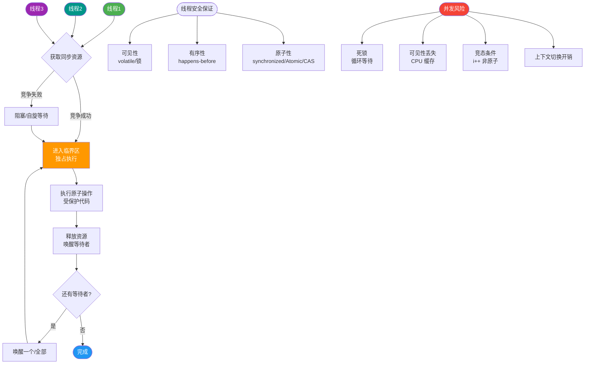
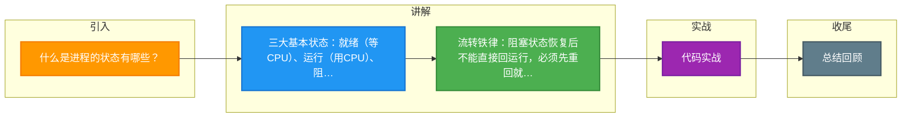

# 什么是进程的状态有哪些？

### 进程的基本状态

操作系统中的进程通常具有三种基本状态：

1. **就绪状态**：
   进程已获得除 CPU 以外的所有必要资源，只要获得 CPU 即可立即执行。

2. **运行状态**：
   进程正在 CPU 上执行指令。单核系统中同一时刻只有一个进程处于运行状态。

3. **阻塞状态**：
   也称等待状态。进程因等待 I/O 完成、信号或其他事件而暂停运行，此时即使分配 CPU 也无法执行。

**状态转换关系**：
- **就绪 -> 运行**：进程调度程序选中进程。
- **运行 -> 就绪**：时间片用完，或被更高优先级进程抢占。
- **运行 -> 阻塞**：请求 I/O 或等待资源。
- **阻塞 -> 就绪**：等待的事件发生（如 I/O 完成）。

**扩展：五状态模型**
在基本三状态基础上，增加了：
- **创建状态**：进程正在被创建，尚未就绪。
- **终止状态**：进程执行结束，正在回收资源。

**进程状态流转图**：
```text
                 ┌─────────────┐
                 │   创建状态   │
                 └──────┬──────┘
                        │ [创建完成，资源分配]
                        ▼
  ┌───────────────────────────────────────┐
  │              就绪状态                  │ ◀───┐
  │ [在就绪队列中排队等待 CPU 调度]       │     │
  └───────────────────┬───────────────────┘     │
                      │ [被调度程序选中]         │
                      ▼                         │ [I/O 完成/事件到达]
  ┌───────────────────────────────────────┐     │
  │              运行状态                  │─────┘ (注意：阻塞不能直接回运行)
  └───────┬───────────────────┬───────────┘
          │                   │
          │ [等待 I/O/事件]   │ [时间片用完/被抢占]
          ▼                   │
  ┌───────────────────┐       │
  │     阻塞状态      │       │
  └───────────────────┘       │
                               │
                               │ ────────────────┘
```

**实战案例**：在 Linux 服务器排查高负载时，发现某进程状态常为 `D` (Uninterruptible Sleep，不可中断睡眠)。这是因为进程正在进行磁盘 I/O 且驱动层不允许中断（如 NFS 挂载超时）。这种情况无法被 `kill -9` 杀死，只能等待 I/O 恢复或重启机器。

**对比表格（进程状态 vs Java 线程状态）**：
| 操作系统进程状态 | Java Thread.State | 说明 |
| :--- | :--- | :--- |
| **就绪** | RUNNABLE | 获得除 CPU 外的所有资源，等待调度 |
| **运行** | RUNNABLE | 正在 CPU 上执行（Java 中未细分） |
| **阻塞** | BLOCKED / WAITING / TIMED_WAITING | 等待事件或锁 |
| **终止** | TERMINATED | 执行结束 |
| **挂起** | (无直接对应) | 进程被调至外存，Java 中通常指线程被阻塞 |

## 常见考点
1. 进程“挂起”状态和“阻塞”状态有什么区别？（挂起是调至外存，阻塞是在内存中等待）
2. 进程从阻塞状态恢复后，是直接回到运行状态还是就绪状态？
3. 单核 CPU 系统中，能否有多个进程处于运行状态？
4. 引入进程是为了解决什么问题？它与线程的主要区别在调度层面的体现？


## 核心流程图



## 记忆要点

- 三大基本状态：就绪（等CPU）、运行（用CPU）、阻塞（等资源）。
- 流转铁律：阻塞状态恢复后不能直接回运行，必须先重回就绪队列排队。
- 挂起与阻塞对比：阻塞在内存等事件，挂起被调至外存腾空间。
- 状态细分：五状态模型在三态基础上，增加创建状态和终止状态。

## 结构化回答


**30 秒电梯演讲：** 作业状态：写好了（就绪）、正在写（运行）、等老师签字（阻塞）、写完了（终止）。

**展开框架：**
1. **三态模型** — 就绪、运行、阻塞
2. **就绪到运行由** — 就绪到运行由调度触发
3. **运行到阻塞由** — 运行到阻塞由资源请求触发

**收尾：** 这是我实战中的理解，您想深入哪一段？


## 视频脚本

> 预计时长：3 分钟 | 由浅入深

| 时间 | 画面/字幕 | 口播台词 | 讲解要点 |
|------|----------|----------|----------|
| 0:00 | 标题卡：什么是进程的状态有哪些 | 今天这道题：什么是进程的状态有哪些。30 秒先给你讲清楚。 | 开场钩子 |
| 0:20 | 核心概念动画/示意图 | 作业状态：写好了（就绪）、正在写（运行）、等老师签字（阻塞）、写完了（终止）。 | 核心概念 |
| 0:40 | 三态模型示意图 | 三态模型：就绪、运行、阻塞 | 三态模型 |
| 1:10 | 总结卡 + 下期预告 | 记住今天这几个关键词，面试一定用得上。下期见。 | 收尾 |

### 视频流程图



