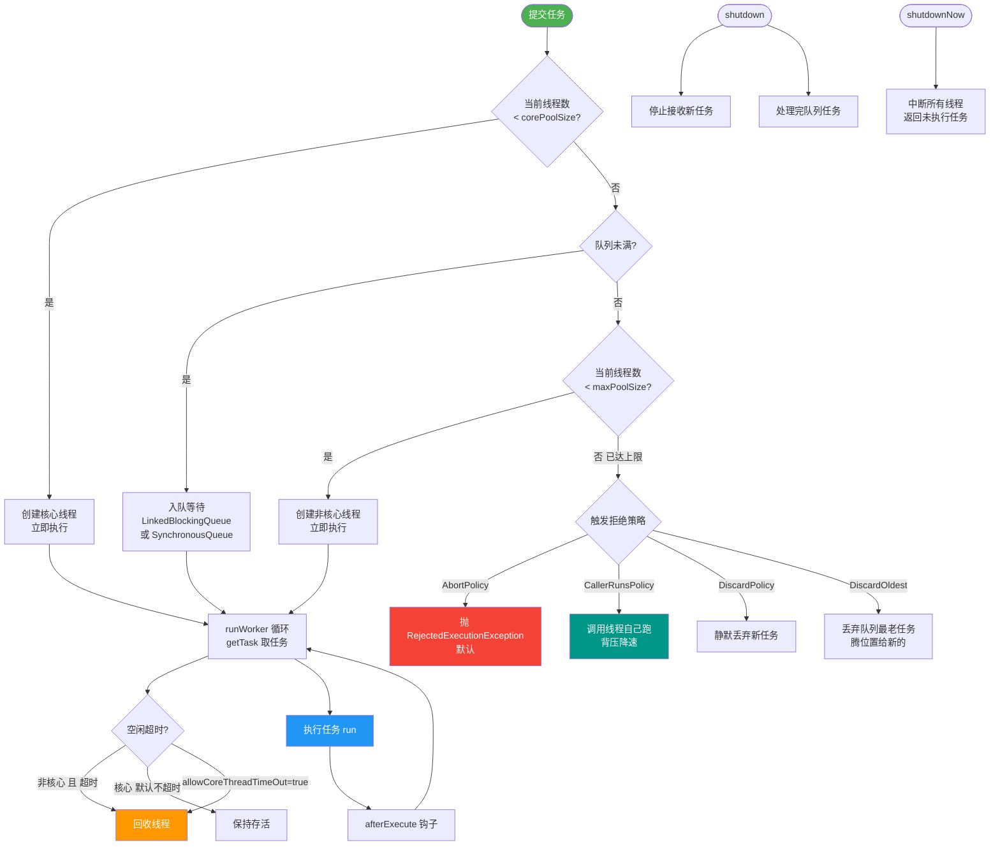

# 什么是阻塞队列的主要方法？

阻塞队列提供了四类处理元素的方法，对应不同的操作策略。在实际生产中，根据业务场景（如是否允许阻塞、是否需要异常处理）选择对应的方法至关重要。

**1. 抛出异常**
- **插入**：`add(e)`，队列满时抛出 `IllegalStateException: Queue full`。
- **移除**：`remove()`，队列空时抛出 `NoSuchElementException`。
- **检查**：`element()`，队列空时抛出 `NoSuchElementException`。
- *场景*：适合需要明确告知调用者失败且调用者能处理异常的情况。

**2. 返回特殊值**
- **插入**：`offer(e)`，成功返回 `true`，失败返回 `false`。
- **移除**：`poll()`，成功返回元素，失败返回 `null`。
- **检查**：`peek()`，成功返回元素，失败返回 `null`。
- *场景*：常用于轮询或非阻塞的任务提交。

**3. 阻塞**
- **插入**：`put(e)`，队列满时一直阻塞直到有空位（或线程被中断）。
- **移除**：`take()`，队列空时一直阻塞直到有元素（或线程被中断）。
- *场景*：生产者-消费者模型中，强依赖数据的实时传递，不允许丢数据。

**4. 超时退出**
- **插入**：`offer(e, time, unit)`，队列满时阻塞指定时间，超时返回 `false`。
- **移除**：`poll(time, unit)`，队列空时阻塞指定时间，超时返回 `null`。
- *场景*：需要一定弹性，避免永久死锁，例如调用外部接口超时控制。

### 实战案例
在对接第三方支付回调时，若处理线程池满，直接使用 `put` 会导致支付回调线程被阻塞，进而导致第三方支付平台超时重试，产生大量重复订单。**最佳实践**是使用 `offer(timeout)`，若队列满则在有限时间内等待，超时后记录异常日志并快速返回 `503 Busy`，确保回调链路不阻塞。

### 代码示例
```java
// 场景：生产者写入消息，如果队列满等待2秒，超时则丢弃记录
boolean success = blockingQueue.offer(message, 2, TimeUnit.SECONDS);
if (!success) {
    // 触发告警或降级逻辑（如记录到数据库或丢弃非核心数据）
    log.warn("Queue is full, drop message: {}", message);
}
```

### 对比表格
| 方法类型 | 核心方法 | 队列满/空行为 | 典型应用场景 |
| :--- | :--- | :--- | :--- |
| **抛异常** | add/remove | 抛出异常 | 快速失败，明确告知调用者错误 |
| **特殊值** | offer/poll | 返回 false/null | 轮询任务，非阻塞IO处理 |
| **阻塞** | put/take | 阻塞等待直到成功 | 生产者-消费者模型，强一致性 |
| **超时** | offer(time)/poll(time) | 阻塞直到超时 | 调用远程服务，防止死锁 |

**## 常见考点**
1. **ArrayBlockingQueue 与 LinkedBlockingQueue 的锁区别？**
   - ArrayBlockingQueue：只有一把锁（入队出队互斥）。
   - LinkedBlockingQueue：两把锁（takeLock 和 putLock），吞吐量通常更高。
2. **SynchronousQueue 的特性？**
   - 容量为 0，`put` 必须等待 `take`，直接交接，不存储元素，用于传递性场景（如 Executors.newCachedThreadPool）。
3. **阻塞队列的“虚假唤醒”如何处理？**
   - 在循环（while）中使用 `take` 或 `wait`，而不是 if 判断，防止条件未满足即被唤醒。
4. **offer(e) 在无界队列中会失败吗？**
   - 不会，无界队列（如 LinkedBlockingQueue 未指定容量时）理论上不会满，offer 永远返回 true（除非内存溢出）。


## 核心流程图



## 记忆要点

- 口诀「抛异返值阻超时」：四大类策略对应不同失败处理场景
- 抛异常 vs 返特殊值：add/remove 遇满空抛异常，而 offer/poll 返 false/null
- 阻塞 vs 超时：put/take 死等到底，而 offer(e,time) 限时等待防死锁
- 实战避坑：第三方回调慎用 put 阻塞，推荐用 offer(timeout) 防止超时重试

## 结构化回答

**30 秒电梯演讲：** 排队上厕所，满了要么硬挤（异常），要么回头（特殊值），要么一直等（阻塞），要么等会再看（超时）。

**展开框架：**
1. **抛出异常组** — 抛出异常组：add, remove, element，失败即报错
2. **特殊值组** — 特殊值组：offer, poll, peek，失败返回false或null
3. **阻塞组** — 阻塞组：put, take，队列不满足条件时无限等待

**收尾：** 这块我踩过一些坑，您想深入聊哪一段——原理细节、实战案例还是常见踩坑？

## 视频脚本

> 预计时长：3 分钟 | 由浅入深

| 时间 | 画面/字幕 | 口播台词 | 讲解要点 |
|------|----------|----------|----------|
| 0:00 | 标题卡：什么是阻塞队列的主要方法 | 今天这道题：什么是阻塞队列的主要方法。30 秒先给你讲清楚。 | 开场钩子 |
| 0:20 | 核心概念动画/示意图 | 排队上厕所，满了要么硬挤（异常），要么回头（特殊值），要么一直等（阻塞），要么等会再看（超时）。 | 核心概念 |
| 0:40 | 抛出异常组示意图 | 抛出异常组：add, remove, element，失败即报错 | 抛出异常组 |
| 1:10 | 总结卡 + 下期预告 | 记住今天这几个关键词，面试一定用得上。下期见。 | 收尾 |
