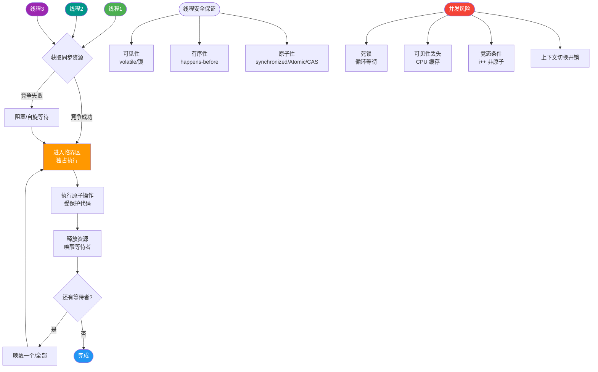
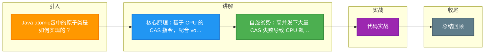

# Java atomic包中的原子类是如何实现的？

Java `java.util.concurrent.atomic` 包中的原子类（如 `AtomicInteger`）主要基于 **CAS (Compare-And-Swap)** 算法实现。

**1. CAS 核心原理**
- CAS 包含 3 个操作数：**内存值(V)**、**预期原值(E)**、**新值(N)**。
- **执行逻辑**：仅当内存值 V 与预期值 E 相同时，才将 V 更新为 N；否则说明已被其他线程修改，操作失败。
- **硬件支持**：CAS 依靠 CPU 的原子指令（如 `cmpxchg`），无需加锁，属于乐观锁策略。

**2. 实现示例**
- **存储**：内部使用 `volatile int value` 保证内存可见性。
- **自旋**：在 `getAndIncrement()` 等方法中，通过死循环（自旋）不断尝试 CAS 操作，直到成功为止。

**3. ABA 问题**
- **现象**：如果变量值从 A 变为 B 又变回 A，CAS 无法感知变化。
- **解决**：使用版本号或时间戳（如 `AtomicStampedReference`）。

**4. 优点与缺点**
- **优点**：非阻塞，性能高（无线程上下文切换）。
- **缺点**：只能保证单个变量的原子性；长时间自旋浪费 CPU 资源。

**5. 边界情况**
- **高并发下的自旋开销**：当线程数激增时，大量线程 CAS 失败自旋，会显著提高 CPU 使用率。
- **AtomicReference 带来的对象引用更新**：可以保证引用变量的原子性，但需注意被引用对象内部的线程安全。
- **LongAdder 的权衡**：在高并发统计场景（如计数器），`AtomicLong` 因竞争激烈导致性能下降；`LongAdder` 通过分散热点到多个 Cell 避免竞争，但 `sum()` 操作返回的不是精确的实时值（最终一致性）。

### CAS 执行流程图

```text
      Thread 1                      Thread 2
         |                             |
         | (Read V=0)                  |
         |                             |
         v                             |
    [CAS(0, 1)]                       |
         |                             |
    (Check V==0?)                     |
         |                             |
    Yes -> Update V=1                 |
         |                             |
    Success ------------------------->| (Preempt/Retry)
         |                             |
         |                             | (Read V=1)
         |                             |
         |                             v
         |                        [CAS(0, 1)] <-- Expect Fail
         |                             |
         |                             | (Check V==0? No, V is 1)
         |                             |
         |                             | (Retry loop...)
```

### 实战与深化

- **实战案例**：在高并发计数器场景（如接口 QPS 统计）中，直接使用 `AtomicInteger` 在千万级并发下会导致多个线程 CPU 自旋空转，吞吐量下降；改用 `LongAdder` 后，通过分散热点数据到 Cell 数组，性能提升数倍，但在最终取值时可能会有轻微延迟。
- **代码示例**：
```java
AtomicInteger atomicInt = new AtomicInteger(0);

// 模拟 CAS 自旋实现原子递增
public void increment() {
    int prev, next;
    do {
        prev = atomicInt.get(); // 获取当前内存值
        next = prev + 1;        // 计算新值
    } while (!atomicInt.compareAndSet(prev, next)); // CAS 失败则重试
}
```

## 面试追问
1. 如果在极高并发下，CAS 一直自旋重试，CPU 飙升怎么办？有没有更优化的方案（如 LongAdder）？
2. AtomicStampedReference 是如何解决 ABA 问题的？它的内部实现原理是什么？
3. 为什么 Atomic 类只能保证可见性和原子性，不能保证有序性？（或者说 volatile 在这里起什么作用？）

## 易错点
1. **ABA 问题忽略**：在链表节点删除等场景，ABA 可能导致严重的数据错误，需使用 `AtomicStampedReference` 处理。
2. **误解原子性范围**：`atomicRef.getAndUpdate()` 只能保证引用赋值的原子性，不能保证对象内部属性修改的原子性，对象本身仍需是线程安全的。


## 核心流程图



## 记忆要点

- 核心原理：基于 CPU 的 CAS 指令，配合 volatile 保证可见性与原子自旋
- 自旋劣势：高并发下大量 CAS 失败导致 CPU 飙高，不保证有序性
- ABA隐患：值从A变B再变A无法感知，需引入 AtomicStampedReference 加版本号
- 性能进阶：高并发计数器推荐 LongAdder，用分散热点 Cell 数组减少自旋冲突

## 结构化回答

**30 秒电梯演讲：** 抢红包前先看余额，假设没变就抢，变了就重试。不用排队锁门，但也可能抢不到一直试。

**展开框架：**
1. **底层依赖Unsafe类和** — 底层依赖Unsafe类和CPU CAS指令
2. **volatile** — 通过volatile保证可见性，通过循环自旋保证原子性
3. **属于乐观锁** — 属于乐观锁，无阻塞但可能有ABA问题

**收尾：** 这块我踩过一些坑，您想深入聊哪一段——原理细节、实战案例还是常见踩坑？

## 视频脚本

> 预计时长：4 分钟 | 由浅入深

| 时间 | 画面/字幕 | 口播台词 | 讲解要点 |
|------|----------|----------|----------|
| 0:00 | 标题卡：Java atomic包中的原子类是如何实现的 | 今天这道题：Java atomic包中的原子类是如何实现的。30 秒先给你讲清楚。 | 开场钩子 |
| 0:20 | 核心概念动画/示意图 | 抢红包前先看余额，假设没变就抢，变了就重试。不用排队锁门，但也可能抢不到一直试。 | 核心概念 |
| 0:40 | 底层依赖Unsafe类和示意图 | 底层依赖Unsafe类和CPU CAS指令 | 底层依赖Unsafe类和 |
| 1:10 | volatile示意图 | 通过volatile保证可见性，通过循环自旋保证原子性 | volatile |
| 1:40 | 总结卡 + 下期预告 | 记住今天这几个关键词，面试一定用得上。下期见。 | 收尾 |

### 视频流程图



