# Java创建线程有哪几种方式？

### Java 线程实现/创建方式

#### 1. 继承 Thread 类
*   **方式**：继承 `java.lang.Thread` 类，重写 `run()` 方法。
*   **启动**：调用 `start()` 方法。

```java
public class MyThread extends Thread {
    public void run() {
        System.out.println("MyThread.run()");
    }
}
MyThread myThread1 = new MyThread();
myThread1.start();
```

#### 2. 实现 Runnable 接口
*   **方式**：实现 `java.lang.Runnable` 接口，实现 `run()` 方法。
*   **优势**：避免单继承限制，适合资源共享。

```java
public class MyThread extends OtherClass implements Runnable {
    public void run() {
        System.out.println("MyThread.run()");
    }
}
MyThread myThread = new MyThread();
Thread thread = new Thread(myThread);
thread.start();
```

#### 3. 实现 Callable 接口（有返回值）
*   **方式**：实现 `Callable` 接口，通过 `FutureTask` 包装或线程池提交。
*   **特点**：支持返回执行结果，允许抛出异常。

```java
// 创建线程池
ExecutorService pool = Executors.newFixedThreadPool(5);
// 提交 Callable 任务
Future<String> future = pool.submit(new Callable<String>() {
    public String call() throws Exception {
        return "Result";
    }
});
// 获取结果
System.out.println(future.get());
pool.shutdown();
```

**实战案例**：在批量计算报表的场景中，主线程需要汇总 5 个不同维度的数据。使用 `Future` + `Callable` 提交 5 个任务，主线程调用 `future.get()` 阻塞等待结果集齐后合并返回，比串行执行耗时缩短了 80%。

#### 4. 线程池（推荐）
*   **方式**：使用 `ExecutorService` 框架创建并管理线程。
*   **优势**：复用线程，控制并发数，提供定时/任务调度功能。
*   **代码示例**：
```java
// 生产环境建议使用 ThreadPoolExecutor 自定义参数，避免 OOM
ExecutorService executor = new ThreadPoolExecutor(
    4, 10, 60L, TimeUnit.SECONDS, 
    new ArrayBlockingQueue<>(100), 
    new ThreadPoolExecutor.CallerRunsPolicy());
executor.execute(() -> doTask());
```

#### 5. 创建方式对比

| 方式 | 实现接口/类 | 是否有返回值 | 是否支持异常 | 继承限制 | 适用场景 |
| :--- | :--- | :--- | :--- | :--- | :--- |
| **Thread** | 继承 Thread | 无 | 不能直接抛出 (需 try-catch) | 单继承限制 | 简单场景，不推荐 (占用资源) |
| **Runnable** | 实现 Runnable | 无 | 不能直接抛出 | 无限制，灵活 | 任务无需返回结果的简单并发 |
| **Callable** | 实现 Callable | 有 (Future) | 能抛出受检异常 | 无限制，灵活 | 需要异步计算结果的场景 |
| **ThreadPool** | 实现 Runnable/Callable | 取决于任务 | 取决于任务 | 无限制，灵活 | 生产环境标准做法，资源管控 |


## 核心流程图

```mermaid
flowchart TD
    T1([线程1]) --> ENTER{获取同步资源}
    T2([线程2]) --> ENTER
    T3([线程3]) --> ENTER

    ENTER -->|竞争成功| CRITICAL[进入临界区<br/>独占执行]
    ENTER -->|竞争失败| WAIT[阻塞/自旋等待]

    CRITICAL --> OP[执行原子操作<br/>受保护代码]
    OP --> RELEASE[释放资源<br/>唤醒等待者]
    RELEASE --> NEXT{还有等待者?}
    NEXT -->|是| WAKE[唤醒一个/全部]
    NEXT -->|否| DONE([完成])
    WAKE --> CRITICAL
    WAIT --> CRITICAL

    SAFETY([线程安全保证]) --> VIS2[可见性<br/>volatile/锁]
    SAFETY --> ORD2[有序性<br/>happens-before]
    SAFETY --> AT2[原子性<br/>synchronized/Atomic/CAS]

    HAZARD([并发风险]) --> DEAD[死锁<br/>循环等待]
    HAZARD --> LOST[可见性丢失<br/>CPU 缓存]
    HAZARD --> RACE[竞态条件<br/>i++ 非原子]
    HAZARD --> CONTEXT[上下文切换开销]

    style T1 fill:#4CAF50,color:#fff
    style T2 fill:#009688,color:#fff
    style T3 fill:#9C27B0,color:#fff
    style CRITICAL fill:#FF9800,color:#fff
    style DONE fill:#2196F3,color:#fff
    style HAZARD fill:#F44336,color:#fff
```



## 记忆要点

- 四大方式：继承Thread、实现Runnable、实现Callable、线程池
- 核心区分：Runnable无返回不抛异常，而Callable有返回值且能抛受检异常
- 避坑指南：生产环境禁用Executors直接创建，推荐ThreadPoolExecutor防OOM
- 必考点：调start()启动而非run()，前者开启新线程，后者只是普通方法调用

## 结构化回答

**30 秒电梯演讲：** 就像派干活，继承是自己当工人，实现是把活外包给别人做。

**展开框架：**
1. **继承Thread类重写run** — 继承Thread类重写run方法，简单但受限单继承。
2. **实现Runnable** — 实现Runnable接口更灵活，支持多线程共享资源。
3. **实现Callable接口** — 实现Callable接口可获取异步执行结果。

**收尾：** 这块我踩过一些坑，您想深入聊哪一段——原理细节、实战案例还是常见踩坑？

## 视频脚本

> 预计时长：4 分钟 | 由浅入深

| 时间 | 画面/字幕 | 口播台词 | 讲解要点 |
|------|----------|----------|----------|
| 0:00 | 标题卡：Java创建线程有哪几种方式 | 今天这道题：Java创建线程有哪几种方式。30 秒先给你讲清楚。 | 开场钩子 |
| 0:20 | 核心概念动画/示意图 | 就像派干活，继承是自己当工人，实现是把活外包给别人做。 | 核心概念 |
| 0:40 | 继承Thread类重写run示意图 | 继承Thread类重写run方法，简单但受限单继承。 | 继承Thread类重写run |
| 1:10 | 实现Runnable示意图 | 实现Runnable接口更灵活，支持多线程共享资源。 | 实现Runnable |
| 1:40 | 总结卡 + 下期预告 | 记住今天这几个关键词，面试一定用得上。下期见。 | 收尾 |
