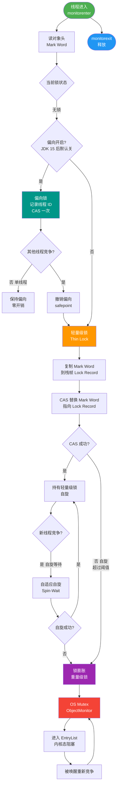

# Java线程锁的特点/性能和使用场景是什么？

### Java 线程锁的特点、性能和使用场景

#### 1. Synchronized
*   **特点**：关键字，自动加锁/解锁；悲观锁；可重入；非公平（默认）。
*   **性能**：JDK 1.6 后优化显著（偏向锁、轻量级锁、自旋锁、锁消除），竞争不激烈时性能接近 ReentrantLock。
*   **场景**：一般同步需求，代码简单，不需要高级特性（如中断、公平性）。

**实战案例**：在一个简单的单例模式双重检查锁中，优先使用 `synchronized`，因为 JVM 对其进行了大量底层优化且代码简洁不易出错；但如果业务需要“尝试获取锁并立即返回失败”的逻辑，synchronized 无法直接满足，必须改用 ReentrantLock 的 `tryLock()`。

#### 2. ReentrantLock
*   **特点**：JUC 类，需手动 `lock()`/`unlock()`（通常在 `finally` 中）；悲观锁；可重入；支持公平锁选择；支持中断；支持多 Condition。
*   **性能**：高并发下表现优于 synchronized，因为调度更灵活。
*   **场景**：高并发场景，需要使用公平锁、中断等待、尝试获取锁或精细化条件唤醒。

**代码示例**：
```java
ReentrantLock lock = new ReentrantLock();
try {
    if (lock.tryLock(1, TimeUnit.SECONDS)) { // 尝试获取，最多等1秒
        // 获取成功，执行业务
    } else {
        // 获取失败，执行降级逻辑或记录日志
    }
} finally {
    if (lock.isHeldByCurrentThread()) {
        lock.unlock();
    }
}
```

#### 3. Semaphore（信号量）
*   **特点**：基于计数（许可），控制同时访问资源的线程数量。允许多个线程同时访问（许可数 > 1）。
*   **场景**：限流（如数据库连接池）、资源池管理。当计数为 1 时，类似于互斥锁。

#### 4. AtomicInteger（CAS/无锁）
*   **特点**：乐观锁（CAS），基于硬件指令实现原子操作；无阻塞；非锁机制。
*   **缺点**：只能保证单个变量的原子性；存在 ABA 问题（可引用 `AtomicStampedReference` 解决）；高并发下 CPU 开销大（自旋）。
*   **场景**：并发计数、序列号生成等单变量原子操作场景。

#### 锁/工具选型对比表

| 维度 | Synchronized | ReentrantLock | Semaphore | Atomic (CAS) |
| :--- | :--- | :--- | :--- | :--- |
| **锁类型** | 悲观/独占/可重入 | 悲观/独占/可重入 | 共享/计数 | 乐观/无锁 |
| **使用复杂度** | 低 (自动管理) | 高 (手动 finally) | 中 | 低 |
| **公平性** | 非公平 | 可选 (公平/非公) | 非公平 | 无此概念 |
| **性能** | 低竞争极高 | 高竞争灵活 | 中等 | 单变量极高 |
| **适用场景** | 普通同步块 | 复杂并发控制 | 限流/资源池 | 计数/序列号 |

#### 锁的选择决策图
```text
     是否需要同步？
        / \
      否   是
      |    |
      |    是否涉及多变量原子更新？
      |    / \
      |  否   是 ---------> 使用 synchronized / ReentrantLock 锁住代码块
      |  |                   (推荐 synchronized，简单自动)
      |  |
      |  是否只是单变量简单读写（如计数）？
      |  / \
      | 是   否
      | |    |
      | |    是否需要公平锁/中断/多Condition？
      | |    / \
      | |  否   是 -----------> 使用 ReentrantLock (手动管理)
      | |  |
      | |  否 ---------------> 使用 synchronized (JVM 自动优化)
      | |
      | -------------------> 使用 AtomicInteger / AtomicReference (CAS)
```

**## 常见考点**
1.  **Synchronized 与 ReentrantLock 的区别**：除了实现方式，锁的释放机制有何不同？（ReentrantLock 必须在 finally 中释放）
2.  **公平锁的代价**：为什么 ReentrantLock 默认是非公平的？公平锁对吞吐量有什么影响？
3.  **Condition 的优势**：相比 Synchronized 的 wait/notify，Condition 有什么优势？（支持多路通知，选择性唤醒）
4.  **ReadWriteLock**：读写锁适用于什么场景？（读多写少）


## 核心流程图



## 记忆要点

- 锁选型：普通同步用Synchronized(自动释放)，复杂控制(公平/中断/超时)用ReentrantLock
- 限流神器：Semaphore控制同时访问的线程数量，常用于资源池
- 性能对比：低并发Synchronized极高(JVM优化)，高并发ReentrantLock更灵活
- 单变量并发：优先用AtomicInteger(CAS乐观锁无阻塞)，避免加锁开销

## 结构化回答

**30 秒电梯演讲：** Synchronized是自动门，ReentrantLock是需手动关的门，Semaphore是限流闸机。

**展开框架：**
1. **Synchronized** — Synchronized简单自动，ReentrantLock灵活强大。
2. **Semaphore** — Semaphore用于控制并发量，非互斥。
3. **AtomicInteger** — AtomicInteger基于CAS，适合单变量无锁操作。

**收尾：** 这块我踩过一些坑，您想深入聊哪一段——原理细节、实战案例还是常见踩坑？

## 视频脚本

> 预计时长：4 分钟 | 由浅入深

| 时间 | 画面/字幕 | 口播台词 | 讲解要点 |
|------|----------|----------|----------|
| 0:00 | 标题卡：Java线程锁的特点/性能和使用场景是什么 | 今天这道题：Java线程锁的特点/性能和使用场景是什么。30 秒先给你讲清楚。 | 开场钩子 |
| 0:20 | 核心概念动画/示意图 | Synchronized是自动门，ReentrantLock是需手动关的门，Semaphore是限流闸机。 | 核心概念 |
| 0:40 | Synchronized示意图 | Synchronized简单自动，ReentrantLock灵活强大。 | Synchronized |
| 1:10 | Semaphore示意图 | Semaphore用于控制并发量，非互斥。 | Semaphore |
| 1:40 | 总结卡 + 下期预告 | 记住今天这几个关键词，面试一定用得上。下期见。 | 收尾 |

### 视频流程图


