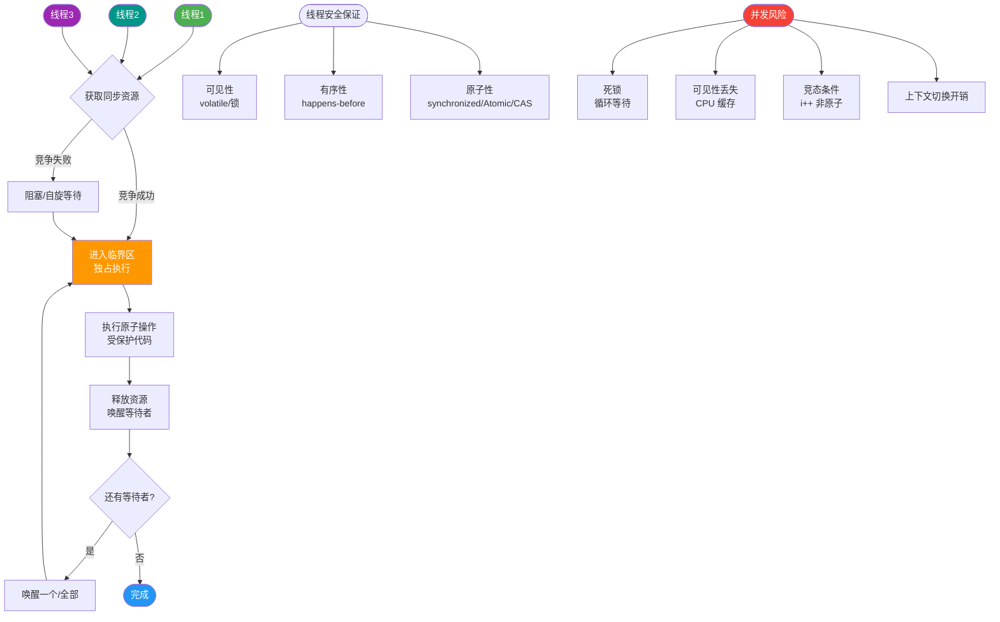

# LinkedBlockingDeque是什么？

### LinkedBlockingDeque

#### 定义
`LinkedBlockingDeque` 是一个由链表结构组成的 **双向阻塞队列**。它基于链表实现，节点之间通过 `prev` 和 `next` 指针连接。

#### 特点
1.  **双向操作**：支持从队列的两端（头部和尾部）插入和移出元素。
2.  **阻塞机制**：当队列已满时，插入操作会被阻塞；当队列为空时，获取操作会被阻塞。支持超时等待的 `offer` 和 `poll` 方法。
3.  **线程安全**：内部通过 **单锁（ReentrantLock）** 保证并发安全（不同于 `LinkedBlockingQueue` 的双锁，Deque 因为是双向操作，使用一把锁更易于实现双向的原子性）。
4.  **可选容量**：构造时如果不指定容量，默认为 `Integer.MAX_VALUE`，可能导致内存溢出（OOM）。

#### 数据结构（链表节点）
```text
Node<Item> Structure:
┌──────────────┐
│  Item (数据)  │
├──────────┬───┤
│  prev    │next│ (双向指针)
└──────────┴───┘
```

#### 特有方法
相较于单向队列，它增加了如下方法：
*   **插入**：`addFirst`, `addLast`, `offerFirst`, `offerLast`, `putFirst`, `putLast`（阻塞式）。
*   **移除**：`removeFirst`, `removeLast`, `takeFirst`, `takeLast`（阻塞式）。
*   **查看**：`peekFirst`, `peekLast`。

#### 使用场景
*   **工作窃取（Work Stealing）算法**：`ForkJoinPool` 中大量使用双端队列。工作线程处理自己队列的任务时从头部获取（LIFO/FIFO均可），当自己队列为空时，可以从其他忙碌线程队列的尾部窃取任务，减少竞争。
*   **多任务生产消费**：多线程同时从两端操作队列，减少竞争。

#### ## 常见考点
1.  **锁机制区别**：`LinkedBlockingDeque` 使用的是一把锁（`mainLock`），而 `LinkedBlockingQueue` 使用两把锁（`takeLock` 和 `putLock`）。为什么？
    *   *答案*：双向队列的头尾操作会重叠（例如一个线程在头删，一个线程在尾删，如果队列只有一个元素，两个操作会冲突），因此无法像单向队列那样通过分离两把锁来完全消除竞争，使用一把锁逻辑更简单且安全。
2.  **与 ArrayBlockingQueue 的区别**：一个是链表（默认无界，节点动态分配），一个是数组（有界，需指定大小）。
3.  **内存结构**：每次插入节点都需要 new Node，在高并发下会对 GC 造成一定压力。

#### 实战案例
在开发高性能爬虫时，曾使用 `LinkedBlockingDeque` 实现了“广度优先遍历”的任务队列：主线程将解析出的新链接 `putLast` 到队尾，而多个工作线程从 `takeFirst` 获取任务；若遇到需优先处理的VIP链接，直接调用 `putFirst` 插入队头，实现了动态优先级调度。

#### 代码示例
```java
// 创建容量为 1000 的双向阻塞队列
LinkedBlockingDeque<String> taskQueue = new LinkedBlockingDeque<>(1000);

// 生产者：高优先级任务插队
taskQueue.putFirst("URGENT_TASK_001");

// 消费者：从头部获取任务（阻塞）
try {
    String task = taskQueue.takeFirst(); // 若空则阻塞
    process(task);
} catch (InterruptedException e) {
    Thread.currentThread().interrupt();
}
```

#### 对比表格
| 特性 | LinkedBlockingDeque | LinkedBlockingQueue | ArrayBlockingQueue |
| :--- | :--- | :--- | :--- |
| **结构** | 双向链表 | 单向链表 | 数组 (环形缓冲区) |
| **锁机制** | 单锁 (ReentrantLock) | 双锁 | 单锁 (ReentrantLock) |
| **操作方向** | 头尾均可插入/删除 | 仅尾插头取 | 仅尾插头取 |
| **容量** | 默认无界 (慎用 OOM) | 默认无界 (慎用 OOM) | 必须指定容量 (有界) |
| **吞吐量** | 中等 (双向竞争锁) | 较高 (读写分离) | 一般 (锁粒度大) |


## 核心流程图



## 记忆要点

- 一句话定义：基于链表的双向阻塞队列，头尾均可插入和移出元素
- 核心区别：Deque用单锁因双向操作会冲突，而单向Queue用双锁(读写分离)
- 避坑要点：默认容量是Integer.MAX_VALUE，生产环境必须指定容量防OOM
- 经典场景：ForkJoinPool的工作窃取算法，空闲线程从尾部窃取任务减少竞争

## 结构化回答


**30 秒电梯演讲：** 像两头都能进出的双车道隧道，两头都能排队。

**展开框架：**
1. **支持在队列头尾进行插入** — 支持在队列头尾进行插入、移除操作。
2. **容量** — 容量可配置，默认无界。
3. **适合工作窃取** — 适合工作窃取算法场景。

**收尾：** 这是我实战中的理解，您想深入哪一段？


## 视频脚本

> 预计时长：4 分钟 | 由浅入深

| 时间 | 画面/字幕 | 口播台词 | 讲解要点 |
|------|----------|----------|----------|
| 0:00 | 标题卡：LinkedBlockingDeque是什么 | 今天这道题：LinkedBlockingDeque是什么。30 秒先给你讲清楚。 | 开场钩子 |
| 0:20 | 核心概念动画/示意图 | 像两头都能进出的双车道隧道，两头都能排队。 | 核心概念 |
| 0:40 | 支持示意图 | 支持在队列头尾进行插入、移除操作。 | 支持 |
| 1:10 | 容量示意图 | 容量可配置，默认无界。 | 容量 |
| 1:40 | 总结卡 + 下期预告 | 记住今天这几个关键词，面试一定用得上。下期见。 | 收尾 |
