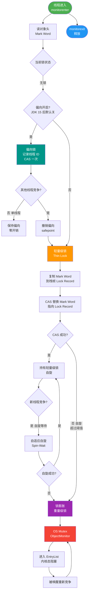

# Synchronized 反向理解是什么？

### Synchronized 锁升级机制（反向理解）

为了理解锁升级，我们可以采用**反向思考**：从最重的状态（重量级锁）出发，推导为何需要升级。

#### 1. 重量级锁（原始状态）
*   **现状**：早期的 `synchronized` 就是重量级锁，依赖 OS 的 **Mutex Lock**。线程竞争会导致用户态与内核态频繁切换，开销极大。
*   **问题**：即使没有并发冲突，也会触发内核操作（杀鸡用牛刀）。

#### 2. 降级优化：无锁 -> 偏向锁
*   **场景**：绝大多数时间，锁不仅没有竞争，甚至只有一个线程在访问（如单线程循环执行代码块）。
*   **优化（偏向锁）**：当第一个线程访问同步块时，会在对象头中 Mark Word 记录线程 ID。以后该线程进入时，无需任何同步操作（即 **无锁** 执行），仅检查 ID 是否匹配。这消除了 CAS 甚至锁撤销的开销。

#### 3. 再次冲突：偏向锁 -> 轻量级锁
*   **场景**：如果有第二个线程尝试获取锁（发生了竞争），偏向锁失效。
*   **优化（轻量级锁）**：不立即升级到重量级锁。JVM 尝试使用 **CAS 自旋** 来替代阻塞。因为“竞争”可能只是线程交错执行（A 刚走，B 来了），CAS 自旋一下通常能拿到锁，避免了系统调用和挂起。

#### 4. 激烈竞争：轻量级锁 -> 重量级锁
*   **场景**：如果自旋超过一定次数（默认10次，由自适应策略调整）或并发非常激烈，CPU 自旋浪费严重。
*   **最终（重量级锁）**：此时才真正升级为重量级锁，让线程进入阻塞队列，依赖操作系统调度，挂起不活跃线程，释放 CPU 资源。

#### 锁升级状态流转图
```text
      Object Mark Word
            │
            ▼
      ┌─────────────┐
      │   无锁      │
      │ (101/001)   │
      └──────┬──────┘
             │ Thread ID 匹配
             ▼
      ┌─────────────┐
      │   偏向锁     │
      │   (101)     │ ◀─── 只有单线程访问
      └──────┬──────┘
             │ 有其他线程竞争 (撤销偏向)
             ▼
      ┌─────────────┐
      │  轻量级锁    │
      │   (00)      │ ◀─── 线程交替执行 / 短时竞争
      └──────┬──────┘
             │ 自旋失败次数过多
             ▼
      ┌─────────────┐
      │  重量级锁    │
      │   (10)      │ ◀─── 激烈多线程竞争 (OS Mutex)
      └─────────────┘
```

#### 总结
锁升级是为了**自适应**：无竞争时不加锁（偏向），轻度竞争时自旋（轻量），重度竞争时才阻塞（重量）。JVM 不支持锁降级（但在 GC 时可能会重置为无锁）。

#### ## 常见考点
1.  **锁撤销**：偏向锁撤销开销很大，需要等待全局安全点（STW）。如果有大量线程交替使用锁，建议关闭偏向锁（`-XX:-UseBiasedLocking`）。
2.  **自旋锁优化**：JDK 1.6 引入了自适应自旋，自旋时间不由次数决定，而是由前一次在同一个锁上的自旋时间及锁拥有者的状态来决定。
3.  **Mark Word 结构**：需要知道对象头中在不同锁状态下存储的内容变化（如存储 HashCode 还是线程 ID 或 Lock Record 指针）。

#### 实战案例
在 JVM 调优一个高并发网关服务时，通过 `jstack -l` 发现大量线程处于 `BLOCKED` 状态且堆栈中包含 `waiting to lock <0x...>`（对象头 Mark Word 10）。经排查是由于某个热点 Key 的缓存击穿导致瞬间重量级锁膨胀。**优化方案**：引入本地缓存并开启 `-XX:-UseBiasedLocking`（因为网关请求通常由不同线程处理，偏向锁反而会因频繁撤销增加 STW 开销）。

#### 代码示例
```java
// 模拟锁升级场景
class LockUpgradeDemo {
    public static void main(String[] args) throws InterruptedException {
        LockUpgradeDemo obj = new LockUpgradeDemo();
        
        // 阶段1：偏向锁 (单线程)
        synchronized(obj) {
            System.out.println("Step 1: Biased Lock"); // MarkWord: ThreadID
        }

        Thread t2 = new Thread(() -> {
            // 阶段2：轻量级锁 -> 重量级锁 (竞争)
            synchronized(obj) {
                System.out.println("Step 2: Lightweight/Heavyweight Lock");
                try { Thread.sleep(1000); } catch (Exception e) {}
            }
        });
        t2.start();
        
        // 主线程稍后尝试获取，触发竞争
        Thread.sleep(100);
        synchronized(obj) { // 此时 t2 持有锁，主线程竞争
            System.out.println("Main entered");
        }
    }
}
```

#### 对比表格
| 锁状态 | Mark Word 后三位 | 适用场景 | 优势 | 劣势 |
| :--- | :--- | :--- | :--- | :--- |
| **无锁** | 001 | 无并发 | 无锁开销 | 线程不安全 |
| **偏向锁** | 101 | 单线程反复加锁 | 几乎无开销 (无 CAS) | 偏向撤销会导致 STW (Stop The World) |
| **轻量级锁** | 00 | 线程交替/短暂竞争 | 避免内核切换 (自旋) | 竞争激烈时 CPU 浪费 (自旋空转) |
| **重量级锁** | 10 | 高并发激烈竞争 | 不浪费 CPU (线程挂起) | 用户态/内核态切换开销大 |


## 核心流程图



## 记忆要点

- 反向推导：早期重量级锁依赖OS阻塞开销大，故需按竞争强度逐级优化
- 升级口诀：无锁 -> 偏向(单线程记ID) -> 轻量(多线程CAS自旋) -> 重量(OS阻塞)
- 自旋策略：自旋成功防阻塞，自旋超限或激烈竞争才升级重量级锁防CPU空转
- 调优避坑：多线程交替频繁场景，偏向锁撤销需STW开销极大，建议关闭偏向锁

## 结构化回答


**30 秒电梯演讲：** 像买票，没排队直接进（无锁/偏向），人少跑两步（轻量自旋），人多老实排队（重量级）。

**展开框架：**
1. **无竞争用偏向锁（** — 无竞争用偏向锁（记录线程ID）。
2. **轻度竞争用轻量级** — 轻度竞争用轻量级锁（CAS自旋）。
3. **重度竞争升级重量** — 重度竞争升级重量级锁（OS阻塞）。

**收尾：** 这是我实战中的理解，您想深入哪一段？


## 视频脚本

> 预计时长：4 分钟 | 由浅入深

| 时间 | 画面/字幕 | 口播台词 | 讲解要点 |
|------|----------|----------|----------|
| 0:00 | 标题卡：Synchronized 反向理解是什么 | 今天这道题：Synchronized 反向理解是什么。30 秒先给你讲清楚。 | 开场钩子 |
| 0:20 | 核心概念动画/示意图 | 像买票，没排队直接进（无锁/偏向），人少跑两步（轻量自旋），人多老实排队（重量级）。 | 核心概念 |
| 0:40 | 无竞争用偏向锁（记录线程ID示意图 | 无竞争用偏向锁（记录线程ID）。 | 无竞争用偏向锁（记录线程ID |
| 1:10 | 轻度竞争用轻量级锁（CAS示意图 | 轻度竞争用轻量级锁（CAS自旋）。 | 轻度竞争用轻量级锁（CAS |
| 1:40 | 总结卡 + 下期预告 | 记住今天这几个关键词，面试一定用得上。下期见。 | 收尾 |
