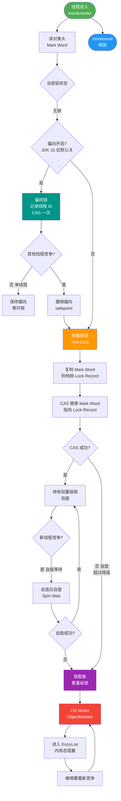

# synchronized关键字的底层原理是什么？

synchronized 是 Java 中的同步关键字，其底层原理在 JDK 1.6 前后有很大区别，经过优化后性能大幅提升。

**底层实现原理：**
1. **对象头**：每个 Java 对象都有一个对象头，其中存储了锁状态标志、持有锁的线程 ID 等信息。
2. **字节码层面**：
   - 修饰同步代码块：通过 `monitorenter` 和 `monitorexit` 指令实现。
   - 修饰方法：通过方法常量池中的 `ACC_SYNCHRONIZED` 标志隐式实现，JVM 检测到该标志会自动在方法调用前后处理锁。

**Monitor 机制（重量级锁基础）：**
```text
        ┌───────────────────────────┐
        │      Java Object Head     │
        └──────────────┬────────────┘
                       │ points to (Heavyweight Lock)
                       ▼
        ┌───────────────────────────┐
        │        Monitor            │
        ├───────────┬───────────────┤
        │  Owner    │ Thread (持锁) │
        ├───────────┼───────────────┤
        │  WaitSet  │ (wait() 线程) │ ◄── 调用 wait 释放锁，进入等待
        ├───────────┼───────────────┤
        │ EntryList │ (阻塞线程)    │ ◄── 竞争失败，进入阻塞
        └───────────┴───────────────┘
```

**锁升级过程（JDK 1.6 优化）：**
为了减少获得锁和释放锁带来的性能消耗，引入了偏向锁、轻量级锁和重量级锁，锁会根据竞争情况逐步升级（不可逆）：
1. **无锁**：对象未被锁定。
2. **偏向锁**：一段同步代码一直被一个线程访问，锁会自动偏向该线程（在对象头 Mark Word 中记录线程 ID）。后续该线程进入无需加锁。
3. **轻量级锁**：当有其他线程竞争时，偏向锁升级为轻量级锁。线程尝试在当前线程栈帧中创建 Lock Record，并通过 CAS 操作将对象头的 Mark Word 替换为指向 Lock Record 的指针。如果成功则获取锁，失败则自旋尝试。
4. **重量级锁**：竞争激烈，自旋超过一定次数（或 CPU 核心数受限），锁膨胀为重量级锁。线程会被挂起，进入操作系统内核态，依赖 Monitor 对象（互斥量）实现，涉及用户态与内核态切换，开销大。

**### 1. 实战案例**
在促销系统中，监控到某接口响应时间偶尔飙升。通过分析 jstack 日志发现大量线程处于 `BLOCKED` 状态等待同一个对象锁。进一步排查发现是由于偏向锁在多线程并发环境下频繁撤销，导致性能退化。通过 JVM 参数 `-XX:-UseBiasedLocking` 关闭偏向锁后，由于锁竞争本身就很激烈，直接进入轻量级/重量级锁，反而消除了撤销震荡，P99 延迟下降。

**### 2. 代码示例**
```java
public class LockUpgradeDemo {
    static Object lock = new Object();
    public static void main(String[] args) {
        synchronized (lock) {
            // 此时偏向锁：Mark Word 记录 main 线程 ID
            System.out.println("Main thread holding lock");
        }
    }
}
```

**### 3. 对比表格**

| 锁状态 | Mark Word 内容 (64-bit JVM) | 适用场景 | 开销 |
| :--- | :--- | :--- | :--- |
| **无锁** | 对象的 HashCode、分代年龄 | 无线程访问 | 无 |
| **偏向锁** | 线程 ID、Epoch、分代年龄 | 仅有一个线程访问 | 极低（仅 CAS 替换 ID 一次） |
| **轻量级锁** | 指向栈中 Lock Record 的指针 | 两个线程交替执行，无竞争 | 中等（自旋 CAS 消耗 CPU） |
| **重量级锁** | 指向堆中 Monitor 对象的指针 | 多线程竞争激烈 | 高（内核态切换，线程挂起） |

**## 常见考点**
1. **锁能否降级**：锁升级是单向的，不能降级（但在特定 JVM 实现中，如 Safepoint 时可能会发生重置，一般面试答不可逆）。
2. **偏向锁的撤销**：什么时候偏向锁会被撤销？（当有其他线程竞争时，会暂停持有偏向锁的线程，根据是否锁定决定恢复无锁或升级为轻量级锁，批量撤销机制是优化点）。
3. **自旋锁的优缺点**：为什么要有自旋？（避免挂起线程的开销，但自旋会消耗 CPU，适用于锁持有时间短的场景）。
4. **对象头结构**：Mark Word 在不同锁状态下的位布局变化（如 64 位 JVM 中，无锁、偏向、轻量级、重量级分别存储了什么信息）。


## 核心流程图



## 记忆要点

- 底层实现：代码块用 monitorenter/exit 指令，方法用 ACC_SYNCHRONIZED 标志位。
- 锁升级口诀：无锁 -> 偏向锁 -> 轻量级锁(自旋CAS) -> 重量级锁(内核态Monitor)，且不可逆。
- 重量级锁：依赖操作系统 Monitor，涉及用户态与内核态切换，开销大。
- 锁降级：锁升级是不可逆的（极端 JVM 内部 Safeepoint 除外）。

## 结构化回答

**30 秒电梯演讲：** 进房间：先试占坑（偏向），不行就敲门等一会（轻量级自旋），人太多就排队领号（重量级）。

**展开框架：**
1. **对象头MarkWord** — 基于对象头MarkWord存储锁状态
2. **锁升级** — 锁升级：偏向->轻量级->重量级
3. **依赖Monitor对象的** — 依赖Monitor对象的WaitSet和EntryList管理线程

**收尾：** 这块我踩过一些坑，您想深入聊哪一段——原理细节、实战案例还是常见踩坑？

## 视频脚本

> 预计时长：4 分钟 | 由浅入深

| 时间 | 画面/字幕 | 口播台词 | 讲解要点 |
|------|----------|----------|----------|
| 0:00 | 标题卡：synchronized关键字的底层原理是什么 | 今天这道题：synchronized关键字的底层原理是什么。30 秒先给你讲清楚。 | 开场钩子 |
| 0:20 | 核心概念动画/示意图 | 进房间：先试占坑（偏向），不行就敲门等一会（轻量级自旋），人太多就排队领号（重量级）。 | 核心概念 |
| 0:40 | 对象头MarkWord示意图 | 基于对象头MarkWord存储锁状态 | 对象头MarkWord |
| 1:10 | 锁升级示意图 | 锁升级：偏向->轻量级->重量级 | 锁升级 |
| 1:40 | 总结卡 + 下期预告 | 记住今天这几个关键词，面试一定用得上。下期见。 | 收尾 |
