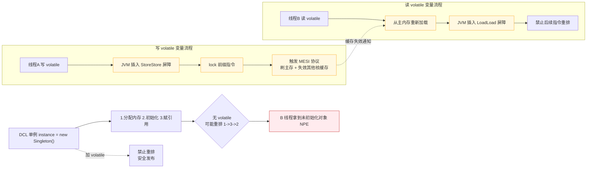

# volatile关键字的作用和原理是什么？

volatile 是 Java 的轻量级同步机制，提供三大核心保证：

**1. 可见性：**
- **原理**：JMM 定义了主内存与工作内存的交互模型。普通变量操作均在工作内存（CPU 缓存/寄存器），volatile 强制读写直接与主内存交互。
- **实现**：JVM 内存屏障（LoadLoad, LoadStore, StoreStore, StoreLoad）。在 x86 架构下，写操作会使用 `lock` 前缀指令（如 `lock addl $0x0`），该指令会触发 MESI 缓存一致性协议，将当前 CPU 缓存行立即写回主内存并使其他 CPU 核心该缓存行失效，确保其他线程读到的最新值。

**2. 禁止指令重排序：**
- **原理**：为了优化性能，编译器和 CPU 会改变指令执行顺序。volatile 读写前后插入内存屏障，禁止特定类型的重排。
- **经典应用（单例 DCL）**：
  ```java
  instance = new Singleton(); // 字节码层面分三步
  // 1. 分配对象内存空间
  // 2. 初始化对象
  // 3. 将 instance 引用指向内存地址
  ```
  若无 volatile，可能重排为 1->3->2。线程 A 执行完 3（未执行 2），线程 B 判断 instance 非空直接使用，导致报错（NPE）。

**3. 不保证原子性：**
- `i++` 操作包含：读、改、写三步。即便保证可见性，并发时两个线程同时读到旧值并分别回写，导致覆盖丢失。
- **边界条件**：仅当单一线程修改变量，或状态标志位本身逻辑无需原子复合操作时使用。

**## 实战案例**
在实际开发中，我曾遇到使用 `volatile` 修饰 `boolean running` 标志位来控制后台线程停止的场景。如果不加 volatile，在主线程修改标志位后，工作线程可能因 CPU 缓存一致性问题无法“看到”更新，导致线程无法正常停止，造成任务泄漏或死循环。

**## 代码示例**
```java
// 状态标记位模式：优于直接调用 interrupt() 的场景
public class VolatileExample {
    private volatile boolean shutdownRequested;

    public void shutdown() { shutdownRequested = true; }

    public void doWork() {
        while (!shutdownRequested) {
            // 业务逻辑
        }
    }
}
```

**## 对比表格**
| 特性 | volatile | synchronized |
| :--- | :--- | :--- |
| **原子性** | 不保证 | 保证 |
| **可见性** | 保证 | 保证 |
| **有序性** | 保证（禁止重排） | 保证（互斥锁自带有序性） |
| **阻塞/线程挂起** | 不会阻塞线程 | 会阻塞线程（涉及上下文切换） |
| **开销** | 较低（无锁） | 较高（重量级锁存在优化） |

**## 面试追问**
1. 为什么 volatile 不能保证原子性？JVM 层面是如何实现的内存屏障？
2. 64 位 JVM 中，对于 long 和 double 类型的 volatile 读写，原子性是如何保证的？（引出八原子性协定）
3. 既然 volatile 能保证可见性，为什么写 volatile 变量时，前面的普通变量操作也能对其他线程可见？（Happens-Before 规则）

**## 易错点**
1. **误用场景**：认为 `volatile int i` 可以替代 `AtomicInteger`，在高并发计数场景下会导致计算结果不准确（丢失更新）。
2. **依赖顺序性**：认为两个 volatile 变量的赋值操作具有绝对的顺序性，虽然禁止了重排序，但在极高并发下，相对于锁的互斥性，其逻辑控制仍较弱，不适合依赖复杂状态流转的场景。

---

**## 常见考点**
1. **synchronized 和 volatile 的区别？**（synchronized 保证可见性、原子性、可重入；volatile 仅保证可见性、有序性，且不可阻塞）。
2. **JMM 八大原子操作中，volatile 主要影响哪些？**（Lock/Unlock 主内存操作，Read/Load/Use/Assign/Store/Write 交互）。
3. **除了单例，还有哪些适用场景？**（读写锁的读状态标识、广播通知机制）。

### volatile 内存屏障与可见性原理




## 记忆要点

- 三大核心作用：保证可见性、禁止指令重排序，但不保证原子性。
- 底层原理：依赖内存屏障与CPU的lock指令触发MESI缓存一致性协议。
- DCL单例必加volatile，因为new对象分3步，防止指令重排导致拿到未初始化对象。
- 对比synchronized：volatile是轻量级无锁同步，不阻塞且无法替代原子计数操作。

## 结构化回答


**30 秒电梯演讲：** 就像写在白板上的通知，大家立刻看到，且不能乱涂乱改顺序。

**展开框架：**
1. **强制刷新主内存保证** — 强制刷新主内存保证可见性
2. **插入内存屏障** — 插入内存屏障禁止指令重排
3. **不保证原子性** — 不保证原子性（如i++需加锁）

**收尾：** 这是我实战中的理解，您想深入哪一段？


## 视频脚本

> 预计时长：4 分钟 | 由浅入深

| 时间 | 画面/字幕 | 口播台词 | 讲解要点 |
|------|----------|----------|----------|
| 0:00 | 标题卡：volatile关键字的作用和原理是什么 | 今天这道题：volatile关键字的作用和原理是什么。30 秒先给你讲清楚。 | 开场钩子 |
| 0:20 | 核心概念动画/示意图 | 就像写在白板上的通知，大家立刻看到，且不能乱涂乱改顺序。 | 核心概念 |
| 0:40 | 强制刷新主内存示意图 | 强制刷新主内存保证可见性 | 强制刷新主内存 |
| 1:10 | 插入内存屏障禁止指令重排示意图 | 插入内存屏障禁止指令重排 | 插入内存屏障禁止指令重排 |
| 1:40 | 总结卡 + 下期预告 | 记住今天这几个关键词，面试一定用得上。下期见。 | 收尾 |
