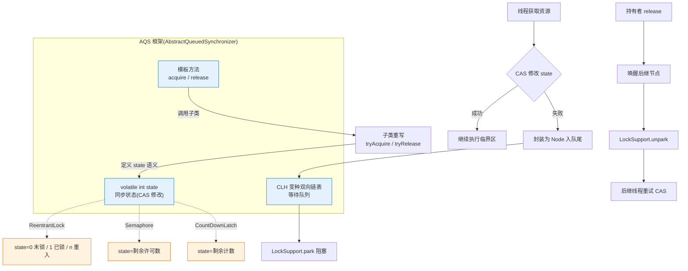

# 什么是AQS？

**AQS (AbstractQueuedSynchronizer)**

AQS 是 Java 并发包中锁机制的基础框架，全称为“抽象队列同步器”。

**核心概念：**
1. **同步状态**：使用一个 `volatile int state` 变量来表示资源的状态（如锁是否被占用、信号量剩余数量）。通过 CAS 操作保证修改的原子性。
2. **等待队列**：内部维护一个双向链表队列（CLH 队列的变种），用于管理获取资源失败的线程。线程会被封装成节点加入队列尾部进行阻塞等待。

**工作流程：**
- 线程尝试获取资源（修改 state），如果成功则继续执行。
- 如果失败，AQS 将线程封装成节点放入等待队列，并阻塞线程。
- 当持有资源的线程释放资源后，AQS 会唤醒队列中的一个或多个后继节点线程去尝试获取资源。

**应用：**
AQS 定义了一套模板方法，使用者继承它并重写 `tryAcquire`（尝试获取）和 `tryRelease`（尝试释放）等逻辑，即可快速实现自定义锁。`ReentrantLock`、`CountDownLatch` 等都是基于此实现。

**## 面试追问**
1. AQS 的队列是 FIFO（先进先出）的，那“非公平锁”是如何体现非公平性的？（体现在入队前先尝试 CAS 抢锁，而不是直接排队）
2. AQS 中的 `waitStatus` 字段有哪些取值？分别代表什么意义？（SIGNAL, CANCELLED, CONDITION, PROPAGATE, 0）
3. `ReentrantReadWriteLock` 是如何利用 AQS 实现读写共享的？（通过将 state 的高 16 位作为写锁计数，低 16 位作为读锁计数）

**## 易错点**
1. **阻塞机制**：认为 AQS 阻塞线程使用的是 `Thread.suspend()` 或 `wait()`，实际使用的是 `LockSupport.park()`（Unsafe 类）。
2. **模板方法**：认为子类直接操作队列，实际上子类只管理 `state`，队列管理（入队、出队、阻塞、唤醒）完全由 AQS 框架负责。

## 技术原理

AQS 的设计精髓是**"state + CLH 队列 + 模板方法"三位一体**，把"如何管理阻塞线程排队"这一通用逻辑下沉到框架，把"何时获取/释放资源"这一业务逻辑留给子类：

- **state 的语义由子类定义**：`volatile int state` 本身只是个整数，语义由子类赋予——在 `ReentrantLock` 里 state=0 未锁、state=1 已锁、state=2 重入两次；在 `Semaphore` 里 state=剩余许可数；在 `CountDownLatch` 里 state=还剩多少个计数。修改 state 用 `compareAndSetState`（CAS）保证原子性，`volatile` 保证可见性。
- **CLH 变种队列管理阻塞线程**：获取资源失败的线程被封装成 `Node` 加入双向链表尾部，并调用 `LockSupport.park()` 把自己挂起（不是 `Object.wait()` 也不是 `Thread.suspend()`）。前驱节点释放资源后，会调用 `LockSupport.unpark(后继线程)` 唤醒。双向链表的好处是支持取消节点时快速找到有效前驱。
- **公平 vs 非公平的体现**：
  - **非公平锁**（默认）：新线程获取锁时，先直接 CAS 尝试抢 state（"插队"），抢不到才入队。这牺牲了公平性但提升吞吐（减少线程切换）。
  - **公平锁**：新线程先检查队列里是否有前驱，有就老老实实排队，不插队。保证 FIFO 但吞吐略低。
- **模板方法模式**：AQS 定义了 `acquire`/`release` 等骨架方法（负责排队、阻塞、唤醒），子类只需重写 `tryAcquire`/`tryRelease`（定义获取/释放的判断逻辑），无需关心底层队列管理。这让 `ReentrantLock`、`Semaphore`、`CountDownLatch`、`ReentrantReadWriteLock` 都能基于同一套框架实现。

## 代码示例

基于 AQS 实现一个不可重入的自定义互斥锁：

```java
import java.util.concurrent.locks.AbstractQueuedSynchronizer;

public class SimpleMutex {
    // 内部 Sync 继承 AQS，只重写 tryAcquire/tryRelease
    private static class Sync extends AbstractQueuedSynchronizer {
        // 1. 尝试获取：CAS 把 state 从 0 改成 1
        @Override
        protected boolean tryAcquire(int arg) {
            if (compareAndSetState(0, 1)) {   // CAS 抢锁
                setExclusiveOwnerThread(Thread.currentThread());
                return true;
            }
            return false;   // 抢失败，AQS 框架会把这个线程入队阻塞
        }

        // 2. 尝试释放：state 从 1 改成 0
        @Override
        protected boolean tryRelease(int arg) {
            if (getState() == 0) {
                throw new IllegalMonitorStateException("未持有锁");
            }
            setExclusiveOwnerThread(null);
            setState(0);   // 释放，AQS 会唤醒队列后继节点
            return true;
        }

        @Override
        protected boolean isHeldExclusively() {
            return getExclusiveOwnerThread() == Thread.currentThread();
        }
    }

    private final Sync sync = new Sync();

    public void lock()    { sync.acquire(1); }      // 框架负责排队
    public void unlock()  { sync.release(1); }      // 框架负责唤醒
    public boolean tryLock() { return sync.tryAcquire(1); }
}

// 使用
SimpleMutex mutex = new SimpleMutex();
mutex.lock();
try {
    // 临界区
} finally {
    mutex.unlock();   // 必须在 finally 释放
}
```

```java
// ReentrantReadWriteLock 用 state 的高低位分离读写：
// state 高 16 位 = 共享读锁计数，低 16 位 = 独占写锁计数
// 读锁用 acquireShared（可多线程同时持有），写锁用 acquireExclusive（独占）
```

## 注意事项

- **阻塞用的是 LockSupport.park()，不是 wait()/suspend()**：`park()` 基于线程许可机制，能响应中断、支持超时，比 `Object.wait()`（需 synchronized）和 `Thread.suspend()`（易死锁，已废弃）更安全。
- **子类只管 state，队列由框架管**：常见误区是以为子类要直接操作队列节点。实际上子类只重写 `tryAcquire`/`tryRelease` 决定 state 语义，入队、阻塞、唤醒全由 AQS 的 `acquire`/`release` 骨架处理。
- **非公平锁吞吐更高是默认选择**：非公平锁允许新线程插队，减少了线程切换开销，吞吐通常比公平锁高。除非业务严格要求 FIFO（如限流公平排队），否则用默认的非公平锁。
- **state 是 volatile + CAS，不是 synchronized**：AQS 用乐观并发（CAS）而非悲观锁（synchronized）修改 state，这是它高性能的基础。但要注意 CAS 自旋在高竞争下会浪费 CPU。

### AQS 核心结构图



## 记忆要点

- 一句话定义：Java并发包中实现锁与同步器的核心基础框架。
- 核心状态：volatile int state代表同步状态，通过CAS保证修改原子性。
- 核心队列：CLH变种双向链表，负责封装与阻塞获取资源失败的线程。
- 设计模式：采用模板方法，使用者重写tryAcquire/tryRelease即可，无需关心底层排队。

## 结构化回答


**30 秒电梯演讲：** 就像红绿灯控制系统(state)，控制车辆(线程)通行，没通行的就在队列排队。

**展开框架：**
1. **state变** — state变量标识资源状态
2. **CLH** — CLH队列管理阻塞线程
3. **模板方法模式** — 模板方法模式，由子类定义获取释放逻辑

**收尾：** 这是我实战中的理解，您想深入哪一段？


## 视频脚本

> 预计时长：4 分钟 | 由浅入深

| 时间 | 画面/字幕 | 口播台词 | 讲解要点 |
|------|----------|----------|----------|
| 0:00 | 标题卡：什么是AQS | 今天这道题：什么是AQS。30 秒先给你讲清楚。 | 开场钩子 |
| 0:20 | 核心概念动画/示意图 | 就像红绿灯控制系统(state)，控制车辆(线程)通行，没通行的就在队列排队。 | 核心概念 |
| 0:40 | state变量示意图 | state变量标识资源状态 | state变量 |
| 1:10 | CLH队列示意图 | CLH队列管理阻塞线程 | CLH队列 |
| 1:40 | 总结卡 + 下期预告 | 记住今天这几个关键词，面试一定用得上。下期见。 | 收尾 |
