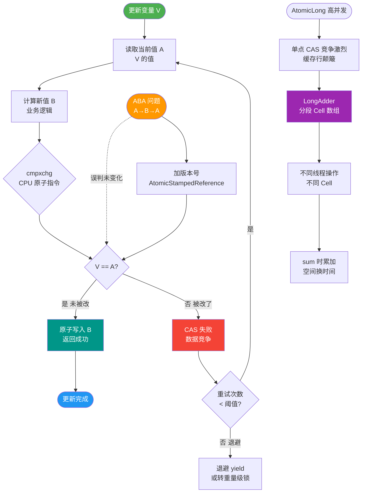
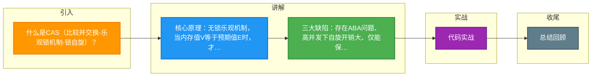

# 什么是CAS（比较并交换-乐观锁机制-锁自旋）？

CAS（Compare And Swap，比较并交换）是一种无锁的原子操作，是乐观锁的核心实现。

**原理：**
CAS(V, Expected, New)：如果内存位置 V 的值等于 Expected，则把它更新为 New，否则什么都不做。整个操作由 CPU 的 `cmpxchg` 指令保证原子性，属于硬件级支持。

**Java 实现：**
- 底层依赖 `sun.misc.Unsafe` 类（直接操作内存偏移量），调用 `compareAndSwapInt`/`compareAndSwapObject`（本地方法 JNI 调用 CPU 指令）。
- JUC 的 `AtomicInteger.compareAndSet()`、`AtomicReference` 都基于它。
- AQS 的 state 修改、ConcurrentHashMap 的节点插入都用 CAS。

**三大问题及解决：**
1. **ABA 问题**：值从 A→B→A，CAS 检测不到。
   - **解决**：加版本号/时间戳。Java 提供 `AtomicStampedReference<V>`，比较时同时比较引用和版本号。
2. **自旋开销（CPU 飙升）**：竞争激烈时 CAS 反复失败重试，浪费 CPU。
   - **解决**：限制自旋次数（如 Java 8 LongAdder 分段累加），或让出 CPU（`Thread.yield()`）。
3. **只能保证单变量原子性**：多变量需加锁或用 AtomicReference 封装。
   - **解决**：将多个变量封装在一个对象里，使用 AtomicReference 更新对象引用。

**## 实战案例**
在开发高并发计数器时，最初使用 `AtomicInteger`，在 QPS 极高时出现 CPU 飙升但吞吐量上不去的情况。这是因为多个线程在 CPU 层面频繁竞争同一个缓存行进行 CAS 自旋。后来改用 `LongAdder`，通过分散热点到多个 Cell（类似于分段锁），利用空间换时间，显著降低了冲突，性能提升了数倍。

**## 代码示例**
```java
// 模拟 AtomicInteger 的 CAS 自增逻辑
public class CasCounter {
    private volatile int count = 0;
    // Unsafe 模拟 (实际直接使用 Atomic 类)
    public void increment() {
        int expected, newValue;
        do {
            expected = count;          // 1. 读取
            newValue = expected + 1;   // 2. 计算
            // 3. CAS (如果内存值是 expected，则更新为 newValue，否则重试)
        } while (!compareAndSwap(expected, newValue));
    }
    private native boolean compareAndSwap(int expect, int update);
}
```

**## 对比表格**
| 维度 | CAS (乐观锁) | synchronized (悲观锁) |
| :--- | :--- | :--- |
| **核心机制** | 无锁，自旋重试 | 监视器，阻塞挂起 |
| **适用场景** | 并发冲突低，短时间操作 | 并发冲突高，长时间持有 |
| **CPU 开销** | 冲突高时持续消耗 CPU | 挂起线程不占 CPU，但唤醒有开销 |
| **ABA 问题** | 存在 | 不存在 |
| **实现层级** | 硬件指令 (`cmpxchg`) | JVM 内置对象头，依赖 OS Mutex |

**CAS 执行流程图：**

```text
        [内存值 V]
            ^
            | (读取)
            |
+-----------+-----------+
|     线程执行 CAS     |
+-----------+-----------+
            |
    +-------+-------+
    | V == Expected? |
    +-------+-------+
      /           \
    Yes            No
    /              \
[更新为 New]    [循环重试/失败]
```

**## 面试追问**
1. 在多核 CPU 系统中，CAS 操作是否一定会导致缓存一致性流量？（是的，通常伴随着 `lock` 前缀指令，会导致总线锁定或缓存行锁定）
2. Java 9+ 对 `Unsafe` 的 CAS 做了什么替代方案？（引入了 `VarHandle`，提供更标准的内存访问和原子操作句柄）
3. 如果循环时间过长导致 CAS 始终失败，除了 `LongAdder` 还有哪些优化策略？（自适应自旋、锁消除、锁粗化）

**## 易错点**
1. **原子性范围**：误认为 CAS 能保证代码块的原子性，它只能保证一个共享变量操作的原子性，复合操作（如 check-then-act）仍需同步处理。
2. **完全无锁**：认为 `AtomicInteger` 是完全无锁的，在高并发极端情况下，其底层的 CAS 自旋也是一种“忙等待”，虽然比挂起线程轻量，但并非零开销。


## 核心流程图



## 记忆要点

- 核心原理：无锁乐观机制，当内存值V等于预期值E时，才更新为新值N（硬件级原子指令）。
- 三大缺陷：存在ABA问题、高并发下自旋开销大、仅能保证单个变量的原子性。
- ABA解决：引入版本号机制，Java提供AtomicStampedReference。
- 高并发优化：AtomicInteger自旋竞争大，极高并发计数推荐使用LongAdder（分段CAS空间换时间）。

## 结构化回答


**30 秒电梯演讲：** 就像改文件名前先看还是不是原名，是就改，不是就重来。

**展开框架：**
1. **CPU** — 无锁算法，依赖CPU原子指令
2. **通过比较并更** — 通过比较并更新保证并发一致性
3. **ABA** — 存在ABA问题，可用版本号解决

**收尾：** 这是我实战中的理解，您想深入哪一段？


## 视频脚本

> 预计时长：4 分钟 | 由浅入深

| 时间 | 画面/字幕 | 口播台词 | 讲解要点 |
|------|----------|----------|----------|
| 0:00 | 标题卡：什么是CAS（比较并交换-乐观锁机制-锁自旋） | 今天这道题：什么是CAS（比较并交换-乐观锁机制-锁自旋）。30 秒先给你讲清楚。 | 开场钩子 |
| 0:20 | 核心概念动画/示意图 | 就像改文件名前先看还是不是原名，是就改，不是就重来。 | 核心概念 |
| 0:40 | 无锁算法示意图 | 无锁算法，依赖CPU原子指令 | 无锁算法 |
| 1:10 | 比较并更新示意图 | 通过比较并更新保证并发一致性 | 比较并更新 |
| 1:40 | 总结卡 + 下期预告 | 记住今天这几个关键词，面试一定用得上。下期见。 | 收尾 |

### 视频流程图



