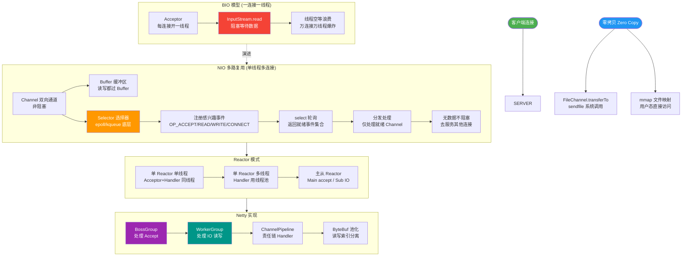

# 什么是IO复用？

### Linux 基础概念

1. **多任务**：多个任务同时执行，分为并发（交替执行）和并行（同时执行）。
2. **SMP (对称多处理)**：多个 CPU 地位平等，共享内存和硬件资源。
3. **ELF (可执行文件链接格式)**：Linux 中可执行文件的存储格式。
4. **宏内核**：系统内核的所有模块（调度、内存、驱动等）都运行在内核态，拥有最高权限。

### I/O 复用详解

#### 1. I/O 操作的两个阶段
1. **等待数据准备好**：数据从网络或磁盘读取到内核缓冲区。
2. **将数据从内核复制到用户空间**：内核缓冲区复制到应用进程缓冲区。

#### 2. 五种 I/O 模型

1. **阻塞式 I/O**：
   - 进程调用 `recvfrom` 后阻塞，直到数据复制完成。
   - 优点：简单，CPU 不忙等；缺点：并发能力低。

2. **非阻塞式 I/O**：
   - 进程调用 `recvfrom` 后立即返回，未准备好返回错误。
   - 进程需不断轮询内核，直到数据准备好。
   - 缺点：占用大量 CPU 资源。

3. **I/O 复用**：
   - 进程阻塞在 `select`/`poll` 系统调用上，而不是阻塞在具体的 I/O 操作上。
   - `select` 可以监听多个文件描述符，任一描述符就绪时返回，然后进程调用 `recvfrom` 读取数据。
   - 优点：可以等待多个描述符就绪。

4. **信号驱动式 I/O**：
   - 进程安装信号处理函数后继续执行，数据准备好时内核发送 `SIGIO` 信号通知进程。
   - 优点：等待期间不阻塞。

5. **异步 I/O (AIO)**：
   - 进程告知内核启动操作，内核完成后通知进程。
   - 与信号驱动的区别：异步 I/O 是内核通知操作“完成”，信号驱动是通知“可以启动操作”。

#### 3. 同步 I/O vs 异步 I/O
- **同步 I/O**：导致请求进程阻塞，直到 I/O 操作完成（包括数据复制阶段）。前四种模型均为同步 I/O。
- **异步 I/O**：不导致请求进程阻塞。

#### 4. I/O 复用机制

1. **select**：
   - 将 fd 集合从用户态拷贝到内核态，内核线性遍历检查。
   - 限制：fd 数量限制（通常 1024），每次都需要线性遍历，开销大。

2. **poll**：
   - 使用链表存储 fd，解决了数量限制。
   - 仍需线性遍历，效率问题依旧。

3. **epoll**：
   - 事件驱动，只返回就绪的 fd，无需遍历。
   - 支持水平触发（LT）和边缘触发（ET），效率高。

#### I/O 模型阶段示意图

```text
┌──────────┐                           ┌─────────────┐
│ 应用程序 │                           │    内核     │
└─────┬────┘                           └──────┬──────┘
      │                                     │
      │  1. recvfrom (系统调用)              │
      │------------------------------------->│
      │                                     │  2. 等待数据到达网卡
      │           (阻塞中)                  │     并拷贝到内核缓冲区
      │                                     │
      │          <-------------------------│  3. 数据准备好，唤醒进程
      │                                     │
      │  4. recvfrom 返回 (数据从内核拷贝到用户态)
      │<-------------------------------------│
      │                                     │

【多路复用特例】
步骤 1 变为：应用程序调用 select/poll/epoll_wait，并传入关注的 fd 列表。
步骤 2 变为：内核监控这些 fd，任一就绪即返回。
步骤 3 变为：select 返回，应用程序再次调用 recvfrom，此时数据已准备好，
步骤 4 变为：recvfrom 迅速拷贝数据并返回（此过程同步阻塞）。
```

### ## 面试追问
1. **epoll 的底层实现**：epoll 在内核中使用了红黑树来管理监听的 fd，使用就绪链表来存储就绪的 fd。请详细描述 `epoll_ctl` 和 `epoll_wait` 的大致内核动作。为什么在高并发下 epoll 的性能优于 select 和 poll？
2. **惊群效应**：在多线程/多进程服务器中，若多个线程/进程都阻塞在同一个 accept 或 epoll_wait 上，当连接到来时，所有进程都被唤醒但只有一个能处理，这叫惊群效应。Linux 是如何解决这个问题的（如 EPOLLEXCLUSIVE、SO_REUSEPORT）？
3. **边缘触发的边界条件**：使用 ET 模式时，如果客户端发送了 100k 数据，但只读取了 50k 就退出了循环（或者缓冲区满了），会发生什么？应该如何编程避免这种情况？

### ## 易错点
1. **I/O 复用的归属**：虽然 I/O 复用可以处理多个连接，但它在分类上属于**同步 I/O**，而非异步 I/O。因为第二步“数据拷贝”依然是同步阻塞进行的（应用进程参与拷贝）。
2. **select 的 1024 限制**：很多人误以为 select 限制是操作系统层面的硬限制。实际上这个限制通常是编译时常量 `FD_SETSIZE`（默认 1024）。修改并重新编译内核可以改变这个值，但性能会因线性遍历进一步下降。


## 核心流程图



## 记忆要点

- IO分两阶段：等数据到达内核缓冲区，再从内核缓冲区拷贝到用户空间。
- 多路复用只优化第一阶段的等待，让单线程能监听多个fd的就绪状态。
- select/poll需线性遍历且拷贝fd，而epoll基于事件驱动直接返回就绪列表。
- 核心区分：前四种IO模型（含多路复用）均为同步IO，因为数据拷贝阶段仍需阻塞。

## 结构化回答

**30 秒电梯演讲：** 以前一个服务员只管一桌（BIO），现在一个服务员在大厅盯着所有桌子，谁举手就过去服务。

**展开框架：**
1. **IO过程分两步** — IO过程分两步：等待数据准备、数据拷贝。
2. **IO复用阻塞** — IO复用阻塞在select调用上，而非具体IO操作，可监听多路。
3. **epoll性能最优** — epoll性能最优，采用事件驱动，避免无差别轮询。

**收尾：** 这块我踩过一些坑，您想深入聊哪一段——原理细节、实战案例还是常见踩坑？

## 视频脚本

> 预计时长：4 分钟 | 由浅入深

| 时间 | 画面/字幕 | 口播台词 | 讲解要点 |
|------|----------|----------|----------|
| 0:00 | 标题卡：什么是IO复用 | 今天这道题：什么是IO复用。30 秒先给你讲清楚。 | 开场钩子 |
| 0:20 | 核心概念动画/示意图 | 以前一个服务员只管一桌（BIO），现在一个服务员在大厅盯着所有桌子，谁举手就过去服务。 | 核心概念 |
| 0:40 | IO过程分两步示意图 | IO过程分两步：等待数据准备、数据拷贝。 | IO过程分两步 |
| 1:10 | IO复用阻塞示意图 | IO复用阻塞在select调用上，而非具体IO操作，可监听多路。 | IO复用阻塞 |
| 1:40 | 总结卡 + 下期预告 | 记住今天这几个关键词，面试一定用得上。下期见。 | 收尾 |

---

## 延伸：什么是IO多路复用？

> 合并自 `conc-071`（相似度 74%）

IO 多路复用（IO Multiplexing）是一种用单个线程同时监听多个 IO 文件描述符的机制，是高性能网络服务器（Nginx、Redis、Netty）的基础。

**工作原理：**
线程把关心的多个 fd 注册到一个多路复用器，然后阻塞等待；当任一 fd 就绪（可读/可写/异常），多路复用器返回就绪 fd 列表，线程逐个处理。

**三种实现：**
1. **select**：最早的实现，fd 数量限制（默认 1024），每次线性遍历所有 fd，O(n)。
2. **poll**：去掉 fd 数量限制，但仍是 O(n) 遍历。
3. **epoll**：事件驱动，只返回就绪的 fd，O(1)，支持边缘触发（ET）和水平触发（LT），是当前主流。

**Java NIO 的 Selector** 底层在 Linux 就是 epoll。Netty、Redis（单线程+epoll 处理百万连接）都用它。相比「一个连接一个线程」的阻塞 IO，多路复用让单线程能管理海量连接。

#### 多路复用 Reactor 线程模型架构图

```text
                  ┌─────────────────────────────────────┐
                  │         多路复用器                  │
                  │        (Selector / Epoll)           │
                  └──────────────┬──────────────────────┘
                                 │
                 ┌───────────────┼───────────────┐
                 │ 注册/监听     │ 就绪通知       │
                 ▼               ▼               ▼
         ┌───────────┐    ┌───────────┐    ┌───────────┐
         │ Socket Ch1│    │ Socket Ch2│    │ Socket Ch3│
         └───────────┘    └───────────┘    └───────────┘
                                 │
                                 ▼
                  ┌───────────────────────────────────────┐
                  │           单线程处理循环               │
                  │  1. Selector.select() (阻塞)          │
                  │  2. 获取 SelectedKeys (就绪集合)      │
                  │  3. 遍历 Key，处理 Read/Write 事件    │
                  └───────────────────────────────────────┘
```

### ## 常见考点
1. **Netty 的 EventLoop 原理**：如何利用多路复用实现无锁串行化任务处理。
2. **空轮询 Bug (Java NIO epoll)**：JDK NIO 在 Linux 下 `Selector.select()` 可能会无限空转，Netty 是如何解决的（通过构建新的 Selector）。
3. **单线程 Redis 为何快**：除了内存操作外，IO 多路复用避免了多线程上下文切换开销。

### ## 面试追问
1. **Reactor 模式的演进**：请描述单 Reactor 单线程、单 Reactor 多线程、主从 Reactor 多线程三种模型的区别。Netty 默认使用的是哪一种？为什么要这样设计？
2. **文件描述符耗尽处理**：在使用 epoll 处理海量连接时，如果单机连接数接近 `ulimit -n` 的上限，系统会有什么表现？如何进行监控和预防？
3. **水平触发与边缘触发的选择**：在 Netty 中，默认使用的是 Level Triggered 还是 Edge Triggered？如果在 Redis 中改用 ET 模式，会带来哪些编程上的复杂性？

### ## 易错点
1. **多路复用 vs 多线程并发**：多路复用并不是真正的“并行”处理 I/O，它只是解决了“等待”和“通知”的问题。数据的实际读写操作依然是由一个（或少量）线程串行处理的。如果某个连接的业务逻辑非常耗时（如复杂计算），会阻塞后续连接的处理，导致“队头阻塞”。
2. **O(1) 的前提条件**：说 epoll 是 O(1) 是建立在“活跃连接数较少”的前提下的。如果所有连接同时活跃（例如所有的 fd 同时就绪），epoll 依然需要处理所有就绪事件，此时的复杂度取决于活跃连接数 O(M)。

## 记忆要点

- 核心目的：用单线程同时监听海量文件描述符，解决阻塞模型的多线程切换开销。
- select/poll采用线性遍历O(n)，epoll采用事件驱动回调，只处理活跃fd。
- 注意：多路复用是并发处理事件，而非多线程并行，耗时业务逻辑仍会阻塞整个线程。
- epoll的O(1)前提是活跃连接数少；若全部活跃，复杂度退化为O(M)。

## 结构化回答

**30 秒电梯演讲：** 好比在大厅办事，不是每个窗口派专人守着，而是设一个总台，谁叫号就通知办事员处理谁。

**展开框架：**
1. **核心** — 核心是单线程管理多连接，避免线程频繁切换开销。
2. **Linux下epoll最主流** — Linux下epoll最主流，性能最优（事件驱动、O(1)）。
3. **广泛用于高并发场景如** — 广泛用于高并发场景如Nginx、Redis、Netty。

**收尾：** 这块我踩过一些坑，您想深入聊哪一段——原理细节、实战案例还是常见踩坑？

## 视频脚本

> 预计时长：4 分钟 | 由浅入深

| 时间 | 画面/字幕 | 口播台词 | 讲解要点 |
|------|----------|----------|----------|
| 0:00 | 标题卡：什么是IO多路复用 | 今天这道题：什么是IO多路复用。30 秒先给你讲清楚。 | 开场钩子 |
| 0:20 | 核心概念动画/示意图 | 好比在大厅办事，不是每个窗口派专人守着，而是设一个总台，谁叫号就通知办事员处理谁。 | 核心概念 |
| 0:40 | 核心示意图 | 核心是单线程管理多连接，避免线程频繁切换开销。 | 核心 |
| 1:10 | Linux下epoll最主流示意图 | Linux下epoll最主流，性能最优（事件驱动、O(1)）。 | Linux下epoll最主流 |
| 1:40 | 总结卡 + 下期预告 | 记住今天这几个关键词，面试一定用得上。下期见。 | 收尾 |
