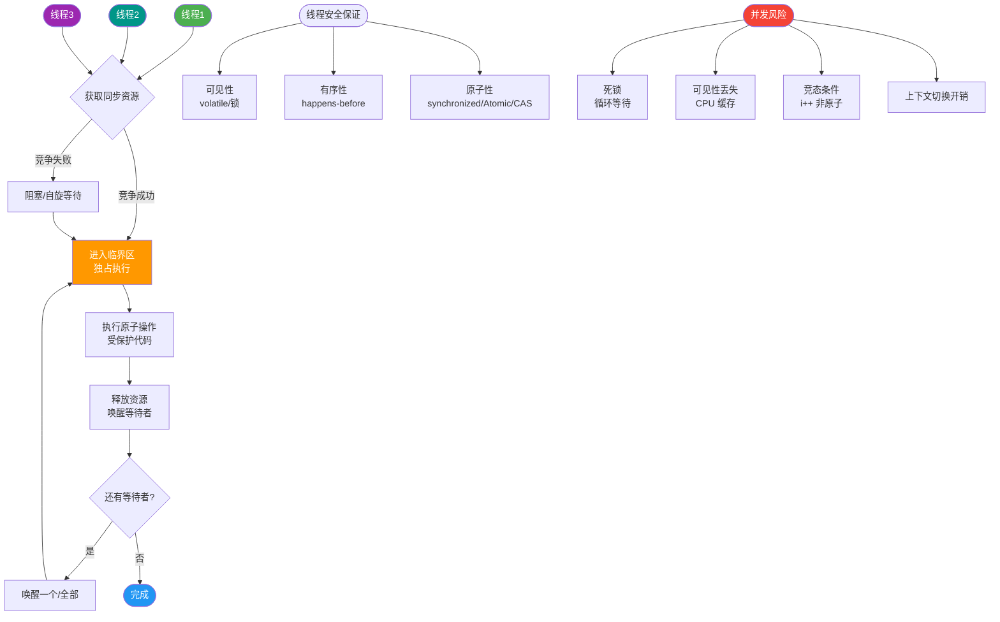

# 什么是Linux？

### Linux 输入工作原理

当键盘按下时，硬件中断触发，CPU 获取扫描码并转换为 ASCII 码存入缓冲队列 `read_que`，等待上层程序读取。

### I/O 多路复用

I/O 多路复用允许单个进程同时监视多个文件描述符（FD），当某个 FD 就绪（可读/可写）时立即响应。

#### 三种机制对比：
1. **select**：
   - 机制：使用位图表示 FD 集合，每次调用需将集合从用户态拷贝到内核态，内核遍历检查。
   - 缺点：FD 数量受限（通常 1024），线性遍历效率低（O(n)），每次调用需重置集合。

2. **poll**：
   - 机制：使用链表（结构体数组）传递 FD，解决了数量限制。
   - 缺点：仍需线性遍历，效率随 FD 数量增加而下降。

3. **epoll** (Linux 特有，主流)：
   - 机制：事件驱动。在内核中维护一棵红黑树和一张就绪链表。`epoll_ctl` 注册事件，`epoll_wait` 仅返回就绪的 FD。
   - 优点：效率高（O(1)），支持海量连接，FD 数量无限制。
   - 模式：支持水平触发（LT）和边缘触发（ET）。

```text
+-------------------+      +-------------------+
|   User Process    |      |   Kernel Space    |
+-------------------+      +-------------------+
| epoll_ctl (add)   | ---> |  Red-Black Tree   |
|                   |      |  (Monitor all FDs)|
|                   |      +---------+---------+
|                   |                |
| epoll_wait (block)| <---------------+
|                   |      Event Triggered
| (Active FD List)  | <---+------+----+
|                   |      |      |    |
| process events    |      |  Ready List |
+-------------------+      +-------------+
```

### Linux 内存管理

#### 进程内存段布局（从低地址到高地址）：
1. **代码段**：存放二进制指令，只读。
2. **已初始化数据段**：已初始化的全局变量和静态变量。
3. **未初始化数据段 (BSS)**：未初始化的全局变量和静态变量。
4. **堆段**：动态分配的内存（如 `malloc`），向上增长。
5. **文件映射段**：动态库、共享内存等。
6. **栈段**：局部变量、函数调用上下文，向下增长（通常 8MB）。

```text
High Addresses
+------------------+
|      Kernel      |
+------------------+
|        Stack     |  <-- v
|         |        |
|         |        |
|         v        |
|      (Gap)       |
|         ^        |
|         |        |  --> ^ (Memory Map)
|        Heap      |
+------------------+
|      BSS         |
+------------------+
|      Data        |
+------------------+
|      Text        |
+------------------+
Low Addresses (0x0)
```

#### 虚拟内存
- 每个进程都有独立的 4GB（32位）虚拟地址空间，通过页表映射到物理内存。
- **MMU**（内存管理单元）负责硬件层面的地址转换。
- **分页**：内存按页（通常 4KB）管理，通过缺页异常处理页面换入换出，减少内存碎片。

### 分页机制详解
- **TLB (Translation Lookaside Buffer)**：页表的高速缓存，用于加速虚拟地址到物理地址的转换。TLB 命中率高则性能好，缺失时需访问内存中的页表。
- **缺页中断**：当访问的页面不在物理内存中时，触发缺页中断，操作系统将磁盘数据加载到内存，更新页表。

## 常见考点
1. **中断与轮询的区别**：中断是异步通知，轮询是主动查询，中断效率更高。
2. **Epoll 的 ET 和 LT 模式区别**：LT 是水平触发（只要未处理就会一直通知），ET 是边缘触发（只在状态变化时通知一次，需非阻塞读写）。
3. **堆和栈的区别**：栈由系统自动分配释放，堆由程序员分配释放（Java 中由 GC 回收）；栈空间小速度快，堆空间大速度慢。
4. **虚拟内存的优势**：隔离性（进程互不干扰）、物理内存利用率高（只加载需要的页）。


## 核心流程图



## 记忆要点

- IO多路复用：select/poll需线性遍历且有上限，epoll事件驱动O(1)且无连接限制。
- epoll底层结构：红黑树管理监听fd，就绪链表存放活跃fd。
- 虚拟内存核心：MMU负责地址转换，通过分页机制和缺页中断实现内存按需分配。
- 内存布局对比：栈由系统自动分配速度快，堆由程序员控制空间大速度慢。

## 结构化回答

**30 秒电梯演讲：** 虚拟内存像给每个进程画的假地图（地址空间），多路复用像只处理有事的客户，epoll是智能叫号机。

**展开框架：**
1. **内存分代码** — 内存分代码、数据、堆、栈等段，堆向上长栈向下长。
2. **虚拟内存** — 虚拟内存通过页表映射物理内存，MMU负责转换。
3. **epoll** — epoll是最高效的IO复用，利用事件通知避免轮询。

**收尾：** 这块我踩过一些坑，您想深入聊哪一段——原理细节、实战案例还是常见踩坑？

## 视频脚本

> 预计时长：4 分钟 | 由浅入深

| 时间 | 画面/字幕 | 口播台词 | 讲解要点 |
|------|----------|----------|----------|
| 0:00 | 标题卡：什么是Linux | 今天这道题：什么是Linux。30 秒先给你讲清楚。 | 开场钩子 |
| 0:20 | 核心概念动画/示意图 | 虚拟内存像给每个进程画的假地图（地址空间），多路复用像只处理有事的客户，epoll是智能叫号机。 | 核心概念 |
| 0:40 | 内存分代码示意图 | 内存分代码、数据、堆、栈等段，堆向上长栈向下长。 | 内存分代码 |
| 1:10 | 虚拟内存示意图 | 虚拟内存通过页表映射物理内存，MMU负责转换。 | 虚拟内存 |
| 1:40 | 总结卡 + 下期预告 | 记住今天这几个关键词，面试一定用得上。下期见。 | 收尾 |
