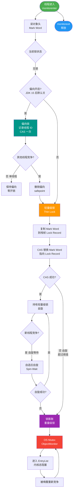

# 什么是Synchronized？

synchronized 是 Java 内置的关键字，用于实现线程同步（互斥锁），基于对象的 monitor（监视器）实现。

**三种用法：**
1. 修饰实例方法：锁的是当前对象实例。
2. 修饰静态方法：锁的是当前类的 Class 对象。
3. 修饰代码块：锁的是括号里指定的对象。

**底层原理：**
- 字节码层面：同步块用 `monitorenter`/`monitorexit` 指令；同步方法在方法表的 ACC_SYNCHRONIZED 标志。
- 锁信息存在对象头的 Mark Word 中。
- monitor 基于 OS 的 Mutex Lock（ObjectMonitor），重量级锁会 park/unpark 线程（用户态↔内核态切换，开销大）。

**JDK 1.6 锁优化（锁升级）：**
无锁 → 偏向锁（单线程访问，记下线程 ID）→ 轻量级锁（CAS 自旋）→ 重量级锁（OS Mutex）。还有自旋锁、锁消除（逃逸分析证明无竞争）、锁粗化（合并相邻同步块）。

```text
+-------------------+--------------------------+--------------------------+
|      Lock State   |       Mark Word (32bit)  |       Mark Word (64bit)  |
+-------------------+--------------------------+--------------------------+
|      Unused       |    25 bits hashcode      |    31 bits hashcode      |
|                   |    4 bits age            |    4 bits age            |
|                   |    1 bit biased          |    1 bit biased          |
|                   |    2 bits lock=01        |    2 bits lock=01        |
+-------------------+--------------------------+--------------------------+
|      Biased       |    23 bits thread_id     |    54 bits thread_id     |
|                   |    2 bits epoch          |    2 bits epoch          |
|                   |    4 bits age            |    4 bits age            |
|                   |    1 bit biased=1        |    1 bit biased=1        |
|                   |    2 bits lock=01        |    2 bits lock=01        |
+-------------------+--------------------------+--------------------------+
|   Lightweight     |    30 bits ptr to        |    62 bits ptr to        |
|                   |    Lock Record in Stack  |    Lock Record in Stack  |
|                   |    2 bits lock=00        |    2 bits lock=00        |
+-------------------+--------------------------+--------------------------+
|    Heavyweight    |    30 bits ptr to        |    62 bits ptr to        |
|                   |    Monitor (ObjectMutex) |    Monitor (ObjectMutex) |
|                   |    2 bits lock=10        |    2 bits lock=10        |
+-------------------+--------------------------+--------------------------+
```

### Monitor 机制
- **_owner**：持有锁的线程。
- **_count**：重入次数。
- **_WaitSet**：调用 `wait()` 的线程进入此队列，等待被 `notify()` 唤醒。
- **_EntryList**：处于阻塞状态等待获取锁的线程队列。

## 常见考点
1. **Synchronized 与 ReentrantLock 的区别**：前者是关键字，JVM层面实现，自动释放锁；后者是API层面，需手动释放，支持公平锁、可中断锁等更灵活的功能。
2. **偏向锁的撤销**：当有其他线程竞争偏向锁时，偏向锁会撤销升级为轻量级锁；偏向锁在Java 15+默认是关闭的（-XX:+UseBiasedLocking）。
3. **自旋锁的优缺点**：优点是避免挂起线程（上下文切换），缺点是如果锁竞争激烈会浪费CPU资源。自旋次数由 `-XX:PreBlockSpin` 控制（JDK1.7后自适应）。


## 核心流程图



## 记忆要点

- 三种锁范围：实例方法锁对象，静态方法锁Class，代码块锁指定括号对象。
- 底层实现：代码块靠monitorenter/exit指令，方法靠ACC_SYNCHRONIZED标志。
- 锁信息位置：存储在对象头的Mark Word中（含hashcode、GC年龄、锁状态）。
- JDK1.6优化：引入偏向锁、轻量级锁、自旋锁，以及锁消除和锁粗化机制。

## 结构化回答

**30 秒电梯演讲：** 像上厕所，synchronized就是门锁，有人进去了锁上，其他人只能等。升级就是从插根棍子（偏向）到正式挂锁（重量级）。

**展开框架：**
1. **用法分三类** — 用法分三类：实例方法、静态方法、代码块。
2. **底层依赖Monitor** — 底层依赖Monitor，涉及对象头Mark Word。
3. **JDK1.6后有锁升级** — JDK1.6后有锁升级优化：偏向->轻量->重量。

**收尾：** 这块我踩过一些坑，您想深入聊哪一段——原理细节、实战案例还是常见踩坑？

## 视频脚本

> 预计时长：4 分钟 | 由浅入深

| 时间 | 画面/字幕 | 口播台词 | 讲解要点 |
|------|----------|----------|----------|
| 0:00 | 标题卡：什么是Synchronized | 今天这道题：什么是Synchronized。30 秒先给你讲清楚。 | 开场钩子 |
| 0:20 | 核心概念动画/示意图 | 像上厕所，synchronized就是门锁，有人进去了锁上，其他人只能等。升级就是从插根棍子（偏向）到正式挂锁（重量级）。 | 核心概念 |
| 0:40 | 用法分三类示意图 | 用法分三类：实例方法、静态方法、代码块。 | 用法分三类 |
| 1:10 | 底层依赖Monitor示意图 | 底层依赖Monitor，涉及对象头Mark Word。 | 底层依赖Monitor |
| 1:40 | 总结卡 + 下期预告 | 记住今天这几个关键词，面试一定用得上。下期见。 | 收尾 |
