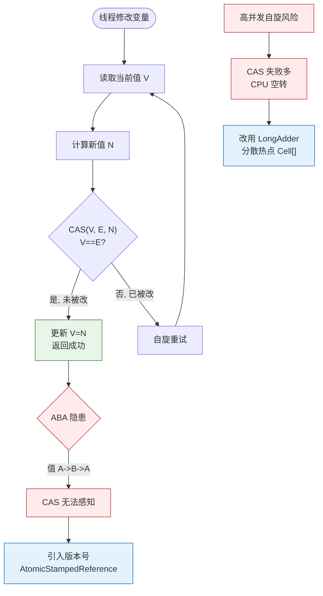

# 什么是乐观锁？它的实现原理是什么？

### 数据库并发策略

数据库在并发环境下通常采用三种策略来控制事务间的冲突，保证数据的一致性：

1. **乐观锁**：
   - **思想**：假设并发冲突概率很低，事务在执行时直接处理数据，提交时检查数据是否被修改过。
   - **实现**：通常使用 **版本号机制** 或 **CAS (Compare And Swap)** 算法。
     - **版本号**：给数据表增加一个版本号字段，每次更新版本号 +1。提交时比对读取时的版本号，若一致则更新，否则失败重试。
   - **适用场景**：读多写少，竞争不激烈的场景。

2. **悲观锁**：
   - **思想**：假设并发冲突概率很高，事务在读取数据时直接加锁，直到事务结束才释放，期间其他事务无法修改。
   - **实现**：数据库的行锁、表锁、`SELECT ... FOR UPDATE` 等。
   - **适用场景**：写多读少，竞争激烈的场景。

3. **时间戳**：
   - **思想**：不加锁，通过给数据记录打时间戳来判断操作的先后顺序，解决冲突。
   - **适用场景**：特定场景下的简单并发控制，现代数据库中较少直接作为主要锁机制使用。

### 乐观锁的实现细节

#### 1. CAS (Compare And Swap)
CAS 是一种无锁算法，包含三个操作数：内存值(V)、预期原值(A)和新值(B)。
- **执行过程**：仅当 V == A 时，处理器才会将 V 更新为 B，否则不做任何操作。
- **ABA 问题**：如果变量 V 初次读取时是 A，被其他线程改为了 B，又被改回了 A，CAS 无法感知。
  - **解决**：加入版本号（Version 1 -> 2 -> 3），MySQL InnoDB 的 MVCC 机制即基于此。

#### 2. 版本号机制 SQL 示例
```sql
-- 读取数据
SELECT id, name, version FROM products WHERE id=1;

-- 更新数据（带版本检查）
UPDATE products 
SET name = 'New Name', version = version + 1 
WHERE id=1 AND version = ${oldVersion};

-- 检查受影响行数，如果为 0 则说明更新失败（已被修改），需重试
```

### 相关概念补充

*   **事务的隔离性**：事务之间互不干扰，一个事务的中间状态对其他事务不可见。
*   **存储过程**：预编译的 SQL 语句集，存储在数据库中，执行效率高，减少网络交互。优化建议包括：少用游标、利用临时表、事务尽可能短等。

## 常见考点
1. **乐观锁的缺点**：并发冲突高时，频繁的重试会导致 CPU 消耗大（即“活锁”或“自旋”代价高）；不适合写多的场景。
2. **ABA 问题的解决**：除了版本号，还有什么方式？可以通过标记位（如 AtomicStampedReference）或者将变量类型定义为不可变对象来解决。
3. **MVCC 与乐观锁的关系**：MVCC（多版本并发控制）是一种并发控制机制，既利用了类似乐观锁的版本思想，又结合了悲观锁的锁机制（如 Next-Key Lock 解决幻读），是数据库层面的综合解决方案。

### 乐观锁 CAS 实现流程




## 记忆要点

- 核心思想：假设无冲突先操作，提交更新时通过版本号校验是否被修改过。
- 适用场景：读多写少、竞争不激烈场景；写多冲突高时频繁重试消耗CPU大。
- CAS三大痛点：ABA问题（加版本号解决）、只能保证单变量、自旋开销大。
- 悲观锁对比：悲观锁读写均加锁，而乐观锁读不加锁，仅在写时校验。

## 结构化回答

**30 秒电梯演讲：** 乐观锁像排队买东西，轮到你看一眼没变就买，变了就重排；悲观锁像上厕所，锁上门谁也别进。

**展开框架：**
1. **乐观锁** — 乐观锁适合读多写少，通过版本号/CAS实现。
2. **悲观锁** — 悲观锁适合写多，直接加锁禁止并发修改。
3. **时间戳** — 时间戳通过排序解决部分冲突问题。

**收尾：** 这块我踩过一些坑，您想深入聊哪一段——原理细节、实战案例还是常见踩坑？

## 视频脚本

> 预计时长：4 分钟 | 由浅入深

| 时间 | 画面/字幕 | 口播台词 | 讲解要点 |
|------|----------|----------|----------|
| 0:00 | 标题卡：什么是乐观锁？它的实现原理是什么 | 今天这道题：什么是乐观锁？它的实现原理是什么。30 秒先给你讲清楚。 | 开场钩子 |
| 0:20 | 核心概念动画/示意图 | 乐观锁像排队买东西，轮到你看一眼没变就买，变了就重排；悲观锁像上厕所，锁上门谁也别进。 | 核心概念 |
| 0:40 | 乐观锁示意图 | 乐观锁适合读多写少，通过版本号/CAS实现。 | 乐观锁 |
| 1:10 | 悲观锁示意图 | 悲观锁适合写多，直接加锁禁止并发修改。 | 悲观锁 |
| 1:40 | 总结卡 + 下期预告 | 记住今天这几个关键词，面试一定用得上。下期见。 | 收尾 |
