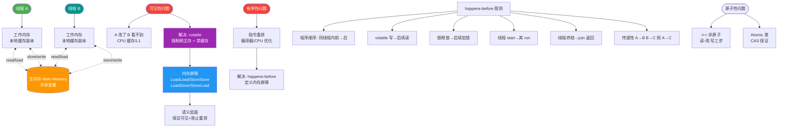

# 什么是单例模式的6种实现？

单例模式确保一个类只有一个实例，并提供一个全局访问点。其核心要素包括：
1. **私有构造函数**：防止外部通过 `new` 创建实例。
2. **私有静态变量**：存储唯一的实例。
3. **公有静态方法**（如 `getInstance`）：提供全局访问入口。

单例模式的6种主要实现方式如下：

### 1. 懒汉式（线程不安全）
- **原理**：延迟加载，只有在第一次调用 `getInstance` 时才创建实例。
- **代码片段**：
  ```java
  public class Singleton {
      private static Singleton instance;
      private Singleton() {}
      public static Singleton getInstance() {
          if (instance == null) {
              instance = new Singleton();
          }
          return instance;
      }
  }
  ```
- **优点**：延迟加载，节省资源。
- **缺点**：多线程环境下不安全，可能创建多个实例。

### 2. 饿汉式（线程安全）
- **原理**：类加载时就创建实例。
- **代码片段**：
  ```java
  public class Singleton {
      private static final Singleton instance = new Singleton();
      private Singleton() {}
      public static Singleton getInstance() {
          return instance;
      }
  }
  ```
- **优点**：线程安全，实现简单。
- **缺点**：无延迟加载，可能浪费资源。

### 3. 懒汉式（线程安全）
- **原理**：在 `getInstance` 方法上加锁。
- **代码片段**：
  ```java
  public class Singleton {
      private static Singleton instance;
      private Singleton() {}
      public static synchronized Singleton getInstance() {
          if (instance == null) {
              instance = new Singleton();
          }
          return instance;
      }
  }
  ```
- **优点**：线程安全，延迟加载。
- **缺点**：锁粒度大，性能较差。

### 4. 双重检查锁（DCL，线程安全）
- **原理**：减小锁粒度，两次检查 `instance` 是否为 null，使用 `volatile` 防止指令重排序。
- **代码片段**：
  ```java
  public class Singleton {
      private volatile static Singleton instance;
      private Singleton() {}
      public static Singleton getInstance() {
          if (instance == null) {
              synchronized (Singleton.class) {
                  if (instance == null) {
                      instance = new Singleton();
                  }
              }
          }
          return instance;
      }
  }
  ```
- **优点**：线程安全，延迟加载，性能较好。
- **缺点**：实现稍复杂。

### 5. 静态内部类（线程安全）
- **原理**：利用类加载机制保证线程安全，实现延迟加载。
- **代码片段**：
  ```java
  public class Singleton {
      private Singleton() {}
      private static class Holder {
          private static final Singleton INSTANCE = new Singleton();
      }
      public static Singleton getInstance() {
          return Holder.INSTANCE;
      }
  }
  ```
- **优点**：线程安全，延迟加载，不依赖 synchronized，性能最优。
- **缺点**：无法传递构造参数。

### 6. 枚举（线程安全）
- **原理**：利用 JVM 保证枚举类型的唯一性，不仅天然线程安全，还能防止反序列化破坏单例。
- **代码片段**：
  ```java
  public enum Singleton {
      INSTANCE;
      public void doSomething() { ... }
  }
  ```
- **优点**：写法极简，天然防序列化攻击，线程安全。
- **缺点**：不是延迟加载（类加载时初始化），且由于继承自 Enum，无法继承其他类。

### 边界情况
1. **反射攻击**：通过反射调用私有构造函数可以破坏除枚举外的所有单例。解决方式是在构造函数中添加判断，若实例已存在则抛出异常。
2. **序列化/反序列化**：反序列化时会创建新对象。解决方式是实现 `readResolve()` 方法返回单例实例，或直接使用枚举。
3. **克隆**：若单例类实现了 `Cloneable` 接口，克隆会破坏单例。解决方式是重写 `clone()` 方法直接返回单例实例或抛出异常。

## 面试追问
1. **为什么枚举单例是《Effective Java》推荐的最佳实现方式？**
   - 它不仅自动处理序列化机制，防止反序列化重新创建新的对象，而且绝对防止多次实例化，即使在面对复杂的序列化攻击或反射攻击时。
2. **双重检查锁（DCL）中为什么要加 `volatile`？**
   - 防止指令重排序。`new Singleton()` 并非原子操作（分配内存->初始化->引用指向），若重排序为 1->3->2，其他线程可能拿到未初始化完的对象。
3. **单例模式在实际框架中有哪些应用场景？**
   - Spring 的 Bean 默认是单例的；ServletContext；Runtime 类；数据库连接池（通常作为单例管理）。

## 易错点
1. **认为双重检查锁只需要 `synchronized` 不需要 `volatile`**：忽略了指令重排序带来的半初始化对象风险。
2. **认为静态内部类是“懒加载”但忽略了类加载时机**：虽然利用了类加载机制实现延迟加载，但如果外部类加载器加载了 Holder 类（虽然通常不会主动加载），实例就会被创建。


## 核心流程图



## 记忆要点

- 核心三要素：私有构造、私有静态变量、公有静态访问方法。
- 口诀记忆6种：饿汉、懒汉(不安全/安全)、DCL、静态内部类、枚举。
- 懒汉需加锁，DCL须配volatile防指令重排。
- 静态内部类利用类加载保线程安全且实现懒加载；枚举天然防反序列化攻击最简。

## 结构化回答


**30 秒电梯演讲：** 就像国家只能有一个主席，大家只能通过特定流程投票选举或确认。

**展开框架：**
1. **私有构造函数** — 私有构造函数防止外部new
2. **私有静态变量** — 私有静态变量存储唯一实例
3. **公有静态方法** — 公有静态方法提供全局访问点

**收尾：** 这是我实战中的理解，您想深入哪一段？


## 视频脚本

> 预计时长：4 分钟 | 由浅入深

| 时间 | 画面/字幕 | 口播台词 | 讲解要点 |
|------|----------|----------|----------|
| 0:00 | 标题卡：什么是单例模式的6种实现 | 今天这道题：什么是单例模式的6种实现。30 秒先给你讲清楚。 | 开场钩子 |
| 0:20 | 核心概念动画/示意图 | 就像国家只能有一个主席，大家只能通过特定流程投票选举或确认。 | 核心概念 |
| 0:40 | 私有构造函数防止外部new示意图 | 私有构造函数防止外部new | 私有构造函数防止外部new |
| 1:10 | 私有静态变量示意图 | 私有静态变量存储唯一实例 | 私有静态变量 |
| 1:40 | 总结卡 + 下期预告 | 记住今天这几个关键词，面试一定用得上。下期见。 | 收尾 |
