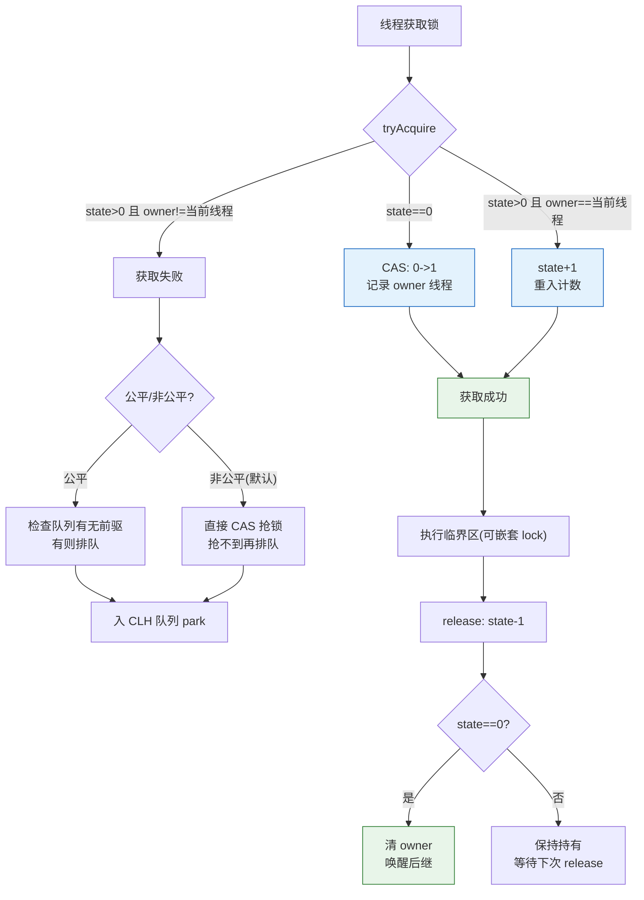

# 什么是可重入锁？它的实现原理是什么？

可重入锁（递归锁）指的是同一线程在外层函数获取锁之后，内层递归函数仍然能获取该锁的代码，而不会阻塞自己。在JAVA环境下 ReentrantLock 和 synchronized 都是可重入锁。其实现原理是：锁内部维护一个计数器（持有次数）和持有线程的标识。当线程获取锁时，计数器加1；重入时再次加1；退出同步块时计数器减1；直到计数器减为0时才真正释放锁。

### 补充原理细节
1. **synchronized 的可重入性实现**：
   - 基于 Monitor 对象，ObjectMonitor 中记录 `_owner`（持有锁的线程）和 `_recursions`（重入次数）。
   - 当线程尝试获取锁时，如果发现 `_owner` 是自己，则 `_recursions` 加 1，直接获取。

2. **ReentrantLock 的可重入性实现**：
   - 基于 AQS（AbstractQueuedSynchronizer），内部维护 `state` 变量表示重入次数。
   - 非公平锁默认通过 `CAS` 修改 `state`，重入时直接增加 `state`。

### 实战深化

#### 实战案例
在使用 `ReentrantLock` 时，如果在 `try` 块中加锁，但在 `finally` 块中未正确判断锁持有者就调用 `unlock()`，若发生异常重入，可能会导致计数器减少过快，实际上锁并未释放，造成死锁。切记 `unlock` 必须放在 `finally` 块中且保证执行。

#### 代码示例
**ReentrantLock 简单的可重入验证：**
```java
ReentrantLock lock = new ReentrantLock();
lock.lock(); // state = 1
try {
    lock.lock(); // 重入，state = 2
    try {
        // 业务逻辑
    } finally {
        lock.unlock(); // state = 1
    }
} finally {
    lock.unlock(); // state = 0，释放锁
}
```

#### synchronized vs ReentrantLock 对比

| 特性 | synchronized | ReentrantLock |
| :--- | :--- | :--- |
| **实现机制** | JVM 层面，基于 Monitor | JDK 层面，基于 AQS |
| **释放方式** | 自动释放（代码块执行完或异常） | **手动释放**（必须在 finally 中） |
| **公平性** | 非公平 | 可选公平/非公平（构造函数传参） |
| **锁获取中断** | 不可中断 | 支持 `lockInterruptibly()` 响应中断 |
| **条件变量** | 单个 Condition（等待集） | 多个 Condition（可精细控制线程等待/唤醒） |
| **性能** | JDK 6 后优化极好 | 高竞争下性能稳定 |

### 边界情况
1. **死锁场景**：虽然是可重入锁，但如果线程 A 持有锁 A 去请求锁 B，同时线程 B 持有锁 B 去请求锁 A，且两者都不释放，依然会发生死锁。可重入性只解决了“自己 deadlock 自己”的问题。
2. **锁降级**：支持将写锁降级为读锁（如 ReentrantReadWriteLock），但不支持从读锁升级为写锁，否则容易造成死锁。
3. **LockSupport.park() 与中断**：ReentrantLock 在响应中断时会抛出 `InterruptedException`，而 synchronized 在等待锁时是不响应中断的。

## 面试追问
1. **ReentrantLock 的公平锁和非公平锁在实现上有什么区别？**
   - 非公平锁在获取锁时，首先尝试 CAS 抢锁，失败了再入队；公平锁在获取锁时，会先检查队列中是否有前驱节点，如果有则直接排队，严格遵循 FIFO。
2. **为什么 ReentrantLock 的 `unlock()` 操作不需要加锁？**
   - 因为 `unlock()` 只能由持有锁的线程执行（会检查当前线程是否是 Owner），这本身就是一种互斥，且 `state` 的减法操作是原子的（或通过 CAS 修改）。
3. **AQS 中的 `state` 变量在 ReentrantLock 和 CountDownLatch 中的含义有何不同？**
   - 在 ReentrantLock 中表示重入次数（0 表示未锁定，>0 表示重入次数）；在 CountDownLatch 中表示计数器的剩余值。

## 易错点
1. **混淆“可重入”与“可中断”**：synchronized 和 ReentrantLock 都是可重入的，但只有 ReentrantLock 支持可中断获取锁。
2. **忘记 ReentrantLock 必须手动释放**：如果在业务逻辑中抛出异常且未在 `finally` 中释放，会导致其他线程永远无法获取锁。

### 可重入锁 ReentrantLock 原理图



## 核心知识点图


## 记忆要点

- 定义：同一线程外层获锁后，内层仍能获取，不会阻塞自己。
- 核心机制：锁内部维护计数器与持有线程标识，重入则加1，退出减1。
- 底层对比：synchronized基于Monitor，而ReentrantLock基于AQS的state变量。
- 实战避坑：ReentrantLock必须在finally块中手动执行unlock。

## 结构化回答


**30 秒电梯演讲：** 这就好比拿着家门钥匙进屋，进卧室时不需要再换一把钥匙，同一把钥匙能开所有锁。

**展开框架：**
1. **允许同一个线** — 允许同一个线程多次获取同一把锁
2. **避免线程因自己持** — 避免线程因自己持有的锁而死锁
3. **实现机制** — 实现机制通常基于计数器

**收尾：** 这是我实战中的理解，您想深入哪一段？


## 视频脚本

> 预计时长：4 分钟 | 由浅入深

| 时间 | 画面/字幕 | 口播台词 | 讲解要点 |
|------|----------|----------|----------|
| 0:00 | 标题卡：什么是可重入锁？它的实现原理是什么 | 今天这道题：什么是可重入锁？它的实现原理是什么。30 秒先给你讲清楚。 | 开场钩子 |
| 0:20 | 核心概念动画/示意图 | 这就好比拿着家门钥匙进屋，进卧室时不需要再换一把钥匙，同一把钥匙能开所有锁。 | 核心概念 |
| 0:40 | 同一个线程多次获取同一把锁示意图 | 允许同一个线程多次获取同一把锁 | 同一个线程多次获取同一把锁 |
| 1:10 | 避免线程因自己持有的锁而死锁示意图 | 避免线程因自己持有的锁而死锁 | 避免线程因自己持有的锁而死锁 |
| 1:40 | 总结卡 + 下期预告 | 记住今天这几个关键词，面试一定用得上。下期见。 | 收尾 |
