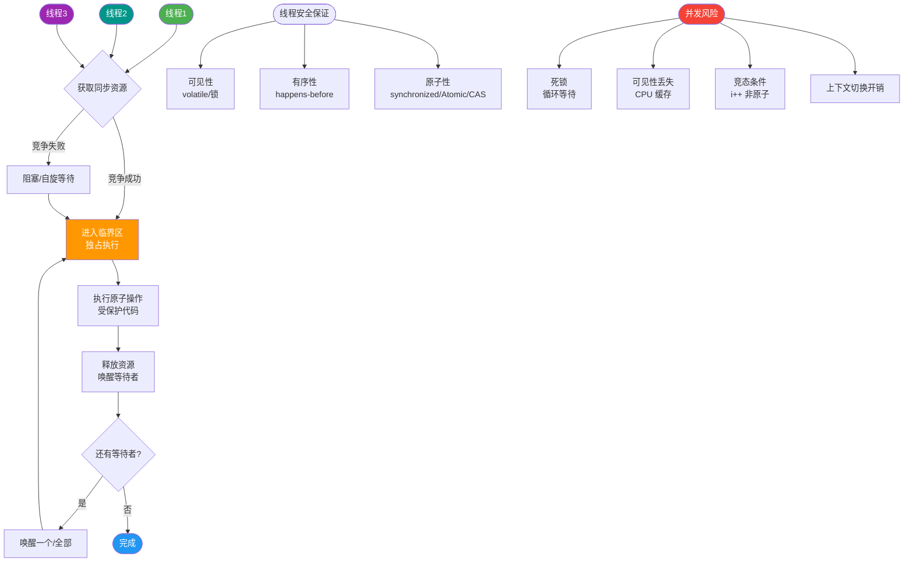

# 什么是多线程？

多线程是指在同一进程内，多个线程并发执行，共享进程的内存空间（堆、方法区），但拥有独立的栈空间和程序计数器（PC）。

### 多线程的好处
1. **简化模型**：将复杂任务分解为多个线程，逻辑更清晰。
2. **资源共享**：线程间共享内存，通信比进程更高效。
3. **轻量级**：线程创建和切换的开销比进程小。
4. **IO 密集型任务优化**：线程可以在等待 IO 时让出 CPU，提高吞吐量。

### 多线程的挑战
1. **线程安全问题**：如 `i++` 非原子操作，需同步机制（锁、CAS）。
2. **线程依赖关系**：需协调线程执行顺序（如 `join`、`CountDownLatch`）。
3. **上下文切换开销**：频繁切换会降低性能。

### 进程与线程的区别
- **内存共享**：线程共享进程的堆和方法区，但栈独立。
- **切换开销**：进程切换需切换虚拟地址空间（导致 TLB 失效），线程切换不涉及。

### 实战深化

#### 实战案例
在未做同步处理的电商秒杀场景下，多个线程同时读取库存变量 `stock` 并执行 `stock--`，由于非原子性，最终库存扣减结果可能不一致，导致超卖。生产中常使用 `AtomicInteger` 或 `synchronized` 解决此类并发问题。

#### 代码示例
**简单的线程创建与执行（Java）：**
```java
Thread t = new Thread(() -> {
    System.out.println("线程运行中: " + Thread.currentThread().getName());
}, "MyThread");
t.start(); // 启动线程，进入就绪状态
```

#### 进程 vs 线程 对比

| 维度 | 进程 | 线程 |
| :--- | :--- | :--- |
| **根本定位** | 资源分配的最小单位 | CPU 调度的最小单位 |
| **包含关系** | 包含线程（至少一个） | 属于进程 |
| **内存空间** | 独立地址空间，相互隔离 | 共享进程地址空间（堆、方法区） |
| **通信方式** | 管道、消息队列、共享内存、Socket | 直接读写共享变量（需同步）、wait/notify |
| **上下文切换** | 涉及页表切换，TLB 刷新，开销大 | 仅需寄存器、栈保存，开销较小 |
| **健壮性** | 多进程间互不影响，高健壮性 | 一个线程崩溃可能导致整个进程崩溃 |

### 边界情况
1. **CPU 密集型 vs IO 密集型**：在 CPU 密集型任务中，过多的线程会导致频繁的上下文切换，反而降低性能；而在 IO 密集型任务中，多线程能显著提升 CPU 利用率。
2. **守护线程生命周期**：当所有的非守护线程结束时，JVM 会退出，即使还有守护线程在运行（如 GC 线程）。
3. **线程栈溢出（StackOverflowError）**：线程的栈空间是有限的，递归过深会导致栈溢出，且不可恢复。

## 面试追问
1. **Java 中创建线程有哪几种方式？它们本质上有什么区别？**
   - 继承 `Thread` 类、实现 `Runnable` 接口、实现 `Callable` 接口（带返回值）、使用线程池。本质上都是通过 `Thread.start()` 启动，但 `Callable` 配合 `FutureTask` 支持返回值和异常处理。
2. **为什么说线程的上下文切换开销比进程小？**
   - 线程切换仅涉及寄存器、栈指针等少量数据的保存与恢复；而进程切换需要切换 CR3 寄存器（页表），导致 TLB（Translation Lookaside Buffer）失效，访问内存变慢。
3. **如何合理设置线程池的线程数？**
   - CPU 密集型设置为 `CPU 核心数 + 1`；IO 密集型设置为 `CPU 核心数 * 2` 或根据 IO 等待时间进行公式估算（`Ncpu * Ucpu * (1 + W/C)`）。

## 易错点
1. **调用 `run()` 而不是 `start()`**：直接调用 `run()` 只是普通的方法调用，不会在新的线程中执行，而是在当前主线程中串行执行。
2. **认为线程一定比进程快**：在计算密集型场景下，过多的线程竞争 CPU 资源和锁，可能导致性能不如单线程或单进程。


## 核心流程图



## 记忆要点

- 根本定位：进程是资源分配的最小单位，而线程是CPU调度的最小单位。
- 内存对比：多线程共享进程的堆和方法区，但各自拥有独立的栈和PC。
- 切换对比：线程切换仅存寄存器和栈，而进程切换需刷新TLB导致开销大。
- 易错提醒：启动线程必调start()实现并发，调run()仅是普通串行方法执行。

## 结构化回答


**30 秒电梯演讲：** 就像一个工厂（进程）里有多条流水线（线程）同时运转，共用工厂的仓库。

**展开框架：**
1. **CPU** — 线程是CPU调度的最小单位
2. **同一进程下的** — 同一进程下的线程共享内存地址空间
3. **线程切换开销** — 线程切换开销远小于进程切换

**收尾：** 这是我实战中的理解，您想深入哪一段？


## 视频脚本

> 预计时长：4 分钟 | 由浅入深

| 时间 | 画面/字幕 | 口播台词 | 讲解要点 |
|------|----------|----------|----------|
| 0:00 | 标题卡：什么是多线程 | 今天这道题：什么是多线程。30 秒先给你讲清楚。 | 开场钩子 |
| 0:20 | 核心概念动画/示意图 | 就像一个工厂（进程）里有多条流水线（线程）同时运转，共用工厂的仓库。 | 核心概念 |
| 0:40 | 线程示意图 | 线程是CPU调度的最小单位 | 线程 |
| 1:10 | 同一进程下的线程共享内存地址示意图 | 同一进程下的线程共享内存地址空间 | 同一进程下的线程共享内存地址 |
| 1:40 | 总结卡 + 下期预告 | 记住今天这几个关键词，面试一定用得上。下期见。 | 收尾 |
