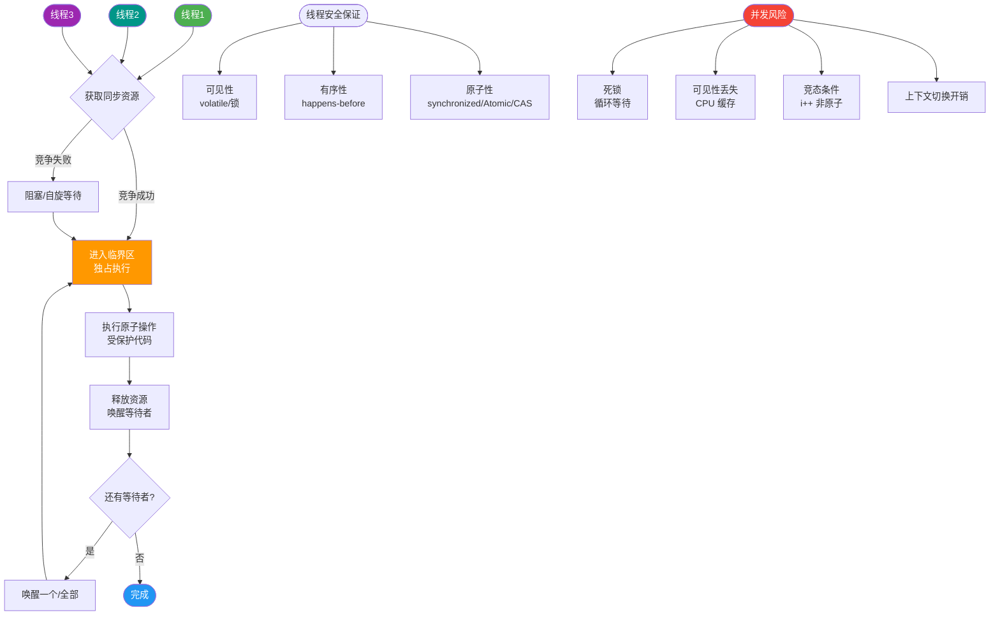
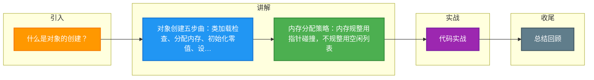

# 什么是对象的创建？

对象的创建过程分为以下 5 步：

### 1. 类加载检查
- JVM 遇到 `new` 指令时，检查常量池中是否存在类的符号引用，并确认类是否已加载、解析、初始化。

### 2. 分配内存
- **指针碰撞**（内存规整）：指针向空闲方向移动对象大小的距离。
- **空闲列表**（内存不规整）：维护可用内存块列表，找到合适空间分配。
- **并发安全解决**：
  - CAS + 失败重试。
  - TLAB（Thread Local Allocation Buffer）：每个线程在堆中预分配私有内存区域。

### 3. 初始化内存空间
- 分配的内存（除对象头外）初始化为 0 值，保证字段可直接访问零值。

### 4. 设置对象头
- 存储对象的元数据（类指针、哈希码、GC 年龄等）。

### 5. 执行构造函数
- 按照 `init` 方法初始化对象字段。

### 实战深化

#### 实战案例
在高并发下，频繁创建大对象会导致 Young GC 频繁触发。实战中常通过**对象池**（如 `Netty ByteBuf`）复用对象，减少内存分配和 GC 压力；或利用逃逸分析（Escape Analysis）在栈上分配非逃逸对象。

#### 代码示例
**模拟对象半初始化问题（DCL 中的指令重排序）：**
```java
// 1. 分配内存
// 2. 初始化对象
// 3. 引用指向内存地址 (instance = memory)
// 若发生指令重排 1->3->2，线程A执行到3时，线程B判断instance非空直接使用，
// 此时对象尚未初始化，会报错或读到错误数据。
```

#### 内存分配策略对比

| 分配方式 | 适用内存状态 | 原理 | 收集器示例 |
| :--- | :--- | :--- | :--- |
| **指针碰撞** | 规整 | 指针单向移动，效率高 | Serial, ParNew (基于复制算法) |
| **空闲列表** | 不规整 | 维护列表查找足够大的空闲块 | CMS (基于标记-清除算法) |

#### 并发安全分配策略对比

| 策略 | 原理 | 优点 | 缺点 |
| :--- | :--- | :--- | :--- |
| **CAS + 失败重试** | 比较并交换，失败则重试 | 无需预留内存，空间利用率高 | 高并发下竞争激烈，CPU 开销大 |
| **TLAB** | 线程私有缓冲区，用完再申请新的 | 大幅减少多线程竞争，性能极高 | 存在空间浪费（TLAB 有剩余） |

### 边界情况
1. **数组对象创建**：除了分配对象头空间，还需要额外分配存储数组元素的空间，并在对象头中记录数组长度。
2. **内存分配失败**：当堆内存不足且无法扩展时，会抛出 `OutOfMemoryError`；若堆内存足够但碎片过多导致无法找到连续空间，也会抛出 OOM。
3. **逃逸分析优化**：如果对象的作用域仅限于当前方法（未逃逸），JIT 编译器可能会将对象直接分配在栈上，随栈帧销毁而回收，从而消除 GC 开销。

## 面试追问
1. **对象头具体包含哪些内容？**
   - Mark Word（存储哈希码、GC 分代年龄、锁状态标志位、偏向线程 ID 等）、类型指针（指向类元数据 Class 对象）、如果是数组还包括数组长度。
2. **什么是 TLAB？它占用的空间是 Eden 区的一部分吗？**
   - 是的，TLAB 是在 Eden 区划分出来的私有缓冲区。每个线程拥有独立的 TLAB，多线程分配内存时不需要锁竞争，仅当 TLAB 用完申请新的 TLAB 时才需要同步。
3. **为什么需要先将内存清零？**
   - 为了保证对象字段即使不显式初始化也能直接使用（如 int 为 0，boolean 为 false），同时避免敏感信息泄露（不清理可能读到其他线程留下的数据）。

## 易错点
1. **认为对象的初始化顺序总是类加载在前**：对于父类与子类的初始化，父类静态 -> 子类静态 -> 父类非静态/构造 -> 子类非静态/构造，但对于同一个对象，`new` 指令触发的检查是确保类已加载，未加载才会触发加载。
2. **混淆指针碰撞和空闲列表的触发条件**：取决于垃圾收集器是否带有压缩整理功能。Serial、ParNew 等收集器使用指针碰撞；CMS 这种基于 Mark-Sweep 的收集器使用空闲列表。


## 核心流程图



## 记忆要点

- 对象创建五步曲：类加载检查、分配内存、初始化零值、设置对象头、执行init构造。
- 内存分配策略：内存规整用指针碰撞，不规整用空闲列表。
- 并发分配保障：高并发下采用CAS重试或TLAB线程私有缓冲区。
- 防重排机制：DCL单例模式中的分配与初始化指令重排，须用volatile修饰。

## 结构化回答


**30 秒电梯演讲：** 像盖房子，先找地（分配内存），再清理场地（清零），最后按图纸砌墙（执行构造函数）。

**展开框架：**
1. **类加载检查** — 确保类已加载解析
2. **内存分配** — 指针碰撞或空闲列表
3. **并发安全** — CAS+重试或TLAB本地分配

**收尾：** 这是我实战中的理解，您想深入哪一段？


## 视频脚本

> 预计时长：4 分钟 | 由浅入深

| 时间 | 画面/字幕 | 口播台词 | 讲解要点 |
|------|----------|----------|----------|
| 0:00 | 标题卡：什么是对象的创建 | 今天这道题：什么是对象的创建。30 秒先给你讲清楚。 | 开场钩子 |
| 0:20 | 核心概念动画/示意图 | 像盖房子，先找地（分配内存），再清理场地（清零），最后按图纸砌墙（执行构造函数）。 | 核心概念 |
| 0:40 | 类加载检查示意图 | 类加载检查：确保类已加载解析 | 类加载检查 |
| 1:10 | 内存分配示意图 | 内存分配：指针碰撞或空闲列表 | 内存分配 |
| 1:40 | 总结卡 + 下期预告 | 记住今天这几个关键词，面试一定用得上。下期见。 | 收尾 |

### 视频流程图



