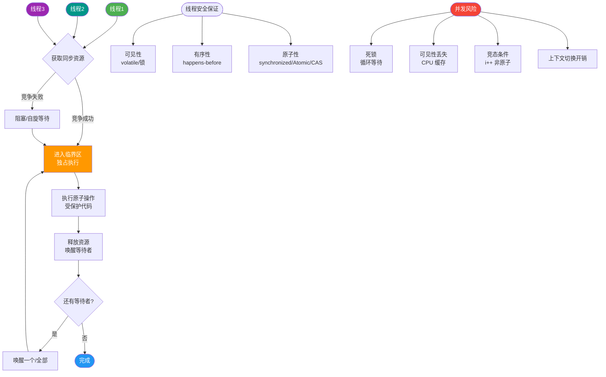
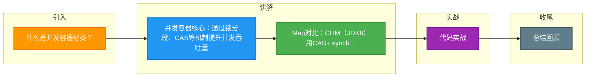

# 什么是并发容器分类？

Java 并发容器位于 `java.util.concurrent` 包中，专为多线程设计，通过锁分段、CAS 等技术提高并发性能。以下是常见并发容器及其原理：

### 1. ConcurrentHashMap
- **对应非并发容器**：HashMap
- **JDK 6/7**：分段锁（Segment），每个 Segment 独立加锁。
- **JDK 8**：CAS + `synchronized`，锁粒度更细（桶级别）。

### 2. CopyOnWriteArrayList
- **对应非并发容器**：ArrayList
- **原理**：写操作复制新数组，读操作无锁，适合读多写少场景。

### 3. CopyOnWriteArraySet
- **对应非并发容器**：HashSet
- **原理**：基于 `CopyOnWriteArrayList`，添加元素时去重。

### 4. ConcurrentSkipListMap
- **对应非并发容器**：TreeMap
- **原理**：跳表（Skip List），支持有序键值对，并发性能优于红黑树。

### 5. ConcurrentLinkedQueue
- **对应非并发容器**：Queue
- **原理**：无锁链表队列（CAS 实现），高性能非阻塞。

### 6. 阻塞队列（如 LinkedBlockingQueue）
- **特点**：支持阻塞插入/获取，适用于生产者-消费者模型。

### 实战深化

#### 实战案例
在做系统配置中心时，若配置读多写少，使用 `CopyOnWriteArrayList` 存储监听器列表，可在触发事件时安全遍历，无需加锁，避免阻塞通知线程。但若配置更新极频繁，会导致大数组频繁拷贝，引发 Full GC，此时应换用 `ConcurrentHashMap` 或读写锁。

#### 代码示例
**ConcurrentHashMap JDK 8 源码逻辑（putVal 关键部分）：**
```java
// 如果桶为空，直接 CAS 放入
if ((f = tabAt(tab, i = (n - 1) & hash)) == null) {
    if (casTabAt(tab, i, null, new Node<K,V>(hash, key, value, null)))
        break; // no lock when adding to empty bin
}
// 如果有哈希冲突，使用 synchronized 锁住当前桶的头节点
else if ((fh = f.hash) == MOVED)
    tab = helpTransfer(tab, f);
else {
    synchronized (f) { // 锁粒度减小到链表/树头节点
        // ... 遍历链表或红黑树更新值
    }
}
```

#### 并发容器选型对比

| 容器类型 | 数据结构 | 线程安全机制 | 读写特点 | 适用场景 |
| :--- | :--- | :--- | :--- | :--- |
| **ConcurrentHashMap** | 数组+链表+红黑树 (JDK8) | CAS + synchronized (头节点) | 读写均高效 | 高并发缓存、频繁更新场景 |
| **CopyOnWriteArrayList** | 动态数组 | 写时复制 | 读极快，写极慢 | 监听器列表、黑名单、白名单（读多写少） |
| **ConcurrentSkipListMap** | 跳表 | CAS + 自旋 | 有序，支持并发范围查询 | 需要排序的并发映射（如排行榜） |
| **BlockingQueue** | 链表/数组 | ReentrantLock + Condition | 阻塞式操作 | 生产者-消费者模型、任务队列 |
| **ConcurrentLinkedQueue** | 单向链表 | CAS (无锁) | 非阻塞，高性能 | 高并发瞬时消息传递、缓冲 |

### 边界情况
1. **ConcurrentHashMap 的 size() 计算精度**：JDK 8 中 `size()` 方法的返回值只是一个基本准确的估计值（通过遍历累加 BaseCounter 和 CellCounter），不是强一致的实时精确值，因为在计算时可能有其他线程正在修改。
2. **CopyOnWriteArrayList 的迭代器弱一致性**：迭代器创建后，即使底层数组被修改，迭代器仍然遍历旧数组，不会抛出 `ConcurrentModificationException`，但无法读取到最新数据。
3. **NullPointerException**：ConcurrentHashMap 和 ConcurrentLinkedQueue 等容器**不允许存储 null 键或 null 值**（二义性问题：无法区分“找不到”和“值为 null”），这一点与 HashMap 不同。

## 面试追问
1. **ConcurrentHashMap 在 JDK 8 中为什么放弃分段锁？**
   - 减少内存占用（Segment 数组继承自 ReentrantLock，内存开销大），提高并发度（锁粒度从 Segment 级别降为桶级别，支持更高的并发数）。
2. **CopyOnWriteArrayList 的迭代器支持 remove 操作吗？**
   - 不支持。因为迭代器基于快照（旧数组），直接修改底层数组结构会导致逻辑错误或数据不一致，且会破坏写时复制机制。
3. **为什么 ConcurrentHashMap 的读操作不需要加锁？**
   - 因为其中的 Node 节点的 `val` 和 `next` 属性都用 `volatile` 修饰，保证了可见性；同时数组引用也是 `volatile` 读取，能确保读到最新的数据结构。

## 易错点
1. **在 ConcurrentHashMap 中使用复合操作**：例如 `if (!map.containsKey(key)) map.put(key, value);` 这种“先检查后执行”的操作在并发下不是原子的，仍需加锁或使用 `putIfAbsent` 等原子方法。
2. **CopyOnWriteArrayList 用于频繁写入场景**：每次写入都会复制整个数组，若写入频繁，会导致内存占用飙升和频繁 GC，性能远不如 `Vector` 或 `Collections.synchronizedList`。


## 核心流程图



## 记忆要点

- 并发容器核心：通过锁分段、CAS等机制提升并发吞吐量。
- Map对比：CHM(JDK8)用CAS+ synchronized锁桶节点，ConcurrentSkipListMap基于跳表实现并发排序。
- List选型：CopyOnWriteArrayList写时复制，读极快，仅适用于读多写少的场景。
- 阻塞对比：BlockingQueue依赖ReentrantLock+Condition适合生产消费模型，ConcurrentLinkedQueue用CAS实现非阻塞。

## 结构化回答

**30 秒电梯演讲：** 普通容器是单车道，并发容器是多车道或智能红绿灯，车多也不堵。

**展开框架：**
1. **ConcurrentHash** — ConcurrentHashMap：分段锁或CAS保证高效读写
2. **CopyOnWriteArr** — CopyOnWriteArrayList：读写分离，写时复制
3. **BlockingQueue** — BlockingQueue：阻塞队列，用于生产消费模型

**收尾：** 这块我踩过一些坑，您想深入聊哪一段——原理细节、实战案例还是常见踩坑？

## 视频脚本

> 预计时长：4 分钟 | 由浅入深

| 时间 | 画面/字幕 | 口播台词 | 讲解要点 |
|------|----------|----------|----------|
| 0:00 | 标题卡：什么是并发容器分类 | 今天这道题：什么是并发容器分类。30 秒先给你讲清楚。 | 开场钩子 |
| 0:20 | 核心概念动画/示意图 | 普通容器是单车道，并发容器是多车道或智能红绿灯，车多也不堵。 | 核心概念 |
| 0:40 | ConcurrentHash示意图 | ConcurrentHashMap：分段锁或CAS保证高效读写 | ConcurrentHash |
| 1:10 | CopyOnWriteArr示意图 | CopyOnWriteArrayList：读写分离，写时复制 | CopyOnWriteArr |
| 1:40 | 总结卡 + 下期预告 | 记住今天这几个关键词，面试一定用得上。下期见。 | 收尾 |

### 视频流程图



