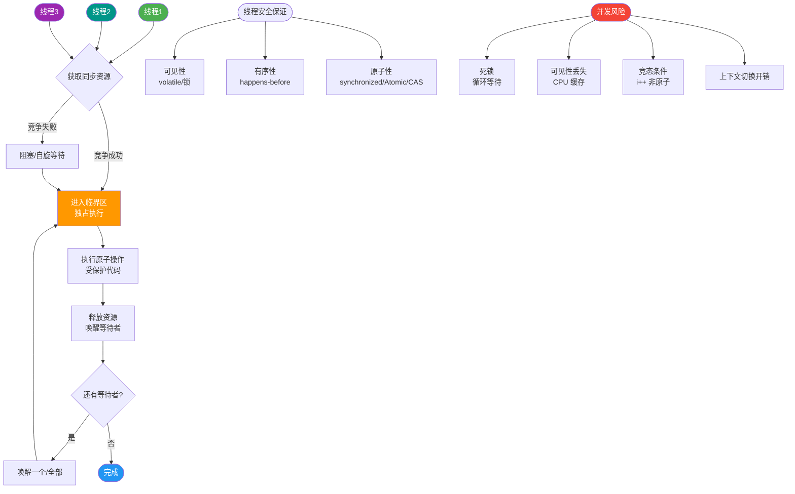
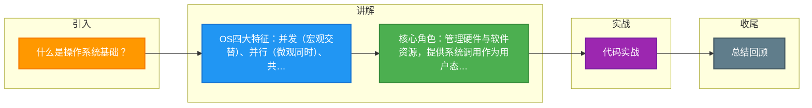

# 什么是操作系统基础？

操作系统是管理计算机硬件与软件资源的系统软件，作为应用程序与硬件之间的接口。

### 一、操作系统的核心概念
操作系统（OS）是计算机系统中最基本的系统软件，负责控制和管理整个计算机的硬件和软件资源，调度计算机的工作与资源的分配，为用户和其他软件提供便捷的接口。

#### 1. 操作系统的特征
*   **并发**：指两个或多个事件在同一时间间隔内发生。
    *   *区别*：并发侧重于同一时间段内的交替执行，并行侧重于同一时刻的同时执行。
*   **共享**：系统中的资源可供内存中多个并发执行的进程共同使用。
    *   *互斥共享*：一段时间内只允许一个进程访问（如打印机）。
    *   *同时访问*：一段时间内允许多个进程交替访问（如磁盘文件）。
*   **虚拟**：把一个物理上的实体变为若干逻辑上的对应物。
    *   例如：虚拟存储器（从物理内存扩展到逻辑内存）、虚拟处理器（多线程分时复用CPU）。
*   **异步**：进程的执行不是一贯到底的，而是以不可预知的速度向前推进（走走停停）。

#### 2. 系统架构视角

```text
┌─────────────────────────────────────┐
│         用户应用程序              │
├─────────────────────────────────────┤
│         操作系统 (OS)              │ │ <--- 系统调用接口
│  ┌─────┐ ┌─────┐ ┌─────┐ ┌─────┐  │
│  │进程管理│ │内存管理│ │文件管理│ │设备管理│  │
│  └─────┘ └─────┘ └─────┘ └─────┘  │
├─────────────────────────────────────┤
│         硬件资源                   │
│  CPU  │ 内存 │ 磁盘 │ 网络/IO   │
└─────────────────────────────────────┘
```

### 二、操作系统的核心功能
操作系统位于硬件之上，应用之下，主要承担以下角色：

#### 1. 资源管理者（解决资源分配与回收）
*   **CPU管理**：决定哪个进程使用CPU（进程调度），解决进程间竞争与同步。
*   **内存管理**：负责内存的分配与回收，处理内存碎片（内/外碎片），防止地址越界。
*   **I/O设备管理**：管理设备的驱动、中断处理，屏蔽硬件差异。

#### 2. 服务提供者（系统调用）
将底层复杂的硬件操作封装成统一的接口（系统调用，System Call）。如果没有OS，开发者需直接操作硬件寄存器，难度大且风险高（可能损坏硬件）。

#### 3. 应用程序的管控者
控制进程的整个生命周期：创建时的环境配置、运行时的调度、结束后的资源回收。

### 三、用户程序与操作系统的关系

*   **OS视角**：OS是第一个启动的软件，后续所有进程都运行在OS之上，受OS监控和服务。
*   **进程视角**：进程运行在用户态，当需要高权限操作（如读写磁盘）时，通过**系统调用**陷入内核态，由OS代为执行。

---

## ## 常见考点
1.  **并发与并行的区别**？
    *   回答要点：并发是宏观上的同时（交替执行），并行是微观上的同时（多核同时执行）。
2.  **系统调用是什么？**
    *   回答要点：是用户态和内核态的桥梁，应用程序请求OS服务的唯一合法途径。
3.  **什么是内核态和用户态？**
    *   回答要点：为了保护系统安全，CPU划分权限等级。内核态可执行所有指令，用户态受限，访问硬件必须切换到内核态。


## 核心流程图



## 记忆要点

- OS四大特征：并发(宏观交替)、并行(微观同时)、共享、虚拟、异步。
- 核心角色：管理硬件与软件资源，提供系统调用作为用户态访问内核态的桥梁。
- 态切换：用户程序需操作硬件时，必须通过系统调用陷入内核态执行。
- 进程视角：OS是首个启动的基础软件，负责管控后续所有进程的完整生命周期。

## 结构化回答

**30 秒电梯演讲：** 就像公司的管家，管理办公室、电脑（硬件），安排员工（进程）干活。

**展开框架：**
1. **并发** — 并发：宏观上同时处理多个任务
2. **共享** — 共享：资源供多个进程共同使用
3. **虚拟** — 虚拟：将物理资源映射为逻辑资源

**收尾：** 这块我踩过一些坑，您想深入聊哪一段——原理细节、实战案例还是常见踩坑？

## 视频脚本

> 预计时长：4 分钟 | 由浅入深

| 时间 | 画面/字幕 | 口播台词 | 讲解要点 |
|------|----------|----------|----------|
| 0:00 | 标题卡：什么是操作系统基础 | 今天这道题：什么是操作系统基础。30 秒先给你讲清楚。 | 开场钩子 |
| 0:20 | 核心概念动画/示意图 | 就像公司的管家，管理办公室、电脑（硬件），安排员工（进程）干活。 | 核心概念 |
| 0:40 | 并发示意图 | 并发：宏观上同时处理多个任务 | 并发 |
| 1:10 | 共享示意图 | 共享：资源供多个进程共同使用 | 共享 |
| 1:40 | 总结卡 + 下期预告 | 记住今天这几个关键词，面试一定用得上。下期见。 | 收尾 |

### 视频流程图



