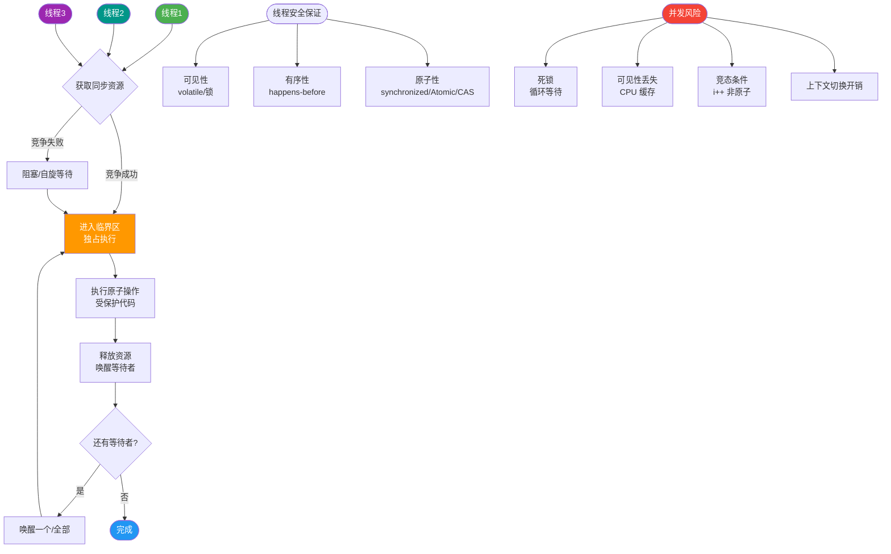
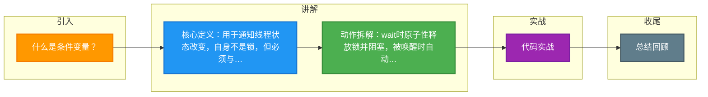

# 什么是条件变量？

条件变量是一种线程同步机制，用于在线程间共享“某个状态改变了”的信息。它本身不是锁，但必须与互斥锁配合使用。

### 一、基本概念
条件变量用来自动阻塞一个线程，直到特定条件发生为止。通常包含两个核心动作：
1.  **等待**：条件不满足时，线程释放锁并进入阻塞状态，等待被唤醒。
2.  **通知**：条件满足时，唤醒一个或多个正在等待的线程。

### 二、为什么需要条件变量？
如果仅使用互斥锁（mutex），消费者即使发现队列为空，也会不断竞争锁去检查，浪费CPU资源（忙等待）。条件变量允许线程在条件不满足时挂起，让出CPU，直到生产者发出信号，从而极大减少无意义的锁竞争和CPU占用。

### 三、工作流程与状态流转

```text
生产者线程                          消费者线程
   │                                  │
   ├─[加锁]                           ├─[加锁]
   │                                  │
   ├─[生产数据]                       ├─[检查条件: 空?]
   │                                  │
   ├─[signal/broadcast] ─────────────>│  (是) -> [wait] (释放锁并挂起)
   │                                  │               │
   ├─[解锁]                           │           (阻塞中)
   │                                  │               │
   │                          (被唤醒)│ <─────────────┘
   │                                  │
   │                                  ├─[wait返回: 自动重新加锁]
   │                                  │
   │                                  ├─[消费数据]
   │                                  │
   │                                  ├─[解锁]
```

### 四、关键函数与细节（以POSIX pthread为例）

1.  `pthread_cond_wait(cond, mutex)`
    *   **原子操作**：执行时，它会做两件事：① 释放mutex；② 阻塞线程。这两步必须是原子的，防止在释放锁和阻塞之间信号丢失。
    *   **唤醒后**：当函数返回（被唤醒）时，它会**自动重新获取mutex**，然后返回。
    *   *注意*：返回后必须重新检查条件，因为可能存在“虚假唤醒”。

2.  `pthread_cond_signal(cond)`
    *   唤醒**至少一个**等待在条件变量上的线程。如果有多个，通常按照FIFO或优先级策略唤醒一个。

3.  `pthread_cond_broadcast(cond)`
    *   唤醒**所有**等待在条件变量上的线程。适用于“状态改变可能影响多个等待者”的场景（如读锁释放）。

4.  虚假唤醒
    *   即使没有发送signal，等待的线程也可能从`wait`返回。因此标准的等待代码必须写在循环中：
    ```c
    pthread_mutex_lock(&mutex);
    while (condition_is_false) {
        pthread_cond_wait(&cond, &mutex);
    }
    // 处理资源
    pthread_mutex_unlock(&mutex);
    ```

---

## ## 常见考点
1.  **为什么 `pthread_cond_wait` 需要传入 mutex？**
    *   回答要点：为了保护条件变量（共享资源）的访问，并实现“释放锁并阻塞”的原子性，防止信号丢失。
2.  **为什么必须在 while 循环中调用 wait，而不是 if 语句？**
    *   回答要点：为了防止**虚假唤醒**。如果是if判断，虚假唤醒后线程会直接往下执行，导致条件不满足就操作数据。
3.  **signal 和 broadcast 的区别？**
    *   回答要点：signal 只唤醒一个，效率高；broadcast 唤醒所有，容易造成“惊群效应”（大量线程竞争锁），但在特定场景下（如状态改变对所有线程可见）是必须的。


## 核心流程图



## 记忆要点

- 核心定义：用于通知线程状态改变，自身不是锁，但必须与互斥锁配合使用。
- 动作拆解：wait时原子性释放锁并阻塞，被唤醒时自动重新获取锁。
- 避坑必记：防止虚假唤醒，wait必须在while循环中调用而非if语句。
- 函数对比：signal唤醒单个效率高，broadcast唤醒全部易引发惊群效应。

## 结构化回答


**30 秒电梯演讲：** 就像快递到了柜子（条件变量），你在家睡觉（阻塞），柜子通知你（唤醒）才去拿。

**展开框架：**
1. **必须配合互斥锁使** — 必须配合互斥锁使用
2. **不满足条件时** — 不满足条件时线程挂起并释放锁
3. **条件满足时被** — 条件满足时被唤醒并重新竞争锁

**收尾：** 这是我实战中的理解，您想深入哪一段？


## 视频脚本

> 预计时长：4 分钟 | 由浅入深

| 时间 | 画面/字幕 | 口播台词 | 讲解要点 |
|------|----------|----------|----------|
| 0:00 | 标题卡：什么是条件变量 | 今天这道题：什么是条件变量。30 秒先给你讲清楚。 | 开场钩子 |
| 0:20 | 核心概念动画/示意图 | 就像快递到了柜子（条件变量），你在家睡觉（阻塞），柜子通知你（唤醒）才去拿。 | 核心概念 |
| 0:40 | 配合互斥锁示意图 | 必须配合互斥锁使用 | 配合互斥锁 |
| 1:10 | 不满足条件时线程挂起并释放锁示意图 | 不满足条件时线程挂起并释放锁 | 不满足条件时线程挂起并释放锁 |
| 1:40 | 总结卡 + 下期预告 | 记住今天这几个关键词，面试一定用得上。下期见。 | 收尾 |

### 视频流程图



