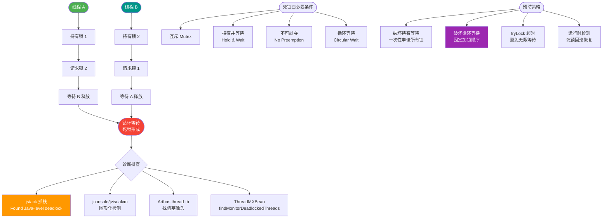

# 什么是死锁（DeadLock）？

死锁是指两个或两个以上的进程在执行过程中，因争夺资源而造成的一种互相等待的现象，如果没有外力干涉，它们都将无法推进下去。

### 一、死锁产生的必要条件
死锁的发生必须同时具备以下四个条件，缺一不可：

1.  **互斥条件**：资源是独占的，一个资源只能被一个进程使用。
2.  **占有且等待**：进程持有至少一个资源，但又正在等待获取其他被别的进程持有的资源。
3.  **不可抢占**：资源不能被强制抢占，只能由持有者显式释放。
4.  **循环等待**：存在一个进程集合 {P0, P1, ..., Pn}，P0 等待 P1 的资源，P1 等待 P2 的资源... Pn 等待 P0 的资源，形成闭环。

```text
死锁环路示例：

  ┌─────────┐       资源 A        ┌─────────┐
  │ 进程 P1 │ ─────────────────> │ 进程 P2 │
  └─────────┘ <───────────────── └─────────┘
       ▲                                   │
       │           持有 B / 等待 A          │ 持有 A / 等待 B
       │                                   │
       └───────────────────────────────────┘
                  资源 B
```

### 二、死锁的处理策略

#### 1. 鸵鸟算法（忽略）
*   **原理**：把头埋在沙子里，假装死锁不会发生。
*   **适用**：死锁发生概率极低，或者解决死锁的代价（如性能损耗、代码复杂度）远高于死锁本身带来的损失（如个人PC偶尔重启）。UNIX/Linux 和 Windows 通常采用此策略。

#### 2. 死锁预防
*   **核心思想**：破坏死锁四个必要条件中的任意一个。
    *   **破坏互斥条件**：很难实现，因为很多资源本身就是独占的（如打印机）。
    *   **破坏占有且等待**：
        *   *静态分配策略*：进程开始运行前，一次性申请所有需要的资源，不满足则不启动。缺点：资源利用率低。
    *   **破坏不可抢占**：允许资源被抢占（如 CPU 资源通过调度）。但对于像打印机这样的资源，抢占会导致数据混乱。
    *   **破坏循环等待**：
        *   *有序资源分配*：给所有资源编号，规定进程必须按编号递增的顺序申请资源。

#### 3. 死锁避免
*   **核心思想**：在动态分配资源时，防止系统进入不安全状态（可能发生死锁的状态）。
*   **算法**：**银行家算法**。
    *   进程申请资源时，系统先试探分配，然后判断剩余资源是否还能满足所有进程的“最大需求”。如果存在一种执行顺序能让所有进程完成，则分配；否则拒绝或推迟。

#### 4. 死锁检测与恢复
*   **检测**：利用资源分配图进行化简或使用死锁检测算法。
*   **恢复**：
    1.  **抢占资源**：挂起死锁进程，强行剥夺其资源给其他进程。
    2.  **终止进程**：撤销（Kill）死锁环中的一个或多个进程，甚至撤销所有进程重启系统。

---

## ## 常见考点
1.  **死锁的四个必要条件是什么？**
    *   回答要点：互斥、占有且等待、不可抢占、循环等待。
2.  **什么是银行家算法？**
    *   回答要点：一种死锁避免算法。系统在分配资源前，先试探分配并计算系统是否处于“安全状态”，若不安全则拒绝分配。
3.  **如何预防死锁中的“循环等待”？**
    *   回答要点：实施有序资源分配策略，强制所有进程按照固定的顺序（如按地址升序或编号）申请资源。


## 核心流程图



## 记忆要点

- 核心定义：多进程因争夺资源造成互相等待，若无外力干涉将永远无法推进。
- 死锁四要素(缺一不可)：互斥、占有且等待、不可抢占、循环等待。
- 预防死锁：破坏四要素，最常用是破坏循环等待(按序申请资源)或占有等待(一次性申请)。
- 死锁避免：银行家算法，分配前试探并校验系统是否处于安全状态。

## 结构化回答


**30 秒电梯演讲：** 就像十字路口四辆车互不相让，谁也动不了，彻底堵死。

**展开框架：**
1. **互斥条件** — 资源不能共享
2. **占有且等待** — 持有资源同时等待其他资源
3. **不可抢占** — 资源不能被强行夺走

**收尾：** 这是我实战中的理解，您想深入哪一段？


## 视频脚本

> 预计时长：4 分钟 | 由浅入深

| 时间 | 画面/字幕 | 口播台词 | 讲解要点 |
|------|----------|----------|----------|
| 0:00 | 标题卡：什么是死锁（DeadLock） | 今天这道题：什么是死锁（DeadLock）。30 秒先给你讲清楚。 | 开场钩子 |
| 0:20 | 核心概念动画/示意图 | 就像十字路口四辆车互不相让，谁也动不了，彻底堵死。 | 核心概念 |
| 0:40 | 互斥条件示意图 | 互斥条件：资源不能共享 | 互斥条件 |
| 1:10 | 占有且等待示意图 | 占有且等待：持有资源同时等待其他资源 | 占有且等待 |
| 1:40 | 总结卡 + 下期预告 | 记住今天这几个关键词，面试一定用得上。下期见。 | 收尾 |
