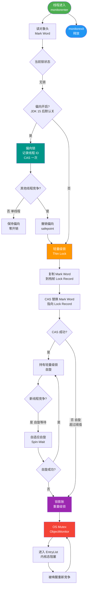

# 什么是线程同步和锁？

线程同步是指多线程在访问共享资源时，通过协调执行的顺序和时机，保证数据的一致性。锁是实现同步的一种主要机制。

### 一、线程死锁

#### 1. 定义
在典型的线程死锁情况下，每个线程都持有一些资源，并且正在等待获取其他线程持有的资源。由于每个线程都在等待，没有一个线程能够继续执行，整个程序被永久阻塞。

#### 2. 死锁产生的四个必要条件
必须同时满足以下四点才会发生死锁：
1.  **互斥条件**：资源是独占的。
2.  **占有且等待条件**：持有资源的同时等待其他资源。
3.  **非抢占条件**：资源不能被强制剥夺。
4.  **循环等待条件**：存在进程资源的环路等待链。

#### 3. 死锁代码示例
```java
class DeadlockExample {
    private final Object resource1 = new Object();
    private final Object resource2 = new Object();
    public void execute() {
        Thread thread1 = new Thread(() -> {
            synchronized (resource1) {
                System.out.println("Thread 1: Locked resource 1");
                try { Thread.sleep(100); } catch (InterruptedException e) {}
                // 此时若 Thread 2 已持有 resource2，则死锁发生
                synchronized (resource2) { 
                    System.out.println("Thread 1: Locked resource 2");
                }
            }
        });
        Thread thread2 = new Thread(() -> {
            synchronized (resource2) {
                System.out.println("Thread 2: Locked resource 2");
                // Thread 1 持有 resource1 不放，Thread 2 持有 resource2 不放
                synchronized (resource1) { 
                    System.out.println("Thread 2: Locked resource 1");
                }
            }
        });
        thread1.start();
        thread2.start();
    }
}
```

### 二、死锁的预防与避免
破坏死锁四个必要条件之一即可预防：
1.  **破坏请求与保持**：一次性申请所有资源（静态分配）。
2.  **破坏不剥夺**：持有部分资源的线程申请新资源失败时，主动释放已持有的资源。
3.  **破坏循环等待**：**按序申请资源**（最常用）。规定所有线程必须按固定的顺序（例如先 resource1 后 resource2）来申请锁。

### 三、Java 中常见的锁分类

#### 1. 按照等待机制分类
*   **乐观锁**：认为并发冲突概率低。操作不加锁，更新时判断是否被修改过（如 CAS 算法、`AtomicInteger`）。适用于读多写少。
*   **悲观锁**：认为并发冲突概率高。操作前先加锁（如 `synchronized`, `ReentrantLock`）。适用于写多场景。

#### 2. 按照锁的设计特性分类
*   **公平锁 / 非公平锁**：
    *   **公平锁**：严格按照请求顺序获取锁，无饥饿现象，但吞吐量较低。
    *   **非公平锁**：允许插队，吞吐量高，但可能导致低优先级线程饥饿（`ReentrantLock` 默认非公平，`synchronized` 也是非公平）。
*   **可重入锁**：同一个线程可以多次获取同一把锁（`synchronized`, `ReentrantLock` 均可重入）。
*   **独享锁 / 共享锁**：
    *   **独享锁（排他锁）**：一次只能被一个线程持有（如 `ReentrantLock`）。
    *   **共享锁**：可以被多个线程同时持有（如 `ReentrantReadWriteLock` 的读锁）。
*   **自旋锁**：线程在获取不到锁时不挂起（不放弃 CPU），而是执行一个空循环等待锁释放。适用于锁持有时间很短的场景。

#### 3. JVM 对 synchronized 的锁状态优化
为了减少性能开销，JVM 在运行时会根据竞争程度将锁分为不同状态（只能升级不能降级）：
*   **无锁**
*   **偏向锁**：一段同步代码一直被一个线程访问，锁会自动偏向该线程。
*   **轻量级锁**：当有其他线程竞争时，升级为轻量级锁，通过自旋（CAS）尝试获取。
*   **重量级锁**：竞争激烈时，升级为重量级锁，线程会挂起，涉及操作系统内核态切换，开销大。

---

## ## 常见考点
1.  **如何避免死锁？**
    *   回答要点：最主要的方法是**加锁顺序一致**（按序申请），或者使用 `ReentrantLock` 的 `tryLock(timeout)` 设置超时，避免无限等待。
2.  **乐观锁和悲观锁的区别？**
    *   回答要点：乐观锁无锁，利用 CAS 更新，适合读多写少；悲观锁加锁，适合写多。Java 中 `synchronized` 是悲观，`Atomic` 类是乐观。
3.  **什么是自旋锁？它的优缺点是什么？**
    *   回答要点：线程忙循环等待锁。优点是减少线程上下文切换的开销；缺点是如果锁持有时间长，会浪费大量 CPU 资源。
4.  **synchronized 是公平锁吗？**
    *   回答要点：不是，synchronized 是非公平锁，它不保证先等待的线程先获取锁。


## 核心流程图



## 记忆要点

- 概念辨析：同步用于协调多线程访问共享资源，锁是实现同步的核心机制。
- 死锁预防：破坏必要条件，最实用的是保证加锁顺序一致性以破坏循环等待。
- 锁态度分类：乐观锁(CAS适合读多) vs 悲观锁(适合写多)。
- 锁特性分类：公平/非公平、可重入、独享/共享(读写锁)、自旋锁(不放弃CPU)。

## 结构化回答


**30 秒电梯演讲：** 就像十字路口的红绿灯（同步）和单行道（锁），指挥车辆有序通过，防止撞车。

**展开框架：**
1. **同步** — 确保线程按约定顺序执行
2. **锁：保证临界** — 锁：保证临界区资源互斥访问
3. **死锁** — 多个线程互相持有对方所需资源

**收尾：** 这是我实战中的理解，您想深入哪一段？


## 视频脚本

> 预计时长：4 分钟 | 由浅入深

| 时间 | 画面/字幕 | 口播台词 | 讲解要点 |
|------|----------|----------|----------|
| 0:00 | 标题卡：什么是线程同步和锁 | 今天这道题：什么是线程同步和锁。30 秒先给你讲清楚。 | 开场钩子 |
| 0:20 | 核心概念动画/示意图 | 就像十字路口的红绿灯（同步）和单行道（锁），指挥车辆有序通过，防止撞车。 | 核心概念 |
| 0:40 | 同步示意图 | 同步：确保线程按约定顺序执行 | 同步 |
| 1:10 | 锁：保证临界区资源互斥访问示意图 | 锁：保证临界区资源互斥访问 | 锁：保证临界区资源互斥访问 |
| 1:40 | 总结卡 + 下期预告 | 记住今天这几个关键词，面试一定用得上。下期见。 | 收尾 |
