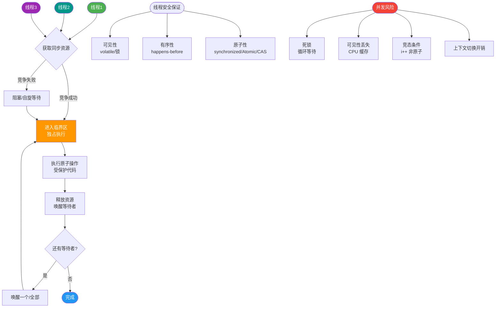
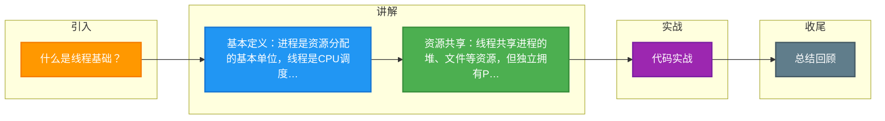

# 什么是线程基础？

### 线程基础

**1. 什么是线程**
线程是“轻量级进程”，是进程中的一个实体，是 CPU 调度和执行的基本单位。
- **本质**：线程是进程当中的一条执行流程。
- **资源共享**：同一进程内多个线程之间共享代码段、数据段、文件等资源（堆内存）。
- **独立性**：每个线程拥有独立的**程序计数器 (PC)**、**寄存器组** 和 **栈**，确保控制流的独立性和函数调用的上下文。

**2. 线程的特点**
- **轻量级**：创建和销毁开销远小于进程，因共享同一进程的虚拟地址空间。
- **共享资源**：直接读写进程内存，通信便捷（无需 IPC），但需引入同步机制。
- **并发执行**：各线程在单核 CPU 上分时复用，在多核 CPU 上并行执行。
- **底层实现**：Linux 中线程创建（`pthread_create`）本质调用 `clone` 系统调用，与创建进程（`fork`）使用相同的内核函数。区别在于 `clone` 传入的 `flags` 参数（如 `CLONE_VM` 共享内存、`CLONE_FS` 共享文件系统）。Linux 内核不区分进程与线程，统一视为可调度的任务。

**3. 进程和线程的比较**
- **资源**：
  - 进程：资源分配的基本单位，拥有独立的内存空间、文件描述符表。
  - 线程：调度基本单位，仅拥有一点必备资源（TCB、栈、寄存器），共享所属进程的资源。
- **调度**：线程切换代价远低于进程（主要切换寄存器和栈，无需切换 CR3 寄存器及页表，TLB 命中率高）。
- **并发**：进程间并发（粗粒度），进程内线程亦并发（细粒度）。多线程提高了系统资源利用率和吞吐量。
- **独立性**：进程间相互独立，一个进程崩溃通常不影响其他进程；同一进程的线程间共享内存，一个线程非法写入可能导致整个进程崩溃。
- **系统开销**：
  - 线程创建/终止快（无需建立复杂资源管理信息）。
  - 线程切换快（无需刷新 TLB）。
  - 线程间数据传递无需内核干预（直接读写内存），效率高。

**4. 线程的状态**
线程在其生命周期中主要处于以下三种基本状态（操作系统层面）：
- **执行状态**：获得 CPU 正在运行指令。
- **就绪状态**：具备执行条件（除 CPU 外），等待调度器分配 CPU。
- **阻塞状态**：因等待 I/O、信号量或锁等事件受阻，暂时放弃 CPU。

状态转换流程图：
```
          [就绪 Ready]
             ^  |
             |  | 调度 / 时间片耗尽
      解除阻塞|  v
             | [执行 Running]
             |  |  
        发生阻塞 |  | 等待 I/O 或锁
             v  |
          [阻塞 Blocked]
```

**5. 线程的实现模型**
- **用户线程**：完全由用户级别的线程库管理，内核不感知。
  - **优点**：切换快（无内核介入，无上下文切换开销），调度策略灵活。
  - **缺点**：一个线程阻塞（如系统调用）会导致整个进程阻塞；无法利用多核优势（内核将其视为一个调度单元）。
- **内核线程**：由内核管理、调度。
  - **优点**：真正的并行，一个线程阻塞不影响其他线程；支持多核。
  - **缺点**：创建和切换开销大（涉及用户态与内核态切换）。
- **轻量级进程**：内核支持的用户线程，通常作为用户线程和内核线程之间的桥梁（一对一或多对多模型）。

## 常见考点
1. **Linux 中线程与进程的区别？**
   重点在于 `clone` 系统调用的 flags 区别，以及内核视角下的 TaskStruct 统一管理。
2. **线程崩溃会导致进程崩溃吗？**
   会。因为线程共享地址空间，非法内存访问（如段错误）会发送信号给进程，导致整个进程终止。
3. **多线程与多进程的适用场景？**
   需要频繁通信、数据共享、低延迟切换选多线程；需要高隔离性、高容错性、利用多核并行计算选多进程。


## 核心流程图



## 记忆要点

- 基本定义：进程是资源分配的基本单位，线程是CPU调度的基本单位（轻量级进程）
- 资源共享：线程共享进程的堆、文件等资源，但独立拥有PC、寄存器和栈
- 切换开销：因为线程切换无需切换页表（不涉及CR3），所以比进程切换快，TLB命中率高
- 实现模型：用户线程由用户库管理（一阻全阻），内核线程由OS管理（支持多核并行）
- 风险隔离：进程间相互隔离，而同进程内的某线程崩溃会导致整个进程崩溃

## 结构化回答


**30 秒电梯演讲：** 进程是火车（车厢资源），线程是列车员（共享车厢干活）。

**展开框架：**
1. **CPU** — 线程是CPU调度的最小单位，进程是资源分配单位
2. **线程间共享内存资源** — 线程间共享内存资源，通信快但需同步
3. **线程切换开销** — 线程切换开销远小于进程

**收尾：** 这是我实战中的理解，您想深入哪一段？


## 视频脚本

> 预计时长：4 分钟 | 由浅入深

| 时间 | 画面/字幕 | 口播台词 | 讲解要点 |
|------|----------|----------|----------|
| 0:00 | 标题卡：什么是线程基础 | 今天这道题：什么是线程基础。30 秒先给你讲清楚。 | 开场钩子 |
| 0:20 | 核心概念动画/示意图 | 进程是火车（车厢资源），线程是列车员（共享车厢干活）。 | 核心概念 |
| 0:40 | 线程示意图 | 线程是CPU调度的最小单位，进程是资源分配单位 | 线程 |
| 1:10 | 线程间共享内存资源示意图 | 线程间共享内存资源，通信快但需同步 | 线程间共享内存资源 |
| 1:40 | 总结卡 + 下期预告 | 记住今天这几个关键词，面试一定用得上。下期见。 | 收尾 |

### 视频流程图



