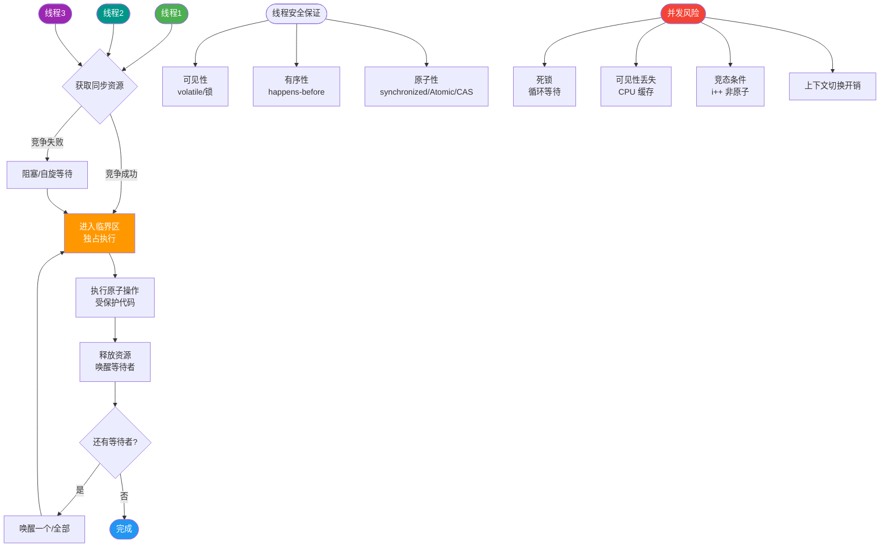

# 什么是线程属性？

### 线程属性 (pthread_attr_t)

**1. 概述**
线程属性主要用于在创建线程（`pthread_create`）之前配置线程的行为。结构体 `pthread_attr_t` 封装了所有属性，对其进行初始化（`pthread_attr_init`）和销毁（`pthread_attr_destroy`）是必要的。

**2. 主要属性详解**

**(1) 分离状态**
控制线程终止时资源的回收方式。
- **JOINABLE（非分离，默认）**：
  - 线程结束后保留其退出状态（返回值）和部分资源，直到其他线程调用 `pthread_join` 获取并回收资源。
  - 若不 join，会导致类似“僵尸进程”的线程泄露，消耗系统资源。
- **DETACHED（分离）**：
  - 线程结束时自动释放所有资源，其他线程无法 `join`，也无法获取返回值。
  - **注意**：避免在 `pthread_create` 返回前新线程已执行完毕并 ID 复用，建议使用锁或条件变量确保主线程能正确设置属性或捕获 ID。

**(2) 栈地址与大小**
- 默认情况下，线程使用进程分配的栈空间（Linux 通常为 8MB，可通过 `ulimit -s` 查看）。
- **自定义栈**：
  - `pthread_attr_setstack(attr, stackaddr, stacksize)`：完全接管栈内存管理。`stackaddr` 必须指向由 `malloc` 或 `mmap` 分配的内存地址，且需考虑内存对齐（通常页对齐）。
  - `pthread_attr_setstacksize(attr, stacksize)`：仅修改栈大小，系统负责分配地址。
- **边界条件**：设置过小会导致栈溢出，设置过大可能导致内存耗尽。

**(3) 其他重要属性**
- **guardsize（警戒缓冲区大小）**：
  - 线程栈末尾的一块内存区域，用于防止栈溢出破坏其他内存。默认通常为一页（4KB）。
  - 若设为 0，则不提供保护，溢出可能覆盖邻近数据。
- **scope（ contention scope，竞争范围）**：
  - `PTHREAD_SCOPE_SYSTEM`：与系统内所有线程竞争 CPU（通常实现为此模式）。
  - `PTHREAD_SCOPE_PROCESS`：仅与同一进程内的线程竞争。
- **inheritsched（继承调度策略）**：
  - 决定新线程继承创建者的调度参数（`PTHREAD_INHERIT_SCHED`）还是使用属性中显式设置的参数（`PTHREAD_EXPLICIT_SCHED`）。

**3. 线程使用注意事项与坑**
1. **主线程退出**：
   - `main` 函数执行 `return` 或调用 `exit()` 会终止整个进程，导致所有线程强制退出。
   - 若主线程仅想结束自己，应调用 `pthread_exit(NULL)`。
2. **避免僵尸线程**：必须对 JOINABLE 线程进行回收，方式包括：`pthread_join`（阻塞等待）、`pthread_detach`（分离）、或创建时指定分离属性。
3. **内存管理**：`malloc` 和 `mmap` 申请的内存属于进程堆，可以被任意线程 free。但要注意线程安全，避免双重释放或竞争。
4. **慎用 fork**：
   - 多线程环境中调用 `fork`，子进程仅复制调用线程（其他线程在子进程中“消失”）。
   - 若非立即 `exec`，极易导致死锁。因为子进程复制了父进程的锁状态，但持有锁的其他线程并未被复制，导致子进程中的锁永远无法被释放。
5. **慎用信号**：
   - 信号在多线程中处理复杂（哪个线程处理？掩码如何继承？）。建议使用 `sigaction` 并配合 `pthread_sigmask`，或将信号处理 dedicated 到特定线程。
6. **Cache 伪共享**：
   - 多线程修改位于同一 Cache Line（通常 64 字节）的不同变量，会导致缓存行在核心间频繁失效（颠簸）。
   - **解决**：字节对齐（如 Java `@Contended`，C++ `alignas(64)`）或填充无意义字节强制独占 Cache Line。

## 常见考点
1. **pthread_join 和 pthread_detach 的区别？**
   前者阻塞等待并回收资源，后者设置为自动回收。
2. **为什么多线程程序调用 fork 容易死锁？**
   因为子进程只复制了调用线程，却复制了父进程的所有锁状态。如果其他线程持有锁，子进程将永远无法获得该锁。
3. **线程栈溢出怎么办？**
   修改 `pthread_attr_setstacksize` 增大栈，或者优化递归深度/局部变量大小。

## 核心流程图

## 记忆要点

- 分离状态：Joinable需手动回收防泄露，Detached终止后自动回收资源无法获取返回值
- 栈管理：默认栈大小通常8MB，可通过pthread_attr_setstacksize动态修改防溢出
- 避坑指南：多线程中慎用fork！因为子进程仅复制调用线程，极易死锁于无法释放的锁
- 伪共享陷阱：多线程修改同一Cache Line(64字节)的变量会导致缓存频繁失效
- 伪共享解决：通过字节对齐(如alignas(64)或@Contended)强制变量独占缓存行

## 结构化回答

**30 秒电梯演讲：** 像给新员工配置入职包：要不要工牌回收(分离)、工位多大(栈)。

**展开框架：**
1. **分离属性决定线程结束** — 分离属性决定线程结束是否自动释放资源
2. **可自定义栈地址和大小以适** — 可自定义栈地址和大小以适应特殊需求
3. **主线程退出** — 主线程退出会带崩整个进程

**收尾：** 这是我实战中的理解，您想深入哪一段？

## 视频脚本

> 预计时长：4 分钟 | 由浅入深

| 时间 | 画面/字幕 | 口播台词 | 讲解要点 |
|------|----------|----------|----------|
| 0:00 | 标题卡：什么是线程属性 | 今天这道题：什么是线程属性。30 秒先给你讲清楚。 | 开场钩子 |
| 0:20 | 核心概念动画/示意图 | 像给新员工配置入职包：要不要工牌回收(分离)、工位多大(栈)。 | 核心概念 |
| 0:40 | 分离属性示意图 | 分离属性决定线程结束是否自动释放资源 | 分离属性 |
| 1:10 | 自定义栈地址和大小以适应特殊示意图 | 可自定义栈地址和大小以适应特殊需求 | 自定义栈地址和大小以适应特殊 |
| 1:40 | 总结卡 + 下期预告 | 记住今天这几个关键词，面试一定用得上。下期见。 | 收尾 |
