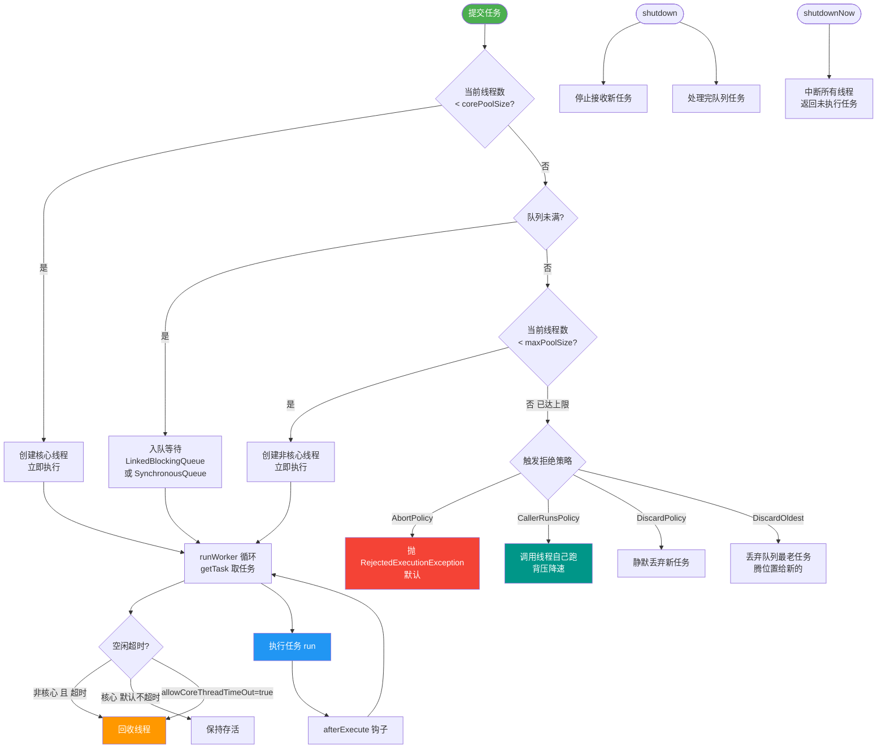
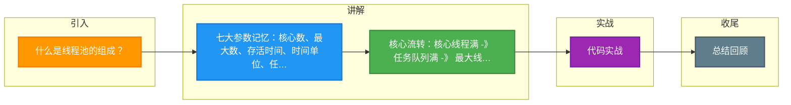

# 什么是线程池的组成？

### 线程池的组成

线程池（以 Java `ThreadPoolExecutor` 为例）旨在复用线程、控制并发数。其核心组成结构如下：

**1. 核心线程**
- **定义**：线程池中长期存活的线程数量。
- **行为**：即使线程处于空闲状态，核心线程也不会被回收（除非设置了 `allowCoreThreadTimeOut` 为 true）。
- **作用**：处理 incoming 的常规流量。

**2. 最大线程数**
- **定义**：线程池允许创建的最大线程数量。
- **限制**：当核心线程满且队列满时，线程池会尝试创建非核心线程，直到总数达到该值。

**3. 任务队列**
用于缓冲待执行的任务。不同的队列类型决定了线程池的容错和调度策略：
- **SynchronousQueue（同步队列）**：不存储元素，每个插入操作必须等待另一个线程的移除操作。
  - *场景*：`CachedThreadPool`，实现无缓冲的直接 handoff，高吞吐但易触发拒绝策略。
- **LinkedBlockingQueue（无界链表队列）**：
  - *场景*：`FixedThreadPool` 和 `SingleThreadExecutor`。理论上限为 `Integer.MAX_VALUE`，可能导致 OOM（内存溢出），但线程数稳定。
- **ArrayBlockingQueue（有界数组队列）**：
  - *场景*：需手动指定容量，防止资源耗尽，有助于系统的自我保护。
- **PriorityBlockingQueue**：支持优先级排序的任务队列。

**4. 非核心线程存活时间**
- **定义**：当线程数超过核心数时，多余的空闲线程在终止前等待新任务的最长时间。
- **参数**：`keepAliveTime` + `TimeUnit`。

**5. 线程工厂**
- **作用**：用于创建新线程。
- **定制**：可以自定义线程的名称（便于调试）、是否为守护线程、优先级以及未捕获异常处理器 (`UncaughtExceptionHandler`)。

**6. 拒绝策略**
当队列满且线程数达到最大值时，触发拒绝策略（实现了 `RejectedExecutionHandler` 接口）：
- **AbortPolicy（默认）**：直接抛出 `RejectedExecutionException` 异常，阻断调用。
- **CallerRunsPolicy**：由调用者所在的线程（提交任务的线程）来执行该任务。这是一种“降级”策略，降低了提交速度，保证任务不丢失。
- **DiscardPolicy**：直接丢弃任务，不做任何处理。
- **DiscardOldestPolicy**：丢弃队列里最老（队头）的任务，并尝试重新提交当前任务。

**线程池工作流程图：**
```
       +-----------------------+
       |   提交新任务 Task     |
       +-----------+-----------+
                   |
                   v
       +-----------+-----------+
       | 核心线程数是否已满?  |
       +-----------+-----------+
          | No              | Yes
          v                 v
    [创建核心线程]    +------+-------+
       | 执行任务       | 队列是否已满?|
       |                +------+-------+
       |                   | No       | Yes
       |                   v          v
       |              [入队等待]  +--+----------+
       |                            |最大线程数已满?|
       |                            +--+----------+
       |                               | No        | Yes
       |                               v           v
       |                        [创建非核心线程] [拒绝策略]
       |                               | 执行任务
       |                               |
       +<------------------------------+
               (非核心线程超时回收)
```

## 常见考点
1. **线程池的拒绝策略有哪些？默认是哪个？**
   AbortPolicy, CallerRunsPolicy, DiscardPolicy, DiscardOldestPolicy。默认是 AbortPolicy。
2. **核心参数如何合理设置？**
   - **CPU 密集型**：`核心线程数 = CPU 核心数 + 1`。
   - **IO 密集型**：`核心线程数 = CPU 核心数 * 2`（或根据 IO 等待时间调整，公式通常为 `CPU数 / (1 - 阻塞系数)`）。
3. **为什么不建议使用 Executors 创建线程池？**
   因为 `FixedThreadPool` 和 `SingleThreadExecutor` 默认允许的队列长度为 `Integer.MAX_VALUE`，可能导致 OOM；`CachedThreadPool` 允许创建最大 `Integer.MAX_VALUE` 个线程，可能导致耗尽 CPU 或内存资源。


## 核心流程图



## 记忆要点

- 七大参数记忆：核心数、最大数、存活时间、时间单位、任务队列、线程工厂、拒绝策略
- 核心流转：核心线程满 -> 任务队列满 -> 最大线程满 -> 触发拒绝策略
- 队列对比：SynchronousQueue直接交接，LinkedBlockingQueue无界易OOM，ArrayBlockingQueue有界保安全
- 四大拒绝策略：Abort抛异常(默认)、CallerRuns调用者执行、Discard直接丢、DiscardOldest丢最老
- 参数设置：CPU密集型设N+1，IO密集型设2N（或根据阻塞系数计算）

## 结构化回答


**30 秒电梯演讲：** 公司接待处：固定柜台(核心线程)、候客区(队列)、临时工(最大线程)。

**展开框架：**
1. **corePool** — Size决定常驻线程数
2. **workQueu** — workQueue缓冲等待任务
3. **maximumP** — oolSize是线程上限

**收尾：** 这是我实战中的理解，您想深入哪一段？


## 视频脚本

> 预计时长：4 分钟 | 由浅入深

| 时间 | 画面/字幕 | 口播台词 | 讲解要点 |
|------|----------|----------|----------|
| 0:00 | 标题卡：什么是线程池的组成 | 今天这道题：什么是线程池的组成。30 秒先给你讲清楚。 | 开场钩子 |
| 0:20 | 核心概念动画/示意图 | 公司接待处：固定柜台(核心线程)、候客区(队列)、临时工(最大线程)。 | 核心概念 |
| 0:40 | corePoolSize示意图 | corePoolSize决定常驻线程数 | corePoolSize |
| 1:10 | workQueue示意图 | workQueue缓冲等待任务 | workQueue |
| 1:40 | 总结卡 + 下期预告 | 记住今天这几个关键词，面试一定用得上。下期见。 | 收尾 |

### 视频流程图



