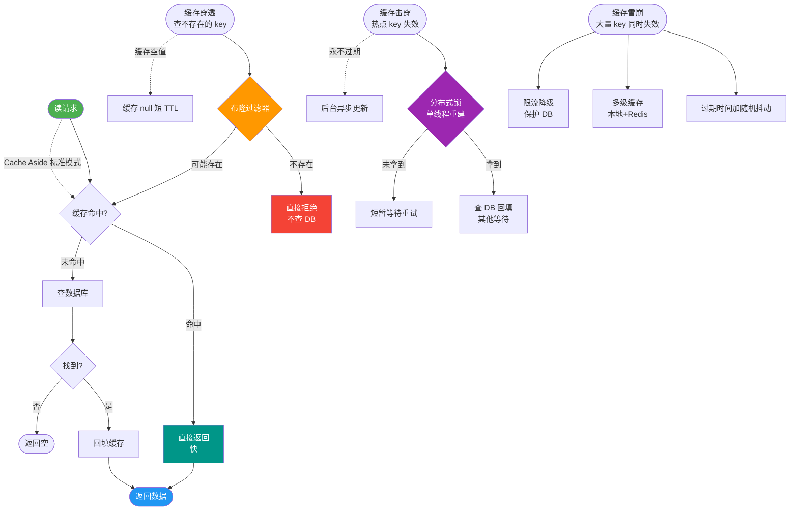

# 什么是缓存降级？什么场景下需要降级？

### 缓存降级

**1. 什么是缓存降级**
当访问量剧增、服务出现问题（如响应慢或超时）或非核心服务影响到核心流程性能时，为了保证核心服务可用，即使是有损服务，也会暂时屏蔽或简化非核心功能（或缓存服务）。降级可以是自动的（根据关键指标），也可以是人工配置开关触发的。

**2. 核心原理与分类**
降级的本质是**舍车保帅**，通过牺牲非核心业务的数据一致性或实时性，换取系统的整体高可用。
- **自动降级**：通过熔断器（如 Hystrix, Sentinel）监控错误率、响应时间。当超过阈值（如 50ms 响应超过 99%）时，自动触发降级逻辑。
- **人工降级**：在秒杀、大促开始前，人工在配置中心关闭非核心服务接口。

**3. 典型场景与策略**
- **高并发峰值（限流降级）**：秒杀、大促期间，关闭推荐系统、评论、物流查询等非核心服务，保下单支付。
- **第三方服务故障（容错降级）**：广告服务挂了，直接降级返回默认推荐或空列表，不拖累主页面。
- **下游服务响应慢（资源降级）**：数据库压力大时，对部分读请求降级（如返回默认值或旧缓存），减少数据库负载。

**4. 执行流程图**
```text

   请求  ──>  熔断器/开关检查  ──>  正常调用缓存/DB  ──>  返回数据
                     │
                (触发降级)
                     ↓
              降级逻辑执行
      ┌──────────┼──────────┐
      ↓          ↓          ↓
   返回默认值  返回本地旧缓存  返回空响应/友好提示
```

**5. 实战案例**
在“双11”大促期间，我们将商品详情页的“用户评价”和“相关推荐”接口降级。评价服务直接返回空列表，推荐服务返回本地缓存的静态 TopN 数据，从而将 99% 的数据库连接资源释放给核心的下单服务，成功扛住了 10倍 于平时的流量洪峰。

**6. 代码示例（Sentinel 降级）**
```java
// 使用 Sentinel 定义资源并配置降级规则
try (Entry entry = SphU.entry("resourceName")) {
    // 被保护的业务逻辑
    return service.queryDetail(id);
} catch (BlockException ex) {
    // 降级逻辑：返回兜底数据或旧缓存
    return fallbackCache.get(id);
}
```

**7. 缓存常见问题与策略（背景补充）**
为了更好理解降级背景，需了解以下概念：
- **缓存雪崩**：大量缓存同时失效，请求瞬间击穿数据库。*对策：错开失效时间（随机 TTL）、加锁排队、熔断降级。*
- **缓存穿透**：查询不存在的数据，请求直达数据库。*对策：布隆过滤器、缓存空对象（短 TTL）。*
- **缓存击穿**：热点 Key 过期，大量请求并发重建缓存。*对策：逻辑过期、互斥锁更新。*
- **缓存预热**：系统上线前或大促前，提前加载热点数据到缓存。

## 常见考点
1. 降级、熔断、限流的区别是什么？
   - *限流*：目的是保护系统，拒绝部分请求。
   - *熔断*：目的是防止故障蔓延，切断对下游的调用。
   - *降级*：目的是保证核心可用，提供兜底方案。
2. 降级时如何保证用户体验？
   - 通常返回“稍后重试”、“服务繁忙”等友好提示，或静态化的兜底页面。
3. 如何实现自动恢复？
   - 当服务检测到下游健康（探针成功）或流量恢复正常后，熔断器会进入“半开”状态尝试放行少量请求，成功则全开，失败则继续关闭。


## 核心流程图



## 记忆要点

- 一句话定义：牺牲非核心业务或数据一致性，换取核心系统整体高可用的有损服务策略
- 触发场景：高并发大促时关闭非核心服务（如评论推荐）保下单，或下游第三方服务故障超时
- 本质区别：限流是拒绝请求保系统，熔断是切断调用防蔓延，降级是提供兜底保核心
- 降级策略：通常采用返回默认值、返回本地或静态旧缓存、返回空列表或友好提示
- 恢复机制：服务恢复探针成功后，熔断器进入半开状态尝试放行，成功则全开恢复

## 结构化回答


**30 秒电梯演讲：** 停电时，只保留电梯和照明，关掉装饰灯和空调。

**展开框架：**
1. **目的** — 目的是保核心服务，舍车保帅
2. **可自动触发或** — 可自动触发或人工开关
3. **应对高并发或** — 应对高并发或下游故障

**收尾：** 这是我实战中的理解，您想深入哪一段？


## 视频脚本

> 预计时长：4 分钟 | 由浅入深

| 时间 | 画面/字幕 | 口播台词 | 讲解要点 |
|------|----------|----------|----------|
| 0:00 | 标题卡：什么是缓存降级？什么场景下需要降级 | 今天这道题：什么是缓存降级？什么场景下需要降级。30 秒先给你讲清楚。 | 开场钩子 |
| 0:20 | 核心概念动画/示意图 | 停电时，只保留电梯和照明，关掉装饰灯和空调。 | 核心概念 |
| 0:40 | 目的示意图 | 目的是保核心服务，舍车保帅 | 目的 |
| 1:10 | 自动触发或人工开关示意图 | 可自动触发或人工开关 | 自动触发或人工开关 |
| 1:40 | 总结卡 + 下期预告 | 记住今天这几个关键词，面试一定用得上。下期见。 | 收尾 |
