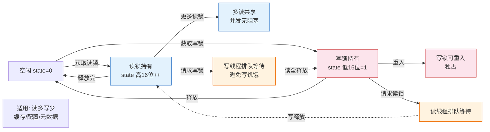

# 什么是读写锁？

### 读写锁

**1. 基本概念**
读写锁是一种针对读多写少场景优化的锁机制。它将锁分为读锁（共享锁）和写锁（排他锁）。

**2. 读写锁规则**
- **读-读共存**：允许一个或多个线程同时持有读锁（读操作不互斥）。
- **读-写互斥**：如果有线程持有读锁，其他线程不能申请写锁；反之亦然。
- **写-写互斥**：同一时间只能有一个线程持有写锁。

**3. 实战案例**
开发一个“配置中心”客户端时，配置项极不常更新（写少），但各业务线程频繁读取（读多）。我们使用 `ReentrantReadWriteLock` 替代 `synchronized`，使得读取配置时不阻塞，仅在配置更新时短时阻塞，将系统吞吐量从 5000 QPS 提升至 20000 QPS。

**4. 代码示例（Java ReentrantReadWriteLock）**
```java
ReentrantReadWriteLock rwLock = new ReentrantReadWriteLock();
Map<String, String> cache = new HashMap<>();

public String get(String key) {
    rwLock.readLock().lock();
    try {
        return cache.get(key);
    } finally {
        rwLock.readLock().unlock();
    }
}

public void put(String key, String value) {
    rwLock.writeLock().lock();
    try {
        cache.put(key, value);
    } finally {
        rwLock.writeLock().unlock();
    }
}
```

**5. 锁选型对比**

| 特性 | synchronized / ReentrantLock | ReentrantReadWriteLock | StampedLock (Java 8+) |
| :--- | :--- | :--- | :--- |
| 锁类型 | 悲观锁、互斥锁 | 悲观锁、共享/排他锁 | 乐观锁、共享/排他/乐观读 |
| 读并发 | 低（读读互斥） | 高（读读共享） | 极高（支持乐观读不阻塞写） |
| 写饥饿 | 可能 | 可能（读请求过多时） | 可能，但支持“读锁升级”优化 |
| 复杂度 | 低 | 中 | 高（需处理数据一致性验证） |
| 适用场景 | 通用计数、简单同步 | 读多写少缓存 | 读极度频繁，写极低频场景 |

**6. POSIX 接口**
- 初始化：`pthread_rwlock_init`
- 销毁：`pthread_rwlock_destroy`
- 加读锁：`pthread_rwlock_rdlock` (阻塞) / `pthread_rwlock_tryrdlock` (非阻塞)
- 加写锁：`pthread_rwlock_wrlock` (阻塞) / `pthread_rwlock_trywrlock` (非阻塞)
- 解锁：`pthread_rwlock_unlock`

**7. 适用场景**
适用于对共享数据的读操作频率远高于写操作的场景（如配置缓存、数据库数据读取）。

### 读写锁状态转换图



## 记忆要点

- 核心规则：读读共享（不互斥），读写互斥，写写互斥
- 适用场景：专门针对读多写少的业务（如配置中心、本地缓存查询）优化并发性能
- Java实现：ReentrantReadWriteLock 将锁分为共享的读锁和排他的写锁
- 进阶优化：StampedLock支持乐观读，允许读操作不阻塞写操作，极大提升读并发
- 风险提示：读锁过多可能导致写饥饿，且锁升级（读转写）容易引发死锁需谨慎

## 结构化回答


**30 秒电梯演讲：** 阅览室：可以多人同时看书(读)，但有人整理书架(写)时其他人不能进出。

**展开框架：**
1. **读锁共享** — 读锁共享，写锁独占
2. **读写互斥** — 读写互斥，写写互斥
3. **适合读多写少** — 适合读多写少场景提高并发

**收尾：** 这是我实战中的理解，您想深入哪一段？


## 视频脚本

> 预计时长：4 分钟 | 由浅入深

| 时间 | 画面/字幕 | 口播台词 | 讲解要点 |
|------|----------|----------|----------|
| 0:00 | 标题卡：什么是读写锁 | 今天这道题：什么是读写锁。30 秒先给你讲清楚。 | 开场钩子 |
| 0:20 | 核心概念动画/示意图 | 阅览室：可以多人同时看书(读)，但有人整理书架(写)时其他人不能进出。 | 核心概念 |
| 0:40 | 读锁共享示意图 | 读锁共享，写锁独占 | 读锁共享 |
| 1:10 | 读写互斥示意图 | 读写互斥，写写互斥 | 读写互斥 |
| 1:40 | 总结卡 + 下期预告 | 记住今天这几个关键词，面试一定用得上。下期见。 | 收尾 |
