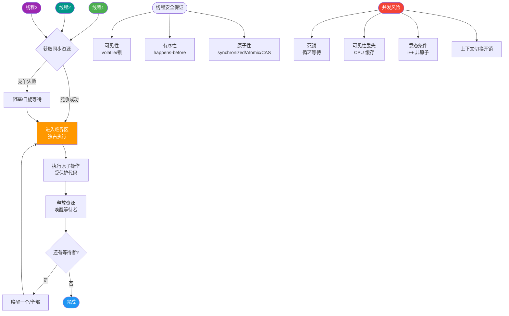

# 什么是进程和线程？它们的区别是什么？

**进程：**
- 系统资源分配和调度的基本单位。
- 拥有独立的地址空间、内存、文件描述符等资源。
- 进程间通信（IPC）需要管道、消息队列、共享内存、Socket 等机制，开销大。
- 创建/销毁开销大（涉及内存分配、页表建立等）。

**线程：**
- CPU 调度的基本单位（轻量级进程）。
- 同一进程内的线程共享地址空间、堆、全局变量、文件描述符等资源。
- 每个线程有独立的栈、程序计数器（PC）、寄存器。
- 线程间通信简单（直接读写共享变量），但需同步（锁、信号量）防数据竞争。
- 创建/销毁开销小。

**核心区别：**
| 维度 | 进程 | 线程 |
|---|---|---|
| 资源 | 独立地址空间 | 共享进程资源 |
| 调度单位 | 资源分配单位 | CPU 调度单位 |
| 通信 | IPC（开销大，需内核介入） | 共享内存（快，需同步机制） |
| 切换开销 | 大（刷新 TLB、Cr3 寄存器） | 小（仅需保存寄存器上下文） |
| 安全性 | 进程隔离，崩溃不影响其他 | 一个线程崩溃可能带崩整个进程 |
| 数据共享 | 难，需 IPC | 易，直接读写全局变量 |

**内存结构示意图：**
```text

进程 A (独立的虚拟地址空间)
┌───────────────────────────────┐
│        内核空间 (OS)           │  <-- 系统调用接口
├───────────────────────────────┤
│         栈 (Thread 1)          │  <-- 线程私有 (局部变量)
├───────────────────────────────┤
│         栈 (Thread 2)          │  <-- 线程私有
├───────────────────────────────┤
│                               │
│            堆 (Heap)           │  <-- 进程共享 (new/malloc)
│                               │
├───────────────────────────────┤
│         BSS/Data 段           │  <-- 进程共享 (全局变量)
├───────────────────────────────┤
│         Text (代码段)          │  <-- 进程共享 (指令)
└───────────────────────────────┘
```

**Java 中：** main 函数启动一个 JVM 进程，进程内可有多个线程（main 线程、GC 线程等）。

**实战案例**
在开发浏览器插件时，我们遇到一个恶意网页导致渲染线程崩溃的问题。如果使用多线程架构，整个浏览器进程会挂掉；而采用 Chrome 的多进程架构，沙箱隔离使得仅该标签页进程崩溃，用户刷新页面即可恢复，极大地提升了稳定性。

## 常见考点
1. 进程切换比线程切换慢在哪些具体操作？
   - 进程切换涉及 CR3 寄存器切换（页表切换），导致 TLB（快表）失效；而同一进程下的线程切换不需要改变地址空间，TLB 依然有效。
2. 多进程 vs 多线程如何选择？
   - 需要高隔离性、高安全性（如 Chrome 的多标签页架构）选多进程。
   - 需要高频数据共享、低延迟通信选多线程。
3. 协程与线程的区别？
   - 协程是用户态轻量级线程，由程序自身调度，切换完全在用户态完成，不涉及内核态切换，开销远小于线程。


## 核心流程图



## 记忆要点

- 基本定义：进程是资源分配的基本单位，线程是CPU调度的基本单位（轻量级进程）
- 资源分配：进程拥有独立地址空间，而同进程内的线程共享堆和全局变量，仅私有栈和PC
- 切换开销：因为线程切换不涉及地址空间变化（无CR3和页表切换），所以比进程切换快
- 通信方式：进程通信需跨越内核边界（IPC开销大），线程通信用直接读写共享内存（快但需加锁）
- 容错对比：进程间相互隔离崩溃互不影响，而线程的非法内存访问会导致整个进程崩溃

## 结构化回答


**30 秒电梯演讲：** 进程是工厂，线程是工人。工厂独立，工人共享工厂设备。

**展开框架：**
1. **进程间隔离** — 进程间隔离，线程间共享
2. **线程切换开销** — 线程切换开销小
3. **多线程** — 多线程需同步防冲突

**收尾：** 这是我实战中的理解，您想深入哪一段？


## 视频脚本

> 预计时长：4 分钟 | 由浅入深

| 时间 | 画面/字幕 | 口播台词 | 讲解要点 |
|------|----------|----------|----------|
| 0:00 | 标题卡：什么是进程和线程？它们的区别是什么 | 今天这道题：什么是进程和线程？它们的区别是什么。30 秒先给你讲清楚。 | 开场钩子 |
| 0:20 | 核心概念动画/示意图 | 进程是工厂，线程是工人。工厂独立，工人共享工厂设备。 | 核心概念 |
| 0:40 | 进程间隔离示意图 | 进程间隔离，线程间共享 | 进程间隔离 |
| 1:10 | 线程切换开销小示意图 | 线程切换开销小 | 线程切换开销小 |
| 1:40 | 总结卡 + 下期预告 | 记住今天这几个关键词，面试一定用得上。下期见。 | 收尾 |
