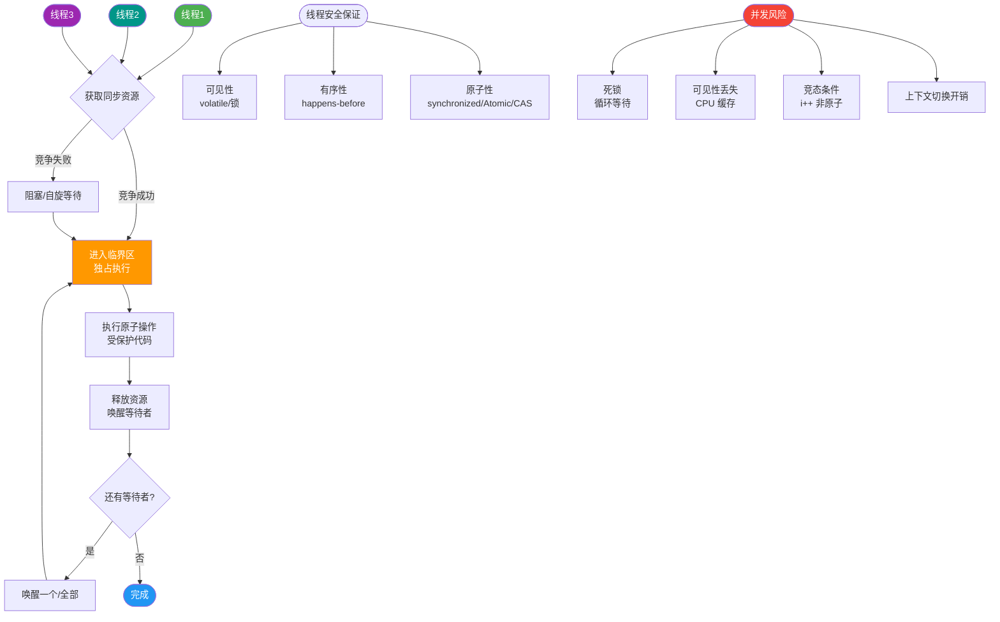

# 什么是进程通信？

### 进程通信 (IPC)

进程间通信是指不同进程之间进行数据交换、信息传递的机制。由于进程间内存相互隔离，必须通过内核提供的特殊机制进行通信。

**1. 常见 IPC 方式详解**

**(1) 管道**
- **匿名管道**：
  - 原理：内核缓冲区，单向数据流。
  - 场景：用于父子进程或兄弟进程通信（具有亲缘关系）。
  - 特点：随进程销毁。
- **命名管道 (FIFO)**：
  - 原理：文件系统中存在一个路径名，允许无亲缘关系的进程通过该路径打开进行通信。
  - 特点：以文件形式存在，数据在内存中传递。

**(2) 消息队列**
- **原理**：消息的链表，存放在内核中。一个进程向队列写入消息，另一个进程读取。
- **特点**：独立于发送和接收进程存在；可以实现消息的随机查询（按类型读取）；全双工。
- **缺点**：通信不及时（需用户态与内核态拷贝）；每个消息有最大长度限制；不适合传输大数据。

**(3) 共享内存**
- **原理**：在物理内存中划出一块区域，映射到多个进程的虚拟地址空间。
- **特点**：**最快**的 IPC 方式，因为数据不需要在客户机和服务器之间复制（直接内存访问）。
- **实现**：通常配合信号量或互斥锁来实现同步，避免数据竞争。

**(4) 信号量**
- 主要作为进程间以及同一进程不同线程之间的同步控制手段（PV操作），而非主要传输数据的载体。

**(5) 套接字**
- 原理：网络通信接口。
- 特点：可用于不同机器之间的进程通信，也可用于本地进程（Unix Domain Socket）。

**2. 实战案例**
我们在高并发的视频流服务中，原本使用消息队列传递视频帧元数据，但在处理 4K 视频流时，频繁的内存拷贝导致 CPU 占用过高。改为共享内存（配合 `semaphore` 同步）后，消除了内核态与用户态的数据拷贝，CPU 利用率下降了 30%，成功解决了性能瓶颈。

**3. 代码示例（Unix Domain Socket - 本地高效 IPC）**
```c
// 服务端
int server_fd = socket(AF_UNIX, SOCK_STREAM, 0);
struct sockaddr_un addr;
addr.sun_family = AF_UNIX;
strcpy(addr.sun_path, "/tmp/socket_file");
bind(server_fd, (struct sockaddr*)&addr, sizeof(addr));
listen(server_fd, 5);
// accept and communicate...
```

**4. 数据拷贝对比**
```text

管道/消息队列:
进程A ──[写]──> 内核缓冲区 ──[拷贝]──> 进程B

共享内存:
进程A ─────┐
          │ <── 物理内存 ──> │
进程B ─────┘
(无需内核拷贝，速度快)
```

**5. 共享存储映射**
- **mmap**：将一个文件或其它对象映射进内存。利用 `MAP_SHARED` 或 `MAP_PRIVATE` 标志控制共享或私有（写时复制）。
- **匿名映射**：使用 `MAP_ANONYMOUS` 标志，无需依赖文件即可在父子进程间建立共享内存区域。

## 常见考点
1. 为什么共享内存最快？
   - 因为共享内存省去了数据在用户态和内核态之间来回拷贝的开销，双方直接访问同一块物理内存。
2. 管道和消息队列的区别？
   - 管道是流式传输（字节流），消息队列是格式化数据（记录流）；管道通常用于亲缘进程，消息队列无此限制。
3. 信号量解决了什么问题？
   - 解决了进程同步和互斥问题，防止多个进程同时访问共享资源导致的数据不一致。


## 核心流程图



## 记忆要点

- 核心分类：管道、消息队列、共享内存、信号量、套接字
- 速度之王：因为共享内存省去了用户态与内核态的数据拷贝，所以是最快的IPC机制
- 亲缘限制：匿名管道只能用于父子或兄弟进程间的单向字节流通信
- 消息队列：存于内核中的格式化消息链表，克服了管道的流式传输缺点，且无亲缘限制
- 同步互斥：信号量主要用于进程间的同步控制（PV操作），本身不负责传输大量数据

## 结构化回答


**30 秒电梯演讲：** 两个隔开的房间(进程)通过传声筒(管道)、共享白板(共享内存)或信箱(消息队列)交流。

**展开框架：**
1. **管道适合简单数据流** — 管道适合简单数据流通信
2. **共享内存速度最快但** — 共享内存速度最快但需同步
3. **消息队列** — 消息队列可实现解耦和异步

**收尾：** 这是我实战中的理解，您想深入哪一段？


## 视频脚本

> 预计时长：4 分钟 | 由浅入深

| 时间 | 画面/字幕 | 口播台词 | 讲解要点 |
|------|----------|----------|----------|
| 0:00 | 标题卡：什么是进程通信 | 今天这道题：什么是进程通信。30 秒先给你讲清楚。 | 开场钩子 |
| 0:20 | 核心概念动画/示意图 | 两个隔开的房间(进程)通过传声筒(管道)、共享白板(共享内存)或信箱(消息队列)交流。 | 核心概念 |
| 0:40 | 管道示意图 | 管道适合简单数据流通信 | 管道 |
| 1:10 | 共享内存速度最快但需同步示意图 | 共享内存速度最快但需同步 | 共享内存速度最快但需同步 |
| 1:40 | 总结卡 + 下期预告 | 记住今天这几个关键词，面试一定用得上。下期见。 | 收尾 |
