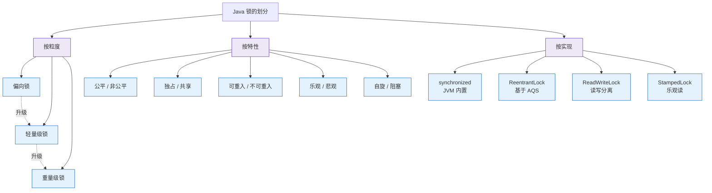

# 什么是锁的划分？

**锁的划分**

MySQL/数据库层面的锁划分主要包含**数据库维度**（按实现机制分）和**程序员维度**（按设计思想分）。

### 一、数据库角度（按锁级别与类型）

#### 1. 全局锁
锁定整个数据库实例，典型命令 `Flush tables with read lock (FTWRL)`。
- **使用场景**：全库逻辑备份（mysqldump 使用）。
- **副作用**：所有更新操作（增删改、DDL、事务提交）均被阻塞。
- **替代方案**：在可重复读隔离级别下，使用 `mysqldump --single-transaction` 开启一致性读快照，避免加全局锁。

#### 2. 表级锁
- **表锁**：`LOCK TABLES t READ/WRITE`。锁整张表，开销小但并发度低。
- **元数据锁 (MDL)**：防止 DDL 与 DML 并发冲突。读 select 加读锁，update/alter 加写锁。**注意**：MDL 是事务级锁，事务不提交锁不释放，可能导致长查询阻塞表结构变更。
- **意向锁**：分为 **IS (意向共享)** 和 **IX (意向排他)**。
  - **原理**：无需扫描全表，快速判断表是否有行锁被占用。
  - **兼容性矩阵**：
    | 锁类型 | IS (意向共享) | IX (意向排他) | S (表共享) | X (表排他) |
    | :--- | :---: | :---: | :---: | :---: |
    | **IS** | 兼容 | 兼容 | 兼容 | 冲突 |
    | **IX** | 兼容 | 兼容 | 冲突 | 冲突 |
    | **S** | 兼容 | 冲突 | 兼容 | 冲突 |
    | **X** | 冲突 | 冲突 | 冲突 | 冲突 |

#### 3. 行级锁
InnoDB 支持的细粒度锁，按范围分为三种：

```
假设有索引值: 10, 15, 20, 25

[10]-----[15]-----[20]-----[25]
 |       |       |       |
Record  Gap    Gap    Record
Lock    Lock   Lock    Lock

Next-Key Lock = Record Lock + 左侧 Gap Lock
(例: (10, 15] 锁住 10 之后到 15 之间的间隙和 15 本身)
```

**核心规则**：
1. **基本原则**：加锁单位是 `next-key lock`（前开后闭区间）。
2. **优化 1（唯一索引等值）**：命中唯一索引等值查询，`next-key lock` 退化为 **Record Lock**（行锁）。
3. **优化 2（非唯一/普通索引等值）**：向右遍历时最后一个值不满足条件，`next-key lock` 退化为 **Gap Lock**（间隙锁）。
4. **特殊"Bug"**：唯一索引上的范围查询会访问到不满足条件的第一个值（MySQL 8.0.18 后已修复）。

**隔离级别差异**：
- **RR (可重复读)**：默认使用 `next-key lock` 解决幻读，间隙锁也是 RR 特有。遵循 2PL（两阶段锁协议），锁在事务结束时释放。
- **RC (读提交)**：仅使用 **Record Lock**，无间隙锁，无法解决幻读。

### 二、程序员角度（按设计思想）

#### 1. 乐观锁
- **思想**：假设并发冲突概率低，不加锁，提交时检查。
- **实现**：通常使用 **版本号机制** 或 **CAS (Compare And Swap)** 算法。
- **SQL 示例**：`UPDATE table SET name = 'new', version = version + 1 WHERE id = 1 AND version = old_version`
- **适用场景**：读多写少，竞争不激烈。

#### 2. 悲观锁
- **思想**：假设并发冲突概率高，操作前直接加锁。
- **实现**：利用数据库自身的锁机制，如 `SELECT ... FOR UPDATE` (排他锁)。
- **适用场景**：写多，竞争激烈。

### 深化内容

**实战案例**：
在某电商大促场景中，曾出现库存扣减使用乐观锁导致大量更新失败（重试风暴），随后改为悲观锁（`select for update`）控制并发，虽然吞吐量略降但保证了系统稳定性。此外，生产环境曾因长事务未提交持有 MDL 读锁，导致线上 `ALTER TABLE` 语句被阻塞，进而导致后续所有查询请求堆积，造成数据库雪崩。

**代码示例（SQL）**：
```sql
-- 悲观锁示例：扣减库存
BEGIN;
SELECT quantity FROM inventory WHERE id = 100 FOR UPDATE;
-- 应用逻辑检查 quantity > 0
UPDATE inventory SET quantity = quantity - 1 WHERE id = 100;
COMMIT;

-- 乐观锁示例：基于版本号更新
UPDATE inventory 
SET quantity = quantity - 1, version = version + 1 
WHERE id = 100 AND version = 5; -- 假设当前版本为5
```

**对比表格（乐观锁 vs 悲观锁）**：

| 维度 | 乐观锁 | 悲观锁 |
| :--- | :--- | :--- |
| **核心思想** | 假设冲突少，提交时检查 | 假设冲突多，操作前加锁 |
| **实现机制** | CAS、版本号、时间戳 | 数据库锁（行锁/表锁）、Synchronized |
| **并发性能** | 高（无锁，适合读多写少） | 低（有锁等待，适合写多） |
| **死锁风险** | 无 | 存在（需注意加锁顺序） |
| **适用场景** | 读多写少、响应速度要求高 | 写多、一致性要求极高的金融场景 |

## 常见考点
1. **Next-Key Lock 的计算题**：给定 SQL（如范围查询、等值查询），判断 InnoDB 会锁住哪些具体的索引记录和间隙。
2. **死锁排查**：如何通过 `SHOW ENGINE INNODB STATUS` 分析死锁日志，定位锁冲突的事务。
3. **MDL 锁阻塞**：

### Java 锁的多维划分图




## 记忆要点

- 两大划分维度：数据库角度（全局/表/行）对比程序员角度（乐观/悲观）
- 行锁退化为口诀：唯一等值退Record，普通等值退Gap
- RR隔离级别用next-key防幻读，而RC级别无间隙锁仅用Record
- 乐观锁适合读多写少用版本号，悲观锁适合写多激烈用for update

## 结构化回答


**30 秒电梯演讲：** 锁卫生间（行级）vs 锁楼层（表级）vs 挂牌示警（意向锁）。

**展开框架：**
1. **全局锁锁整库** — 全局锁锁整库，常用于全库备份
2. **表锁锁整张表** — 表锁锁整张表，开销小并发低
3. **行锁锁具体记录** — 行锁锁具体记录，并发度高开销大

**收尾：** 这是我实战中的理解，您想深入哪一段？


## 视频脚本

> 预计时长：4 分钟 | 由浅入深

| 时间 | 画面/字幕 | 口播台词 | 讲解要点 |
|------|----------|----------|----------|
| 0:00 | 标题卡：什么是锁的划分 | 今天这道题：什么是锁的划分。30 秒先给你讲清楚。 | 开场钩子 |
| 0:20 | 核心概念动画/示意图 | 锁卫生间（行级）vs 锁楼层（表级）vs 挂牌示警（意向锁）。 | 核心概念 |
| 0:40 | 全局锁锁整库示意图 | 全局锁锁整库，常用于全库备份 | 全局锁锁整库 |
| 1:10 | 表锁锁整张表示意图 | 表锁锁整张表，开销小并发低 | 表锁锁整张表 |
| 1:40 | 总结卡 + 下期预告 | 记住今天这几个关键词，面试一定用得上。下期见。 | 收尾 |

### 视频流程图


