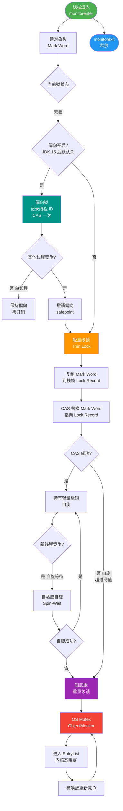

# 什么是锁的种类？

**锁的种类**

锁的种类可以从**作用范围**（粒度）和**锁的行为**（类型）两个维度划分。

### 一、按锁的粒度（范围）划分

#### 1. 全局锁
- **定义**：锁定整个数据库实例。
- **命令**：`Flush tables with read lock (FTWRL)`。
- **影响**：整个库处于只读状态，阻塞所有写操作（数据更新、DDL、事务提交）。
- **用途**：全库逻辑备份。

#### 2. 表级锁
MySQL 中表级锁主要包含以下几种：

**(1) 表锁
- **语法**：`lock tables t read/write`。
- **特点**：开销小，加锁快，并发度低（锁整张表）。
- **注意**：除了限制其他线程，也限定了本线程后续操作对象（例如 lock t read 后，本线程不能写其他表）。

**(2) 元数据锁 (MDL, Metadata Lock)
- **自动机制**：访问表时自动加锁，无需显式调用。
- **目的**：保证读写与表结构变更（DDL）的 正确性（防止查询时表被删除）。
- **规则**：
  - **读锁 (DML)**：增删改查时加读锁，读读不互斥。
  - **写锁 (DDL)**：修改表结构时加写锁，读写互斥、写写互斥。
- **关键点**：MDL 锁在**事务提交后才释放**。长事务会持有 MDL 读锁，导致后续 DDL 被阻塞，进而堵塞后续所有请求（这是常见的生产事故原因）。

**(3) 意向锁
- **作用**：快速判断表是否有行锁被占用，避免全表扫描。
- **类型**：
  - **IS (意向共享)**：事务准备给数据行加**共享锁**（S），先在表上加 IS。
  - **IX (意向排他)**：事务准备给数据行加**排他锁**（X），先在表上加 IX。
- **兼容性**：意向锁之间互不兼容；意向锁仅与表级 S/X 锁互斥。

**(4) AUTO-INC 锁
- **作用**：处理主键自增，保证 ID 连续递增。
- **机制**：插入语句开始时加表级 AUTO-INC 锁，结束后释放。
- **问题**：并发插入性能差（必须串行）。
- **优化**：`innodb_autoinc_lock_mode=2` (轻量级互斥锁/信号量)，申请完 ID 即释放锁，不锁整个语句，提升性能但 ID 可能不连续。

#### 3. 行级锁
InnoDB 的并发核心，针对索引记录加锁。

**(1) Record Lock (记录锁)**
- 锁定单条索引记录。

**(2) Gap Lock (间隙锁)**
- 锁定两个索引值之间的**空隙**（不包含记录本身）。
- **目的**：防止幻读（阻止其他事务向间隙插入新数据）。
- **兼容性**：间隙锁之间是**兼容**的（两个事务可以同时持有同一个间隙的间隙锁）。

**(3) Next-Key Lock (临键锁)**
- **组成**：`Record Lock + Gap Lock`。
- **范围**：前开后闭区间 `(a, b]`，锁定记录及其左侧间隙。
- **场景**：RR 隔离级别下非唯一索引等值查询或范围查询的默认锁模式。

```
数据示例: 1, 5, 10

Index:     1        5        10
          |        |        |
Gap:    (-∞,1]  (1,5]   (5,10]   (10,+∞)
         ^--Next-Key--^--Next-Key--^
```

### 二、按锁的行为（兼容性）划分

1. **共享锁 (S Lock, 读锁)**：允许其他事务加 S 锁，阻止 X 锁。`SELECT ... LOCK IN SHARE MODE`。
2. **排他锁 (X Lock, 写锁)**：禁止其他事务加 S 或 X 锁。`SELECT ... FOR UPDATE` 或 DML 操作自动添加。

### 深化内容

**实战案例**：
1. **死锁排查**：生产环境曾出现 `DELETE` 语句和 `INSERT` 语句死锁。原因在于 `DELETE` 在非唯一索引上执行时，会加 Next-Key Lock（包含间隙锁），而后续的 `INSERT` 恰好试图插入该间隙，导致互相等待。
2. **主键回表**：若 SQL 语句仅命中二级索引，InnoDB 不仅会对二级索引加行锁，还会对主键索引（聚集索引）加对应的 Record Lock，因此在排查锁冲突时需同时关注两棵索引树。

**代码示例（SQL）**：
```sql
-- 复杂 SQL 的加锁分析 (RR 隔离级别)
-- 假设表 t 有索引 (c), (id)
-- 执行: DELETE FROM t WHERE c >= 10 AND c < 15;

-- 加锁逻辑:
-- 1. 在二级索引 c 上: (5, 10], (10, 15], (15, 20) -- Next-Key 和 Gap Lock 组合
-- 2. 在主键索引 id 上: 对对应的主键 ID 加 Record Lock
```

**对比表格（Record/Gap/Next-Key）**：

| 锁类型 | 锁定范围 | 主要目的 | 是否阻塞插入 | 兼容性 |
| :--- | :--- | :--- | :--- | :--- |
| **Record Lock** | 单条索引记录 | 保证行数据一致性 | 否（仅针对不同记录） | 互斥（X锁） |
| **Gap Lock** | 两个索引之间的间隙 | 防止幻读（插入） | 是 | 兼容（共享） |
| **Next-Key Lock** | 记录 + 左侧间隙 | 同时解决幻读与一致性 | 是 | 互斥（X锁） |

## 常见考点
1. **Online DDL 原理**：执行 `ALTER TABLE` 时 MDL 写锁的获取时机和阻塞风险。
2. **主键自增机制**：`innodb_autoinc_lock_mode` 的不同值（0, 1, 2）对性能和 ID 连续性的影响。
3. **幻读与间隙锁**：举例说明 Gap Lock 是如何防止幻读的（例如：插入不存在 ID 时被阻塞）。


## 核心流程图



## 记忆要点

- 锁分两大维度：按粒度划分（全局/表/行）对比按行为划分（共享/排他）
- MDL元数据锁在事务提交才释放，长事务极易阻塞DDL致库雪崩
- 意向锁作用：快速判断表是否有行锁，避免全表扫描资源消耗
- 行锁三兄弟：Record锁单行、Gap锁间隙防幻读、Next-Key前开后闭

## 结构化回答


**30 秒电梯演讲：** 封路（全局）、限行（表级）、定点拥堵（行级）。

**展开框架：**
1. **全局锁锁定整个数据库实例** — 全局锁锁定整个数据库实例，只读
2. **MDL** — 表级锁包括表锁、元数据锁(MDL)和自增锁
3. **MDL** — MDL保证读写的正确性，读写互斥

**收尾：** 这是我实战中的理解，您想深入哪一段？


## 视频脚本

> 预计时长：4 分钟 | 由浅入深

| 时间 | 画面/字幕 | 口播台词 | 讲解要点 |
|------|----------|----------|----------|
| 0:00 | 标题卡：什么是锁的种类 | 今天这道题：什么是锁的种类。30 秒先给你讲清楚。 | 开场钩子 |
| 0:20 | 核心概念动画/示意图 | 封路（全局）、限行（表级）、定点拥堵（行级）。 | 核心概念 |
| 0:40 | 全局锁锁定整个数据库实例示意图 | 全局锁锁定整个数据库实例，只读 | 全局锁锁定整个数据库实例 |
| 1:10 | 表级锁包括表锁示意图 | 表级锁包括表锁、元数据锁(MDL)和自增锁 | 表级锁包括表锁 |
| 1:40 | 总结卡 + 下期预告 | 记住今天这几个关键词，面试一定用得上。下期见。 | 收尾 |
