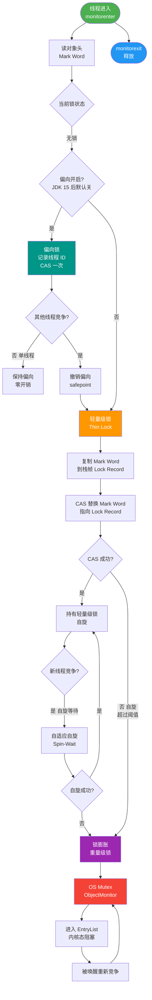

# 介绍一下几种典型的锁？

题目问锁，答案答中断，修正如下：Java中常见的锁包括乐观锁与悲观锁、自旋锁与适应性自旋锁、无锁与偏向锁/轻量级锁/重量级锁、公平锁与非公平锁、可重入锁与非可重入锁、独占锁与共享锁等。这些锁从不同维度（如设计思想、实现机制、状态）对并发控制进行了分类。

## 技术原理

- **乐观锁通过 CAS 无锁实现，适合读多写少**：乐观锁假设冲突很少发生，读时不加锁，写时用 CAS（Compare-And-Swap）原子操作校验版本号是否变化，失败则重试。`AtomicInteger`、`LongAdder`、数据库的 version 字段都属此类，无阻塞所以读多写少场景吞吐高。
- **悲观锁通过互斥同步实现，适合写多**：悲观锁假定冲突必然发生，访问前先加锁独占资源（如 `synchronized`、`ReentrantLock`、`SELECT ... FOR UPDATE`）。写多场景下重试成本高，直接互斥反而更稳定，代价是线程阻塞与上下文切换。
- **Synchronized 随竞争升级为偏向、轻量、重量级锁**：JVM 对 `synchronized` 做了锁升级优化——单线程访问时是偏向锁（只记线程 ID，无 CAS）；多线程轻度竞争时升级为轻量级锁（自旋 CAS）；激烈竞争时膨胀为重量级锁（OS 互斥量，线程挂起）。升级不可逆，兼顾了低竞争的低开销与高竞争的正确性。
- **ReentrantLock 支持公平/非公平、可中断获取**：`ReentrantLock` 是 API 层的悲观锁，提供 `fair` 公平锁（按等待顺序获取，避免饥饿但吞吐低）和非公平锁（默认，允许插队，吞吐高）；还支持 `lockInterruptibly()` 响应中断、`tryLock(timeout)` 超时、多个 `Condition` 队列，灵活性高于 `synchronized`。

## 对比/选型

| 维度 | 乐观锁（CAS） | 悲观锁（synchronized/ReentrantLock） |
|------|----------------|---------------------------------------|
| 实现机制 | 无锁，CAS 重试 | 互斥阻塞 |
| 适合场景 | 读多写少、冲突少 | 写多、临界区长、冲突激烈 |
| 公平性 | 无锁无公平概念 | 支持公平/非公平 |
| 可中断/超时 | 不适用 | ReentrantLock 支持 |
| 典型实现 | Atomic*、LongAdder、DB version | synchronized、ReentrantLock |

| 锁特性 | synchronized | ReentrantLock |
|--------|--------------|---------------|
| 公平/非公平 | 仅非公平 | 二者都支持 |
| 可中断 | 否 | 是（lockInterruptibly） |
| 超时获取 | 否 | 是（tryLock） |
| 多 Condition | 否（单 wait/notify） | 是（newCondition） |
| 锁释放 | 自动 | 必须 finally unlock |

## 代码示例

乐观锁（CAS）实现计数器：

```java
AtomicInteger count = new AtomicInteger(0);
public void increment() {
    int prev;
    do {
        prev = count.get();
    } while (!count.compareAndSet(prev, prev + 1));   // CAS 重试
}
// 或直接用封装方法
count.incrementAndGet();
```

ReentrantLock 公平锁 + Condition（生产者-消费者）：

```java
private final ReentrantLock lock = new ReentrantLock(true); // true = 公平锁
private final Condition notFull  = lock.newCondition();
private final Condition notEmpty = lock.newCondition();

public void put(T x) throws InterruptedException {
    lock.lockInterruptibly();                           // 可响应中断
    try {
        while (queue.size() == CAP) notFull.await();
        queue.offer(x);
        notEmpty.signal();
    } finally {
        lock.unlock();                                  // 必须显式释放
    }
}
```

## 常见坑/注意事项

- **乐观锁 ABA 问题**：CAS 只比对值，值从 A→B→A 会被误判为未变化。用 `AtomicStampedReference` 加版本号解决。
- **乐观锁自旋开销**：写冲突激烈时 CAS 频繁失败重试，CPU 空转比直接阻塞还差，此时应改用悲观锁。
- **synchronized 锁升级不可逆**：一旦升级到重量级锁就不会降级，长时间高竞争后即使竞争消失也保持重量级，需重启或换 ReentrantLock。
- **ReentrantLock 忘记 unlock**：必须在 `finally` 中释放，否则异常时死锁；这是相比 synchronized 自动释放的主要风险点。
- **公平锁吞吐低**：公平锁要维护队列顺序，线程切换多，除饥饿敏感场景外默认用非公平。


## 核心流程图



## 记忆要点

- 一句话总览：Java锁是按设计思想、实现机制、特性等多维度的分类统称
- 核心四维度对比：乐观/悲观、公平/非公平、可重入/不可、独占/共享
- synchronized专属特性：包含自旋优化与无锁到重量级锁的升级状态

## 结构化回答

**30 秒电梯演讲：** 排队上厕所（公平锁）vs 挤进去（非公平锁）。

**展开框架：**
1. **乐观锁** — 乐观锁通过CAS无锁实现，适合读多写少
2. **悲观锁** — 悲观锁通过互斥同步实现，适合写多
3. **Synchronized** — Synchronized随竞争升级为偏向、轻量、重量级锁

**收尾：** 这块我踩过一些坑，您想深入聊哪一段——原理细节、实战案例还是常见踩坑？

## 视频脚本

> 预计时长：4 分钟 | 由浅入深

| 时间 | 画面/字幕 | 口播台词 | 讲解要点 |
|------|----------|----------|----------|
| 0:00 | 标题卡：介绍一下几种典型的锁 | 今天这道题：介绍一下几种典型的锁。30 秒先给你讲清楚。 | 开场钩子 |
| 0:20 | 核心概念动画/示意图 | 排队上厕所（公平锁）vs 挤进去（非公平锁）。 | 核心概念 |
| 0:40 | 乐观锁示意图 | 乐观锁通过CAS无锁实现，适合读多写少 | 乐观锁 |
| 1:10 | 悲观锁示意图 | 悲观锁通过互斥同步实现，适合写多 | 悲观锁 |
| 1:40 | 总结卡 + 下期预告 | 记住今天这几个关键词，面试一定用得上。下期见。 | 收尾 |
