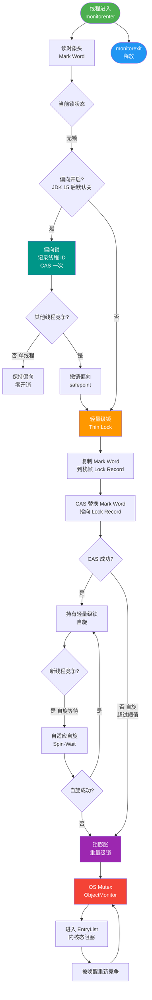

# 你知道Java中有哪些锁吗是什么？

**Java 中常见的锁分类**

Java 中的锁根据**设计思想**、**实现机制**、**特性**等有不同的分类。以下是核心分类详解：

### 1. 乐观锁 vs 悲观锁
- **悲观锁**：认为并发冲突概率高。
  - **实现**：`synchronized`、`ReentrantLock`。
  - **特点**：独占，每次操作都加锁。
- **乐观锁**：认为并发冲突概率低。
  - **实现**：CAS (Compare And Swap) 算法（如 `AtomicInteger`），版本号机制。
  - **特点**：无锁，更新时重试，适合读多写少。

### 2. 公平锁 vs 非公平锁
- **公平锁**：严格按照请求锁的顺序获取（FIFO）。
  - **实现**：`ReentrantLock(true)`。
  - **缺点**：吞吐量较低，线程切换开销大。
- **非公平锁**：允许插队，抢锁时直接尝试 CAS。
  - **实现**：`synchronized`，`ReentrantLock(false)`（默认）。
  - **优点**：减少挂起线程的概率，吞吐量更高。

### 3. 可重入锁
- **定义**：同一个线程可以多次获取同一把锁，不会自己把自己锁死。
  - **Java 实现**：`synchronized` 和 `ReentrantLock` 均支持。
- **计数器原理**：锁内部维护一个 `state` 计数器，重入加 1，释放减 1，减至 0 时完全释放。

### 4. 独占锁 vs 共享锁
- **独占锁 (排他锁)**：一次只能被一个线程持有。
  - **实现**：`ReentrantLock`、`synchronized`。
- **共享锁**：允许多个线程同时持有。
  - **实现**：`ReentrantReadWriteLock` 中的**读锁**。

### 5. 自旋锁 vs 适应性自旋锁
- **自旋锁**：线程在获取不到锁时不挂起（不放弃 CPU），而是执行循环等待（自旋）。
  - **优点**：减少线程上下文切换开销。
  - **缺点**：如果锁占用时间长，会浪费大量 CPU 资源。
- **适应性自旋锁**：JVM 自带优化。自旋次数不是固定的，如果上次自旋成功拿到了锁，本次就允许自旋更多次；反之则减少。

### 6. 锁升级状态 (Synchronized 优化)
JDK 1.6 之后，`synchronized` 锁状态会根据竞争情况自动升级（不可逆）：

```
无锁
  |
  v (线程A访问)
偏向锁 (Biased Lock) <- 只有一个线程访问时
  |
  v (线程B竞争)
轻量级锁 (Lightweight Lock) <- 线程交替执行，或自旋
  |
  v (竞争激烈)
重量级锁 (Heavyweight Lock) <- 涉及内核态互斥量
```

### 7. 分段锁
- **定义**：一种设计思想，将数据分成多段，每段配一把锁。
- **实现**：JDK 7 的 `ConcurrentHashMap`。不同的线程访问不同的 Segment 时，可以并发进行，只有在同一 Segment 内才竞争锁。

### 8. 读写锁 (`ReadWriteLock`)
- 一对锁：一个读锁（共享），一个写锁（独占）。
- **规则**：
  - 读-读：共享
  - 读-写：互斥
  - 写-写：互斥
- **锁降级**：支持从写锁降级为读锁（先获取写锁，再获取读锁，最后释放写锁），但不支持从读锁升级为写锁。

### 深化内容

**实战案例**：
在秒杀系统中，曾误用 `synchronized` 修饰扣减库存的方法，导致单机性能极低（锁升级为重量级锁且无法跨进程），后改为基于 Redis (Lua脚本 + watch dog) 或 `AtomicInteger` 的分布式方案/乐观锁思想，吞吐量提升数倍。另外，`ReentrantLock` 必须在 `finally` 块中手动 `unlock()`，否则若业务代码抛出异常会导致锁永久泄漏，生产中曾因此导致死锁。

**代码示例（Java）**：
```java
// ReentrantLock 实现公平锁与手动释放
private final ReentrantLock lock = new ReentrantLock(true); // 公平锁

public void performTask() {
    lock.lock();
    try {
        // 临界区代码
        System.out.println("Thread " + Thread.currentThread().getId() + " is working");
    } finally {
        lock.unlock(); // 必须在 finally 中释放
    }
}
```

**对比表格（Synchronized vs ReentrantLock）**：

| 维度 | Synchronized | ReentrantLock |
| :--- | :--- | :--- |
| **实现方式** | JVM 层面，字节码指令 | JDK 层面，基于 AQS |
| **锁释放** | 自动释放（代码块执行完或异常） | 必须手动调用 `unlock()` (finally) |
| **公平性** | 非公平 | 可选公平/非公平（构造函数） |
| **等待可中断** | 不可中断 | 可中断（`lockInterruptibly`） |
| **条件变量** | 单一条件集 | 支持多个 Condition（绑定不同队列） |
| **锁类型** | 不可中断，悲观锁 | 灵活，支持尝试锁(`tryLock`) |

## 常见考点
1. **Synchronized 锁升级过程**：解释偏向锁、轻量级锁、重量级锁的转换触发条件和对象头 Mark Word 变化。
2. **AQS 原理**：`ReentrantLock` 和 `ReentrantReadWriteLock` 是如何基于 AQS (AbstractQueuedSynchronizer) 利用 `state` 变量实现独占/共享模式的。
3. **CAS 及 ABA 问题**：乐观锁底层 CAS 的实现原理（Unsafe 类）以及如何解决 ABA 问题（版本号/AtomicStampedReference）。
4. **死锁排查**：如何使用 `jstack` 或 VisualVM 分析死锁日志。


## 核心流程图



## 记忆要点

- 核心分类：悲观对比乐观、公平对比非公平、可重入对比独占/共享
- ReentrantLock对比synchronized：前者基于AQS灵活可中断，后者JVM自动释放
- Synchronized锁升级单向不可逆：无锁 -> 偏向 -> 轻量 -> 重量级
- 实战避坑：ReentrantLock必须在finally中手动unlock以防死锁泄漏

## 结构化回答


**30 秒电梯演讲：** 单人办公室（独享）vs 会议室（共享）。

**展开框架：**
1. **公平锁按顺序获取** — 非公平锁抢占式吞吐高
2. **可重入锁避免同线程死锁** — 如Synchronized
3. **独享锁互斥** — 独享锁互斥，共享锁并发读

**收尾：** 这是我实战中的理解，您想深入哪一段？


## 视频脚本

> 预计时长：4 分钟 | 由浅入深

| 时间 | 画面/字幕 | 口播台词 | 讲解要点 |
|------|----------|----------|----------|
| 0:00 | 标题卡：你知道Java中有哪些锁吗是什么 | 今天这道题：你知道Java中有哪些锁吗是什么。30 秒先给你讲清楚。 | 开场钩子 |
| 0:20 | 核心概念动画/示意图 | 单人办公室（独享）vs 会议室（共享）。 | 核心概念 |
| 0:40 | 公平锁按顺序获取示意图 | 公平锁按顺序获取，非公平锁抢占式吞吐高 | 公平锁按顺序获取 |
| 1:10 | 重入锁示意图 | 可重入锁避免同线程死锁，如Synchronized | 重入锁 |
| 1:40 | 总结卡 + 下期预告 | 记住今天这几个关键词，面试一定用得上。下期见。 | 收尾 |
