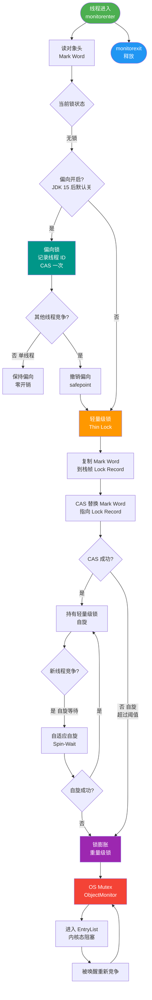

# 共享锁和独占锁的区别是什么？

**共享锁和独占锁的区别**

这两者是按照**锁的访问权限**（互斥性）进行划分的。

### 1. 独占锁
- **定义**：一次只能被**一个线程**持有。
- **特点**：悲观保守策略，严格保证线程安全。
- **场景**：写操作（数据变更）。
- **Java 实现**：`ReentrantLock`、`synchronized`、`ReentrantReadWriteLock.WriteLock`。
- **影响**：如果线程 A 持有独占锁，线程 B 无论是想读还是写，都必须等待。

### 2. 共享锁
- **定义**：可以被**多个线程**同时持有。
- **特点**：乐观策略，允许多个线程并发访问资源。当所有持有共享锁的线程释放后，独占锁才能获取。
- **场景**：读操作（数据查询）。
- **Java 实现**：`ReentrantReadWriteLock.ReadLock`。
- **影响**：多个线程可以同时读；但若有一个线程持有写锁（独占），其他读线程必须等待。

### 3. 读写锁原理架构图

在 `ReentrantReadWriteLock` 中，读写状态由同一个同步状态器 (`sync state`) 维护，通过位运算切割高低位：

```
       int state (32位)
+----------------+----------------+
|  高16位 (写锁) |  低16位 (读锁) |
+----------------+----------------+
|   Write Count  |   Read Count   |
+----------------+----------------+

写锁获取:
1. 检查读锁计数是否为 0 且当前线程未持有写锁。
2. CAS 将 state 高 16 位 + 1。

读锁获取:
1. 检查写锁是否被其他线程持有（独占）。
2. CAS 将 state 低 16 位 + 1 (或直接增加，如果非公平)。
```

### 4. 关键对比表

| 特性 | 独占锁 | 共享锁 |
| :--- | :--- | :--- |
| **持有者数量** | 1 个 | N 个 |
| **读写互斥** | 与读、写均互斥 | 与写互斥，与读共享 |
| **并发吞吐** | 低 | 读高，写低 |
| **典型用途** | 数据更新 | 数据查询 |

### 5. 锁降级
- **定义**：持有写锁的线程可以获取读锁，然后释放写锁。
- **目的**：在写完数据后，紧接着读取数据时，保证数据的可见性，而不被其他写线程打断。
- **注意**：不支持锁升级（不能从读锁直接升级为写锁，否则会造成死锁）。

### 深化内容

**实战案例**：
在实现缓存系统（如本地缓存 LoadingCache）时，曾使用读写锁优化：多个线程可并发读取缓存，但当缓存失效需要重新加载数据时，只有一个线程获取写锁进行加载，其他读线程短暂等待或读取旧数据（StampedLock 优化）。但需注意“写饥饿”问题，若读请求极其频繁，写锁可能迟迟拿不到，导致数据更新严重延迟。

**代码示例（Java）**：
```java
ReentrantReadWriteLock rwLock = new ReentrantReadWriteLock();
ReentrantReadWriteLock.ReadLock readLock = rwLock.readLock();
ReentrantReadWriteLock.WriteLock writeLock = rwLock.writeLock();

// 读操作 - 共享锁
public Object getData() {
    readLock.lock();
    try {
        return data; // 多个线程可同时进入
    } finally {
        readLock.unlock();
    }
}

// 写操作 - 独占锁
public void setData(Object newData) {
    writeLock.lock();
    try {
        this.data = newData; // 阻塞所有读操作
    } finally {
        writeLock.unlock();
    }
}
```

## 常见考点
1. **AQS 共享模式实现**：解释 `tryAcquireShared` 和 `tryReleaseShared` 方法的底层逻辑。
2. **读写锁的“写饥饿”**：如果读操作非常频繁，写锁可能一直获取不到，如何解决（使用“公平锁”策略）？
3. **锁状态存储**：一个 int 变量如何同时保存读锁和写锁的重入次数？（高 16 位写，低 16 位读）。


## 核心流程图



## 记忆要点

- 一句话定义：独占写操作仅1线程持有，共享读操作允许多线程并发
- 互斥规则：读读共享不互斥，只要遇写（读写、写写）均需互斥等待
- AQS原理：整型state变量按位切割，高16位记录写锁低16位记录读锁
- 锁降级单向：支持写锁降级为读锁保证可见性，而读锁不可升级为写防死锁

## 结构化回答


**30 秒电梯演讲：** 单人占座（独占）vs 多人共读（共享）。

**展开框架：**
1. **独占锁（写锁）互斥** — 独占锁（写锁）互斥，保证数据修改安全
2. **共享锁（读锁）并发** — 共享锁（读锁）并发，允许多线程同时读
3. **读写锁中读读共享** — 读写锁中读读共享，读写互斥

**收尾：** 这是我实战中的理解，您想深入哪一段？


## 视频脚本

> 预计时长：4 分钟 | 由浅入深

| 时间 | 画面/字幕 | 口播台词 | 讲解要点 |
|------|----------|----------|----------|
| 0:00 | 标题卡：共享锁和独占锁的区别是什么 | 今天这道题：共享锁和独占锁的区别是什么。30 秒先给你讲清楚。 | 开场钩子 |
| 0:20 | 核心概念动画/示意图 | 单人占座（独占）vs 多人共读（共享）。 | 核心概念 |
| 0:40 | 独占锁（写锁）互斥示意图 | 独占锁（写锁）互斥，保证数据修改安全 | 独占锁（写锁）互斥 |
| 1:10 | 共享锁（读锁）并发示意图 | 共享锁（读锁）并发，允许多线程同时读 | 共享锁（读锁）并发 |
| 1:40 | 总结卡 + 下期预告 | 记住今天这几个关键词，面试一定用得上。下期见。 | 收尾 |
