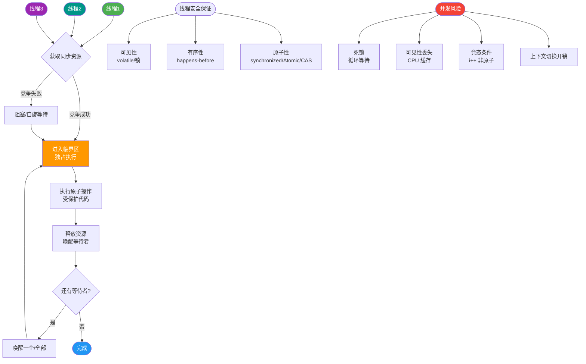
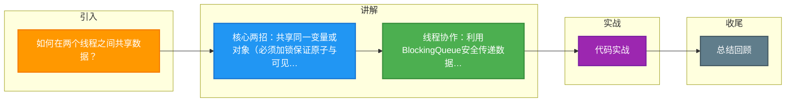

# 如何在两个线程之间共享数据？

在两个线程间共享数据有几种方式：

**1. 共享变量（需同步）：**
多线程访问同一个对象的成员变量时，必须保证可见性、原子性和有序性。
```java
class Shared {
    private volatile int count = 0; // 保证可见性，禁止指令重排
    
    // 方法级同步（锁是 this 实例）
    synchronized void inc() { count++; }
    
    // 或者使用原子类（CAS + volatile）
    AtomicInteger atomicCount = new AtomicInteger(0);
    void atomicInc() { atomicCount.incrementAndGet(); }
}
```

**2. 共享对象（同一 Runnable 实例）：**
多个 Thread 共用同一个 Runnable，Runnable 的实例字段被共享。
```java
Runnable task = new MyTask(); // 同一实例
new Thread(task).start();
new Thread(task).start();
```

**3. wait/notify 通信：**
生产者-消费者，通过共享对象的 monitor 协作。必须包含在 synchronized 块中，且防止虚假唤醒。
```java
synchronized(lock) {
    while (!condition) { // 必须用 while 循环判断
        lock.wait();
    }
    // 执行逻辑
}
```

**4. 并发工具：**
- `BlockingQueue`：线程间安全传递数据（如 ArrayBlockingQueue）。
- `Exchanger`：两个线程在同步点交换数据。
- `CountDownLatch`/`CyclicBarrier`：同步点协调。
- `Phaser`：分阶段的并发控制。

**5. 线程安全容器：**
`ConcurrentHashMap`、`CopyOnWriteArrayList` 等可直接共享，其内部通过分段锁、CAS 或写时复制保证线程安全。

**注意：** 
- 共享可变状态必须加锁或用原子类/CAS，遵循 happens-before 原则。
- 共享不可变对象（final、String）天然线程安全无需同步。
- `ThreadLocal` 本质上是线程隔离，每个线程独享一份数据副本，不属于共享数据。

## 常见考点
1. **Volatile vs Synchronized**：Volatile 能保证可见性和有序性，但不能保证原子性（如 count++）；Synchronized 三者都能保证。
2. **线程间通信方式**：除了 wait/notify，还有 Lock/Condition（支持多条件队列）、管道输入输出流（PipedInputStream/PipedOutputStream）。
3. **ThreadLocal 的内存泄漏问题**：ThreadLocalMap 中的 Key 是弱引用，Value 是强引用，如果线程不结束，Value 无法回收，导致内存泄漏，需手动 remove。


## 核心流程图



## 记忆要点

- 核心两招：共享同一变量或对象（必须加锁保证原子与可见性）
- 线程协作：利用BlockingQueue安全传递数据或wait/notify通信
- 并发工具：使用Exchanger交换数据，或CountDownLatch同步点协调
- 易错点：ThreadLocal本质是线程隔离，绝对不属于线程间共享数据

## 结构化回答


**30 秒电梯演讲：** 两人共看一块黑板（共享变量）vs 传纸条（消息队列）。

**展开框架：**
1. **共享内存需通** — 共享内存需通过synchronized或volatile保证可见性
2. **线程安全容器** — 线程安全容器（如ConcurrentHashMap）可直接共享
3. **BlockingQueue** — 阻塞队列（BlockingQueue）实现生产消费模型

**收尾：** 这是我实战中的理解，您想深入哪一段？


## 视频脚本

> 预计时长：4 分钟 | 由浅入深

| 时间 | 画面/字幕 | 口播台词 | 讲解要点 |
|------|----------|----------|----------|
| 0:00 | 标题卡：如何在两个线程之间共享数据 | 今天这道题：如何在两个线程之间共享数据。30 秒先给你讲清楚。 | 开场钩子 |
| 0:20 | 核心概念动画/示意图 | 两人共看一块黑板（共享变量）vs 传纸条（消息队列）。 | 核心概念 |
| 0:40 | 共享内存需示意图 | 共享内存需通过synchronized或volatile保证可见性 | 共享内存需 |
| 1:10 | 线程安全容器（如示意图 | 线程安全容器（如ConcurrentHashMap）可直接共享 | 线程安全容器（如 |
| 1:40 | 总结卡 + 下期预告 | 记住今天这几个关键词，面试一定用得上。下期见。 | 收尾 |

### 视频流程图



