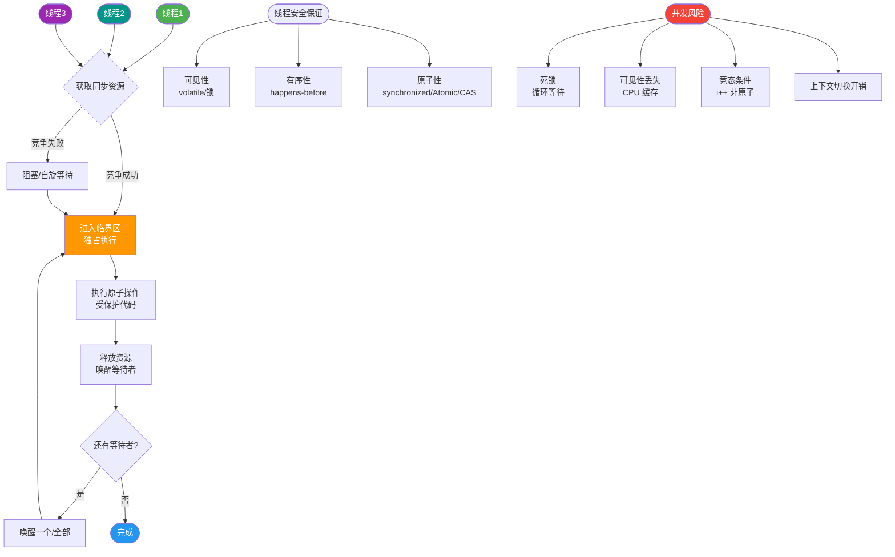

# 如何设计一个秒杀系统？

数据从一个地方搬运到另外一个地方需要花费时间，系统设计人员的一个主要任务就是缩短信息搬运所花费的时间。
场景题 & 系统设计

秒杀系统场景特点：
1. **瞬时高并发**：访问请求数量远远大于库存数量，只有少部分用户能够秒杀成功。大量用户会在同一时间同时进行抢购，网站瞬时访问流量激增。
2. **业务简单**：一般就是下订单减库存。
3. **资源敏感**：库存少，容易造成数据库死锁或连接池耗尽。

**秒杀架构设计理念：**
- **限流**：鉴于只有少部分用户能够秒杀成功，所以要限制大部分流量，只允许少部分流量进⼊服务后端秒杀程序。
- **削峰**：对于秒杀系统瞬时会有大量用户涌⼊，所以在抢购一开始会有很高的瞬间峰值。高峰值流量是压垮系统很重要的原因，所以如何把瞬间的高流量变成一段时间平稳的流量也是设计秒杀系统很重要的思路。实现削峰的常用的方法有前端添加一定难度的验证码后端利用缓存和消息中间件等技术。
- **异步处理**：秒杀系统是一个高并发系统，采用异步处理模式可以极大地提高系统并发量，其实异步处理就是削峰的一种实现方式。
- **内存缓存**：秒杀系统最大的瓶颈一般都是数据库读写，由于数据库读写属于磁盘IO，性能很低，如果能够把部分数据或业务逻辑转移到内存缓存，效率会有极大地提升。
- **可拓展**：当然如果我们想支持更多用户，更大的并发，最好就将系统设计成弹性可拓展的，如果流量来了，拓展机器就好了。像淘宝、京东等双十一活动时会增加大量机器应对交易高峰。

**架构方案与数据流：**

```
Client (Browser/App)
   |
   v
[CDN] (静态资源: HTML/JS/CSS/图片)
   |
   v
[WAF / API Gateway] (限流: 令牌桶/漏桶; 鉴权; 黑名单)
   |
   +-> [拒绝 / 排队页面]
   |
   v
[秒杀服务集群] (1. 校验是否重复秒杀 2. 预减库存 Redis Lua脚本)
   |
   v
[Redis Cluster] (库存扣减、布隆过滤器)
   |
   +-> [库存不足 -> 返回结束]
   |
   v (成功扣减 Redis 库存)
[消息队列] (削峰填谷: RabbitMQ/Kafka)
   |
   v
[订单服务消费者] (1. 写入订单库 MySQL 2. 真正扣减库存)
   |
   v
[MySQL Database] (分库分表，将订单库和库存库分离)
```

**设计思路详解：**
1. **请求拦截在系统上游**：将请求拦截在系统上游，降低下游压力。秒杀系统特点是并发量极大，但实际秒杀成功的请求数量却很少，所以如果不在前端拦截很可能造成数据库读写锁冲突，甚至导致死锁，最终请求超时。
2. **充分利用缓存**：利用缓存预减库存，拦截掉大部分请求。所有写操作（扣库存）先在 Redis 中执行，只有 Redis 扣减成功的请求才进入 MQ。
3. **消息队列异步处理**：这是一个异步处理过程，后台业务根据自己的处理能力，从消息队列中主动的拉取请求消息进行业务处理。

**前端方案：**
- **页面静态化**：将活动页面上的所有可以静态的元素全部静态化，并尽量减少动态元素。通过CDN来抗峰值。
- **禁止重复提交**：用户提交之后按钮置灰，禁止重复提交。
- **用户限流**：在某一时间段内只允许用户提交一次请求，比如可以采取IP限流。
- **答题/验证码**：拉长用户请求的时间分布，平削瞬时峰值。

**后端方案：**
- **服务端控制器层(网关层)**：限制uid（UserID）访问频率。针对某些恶意攻击或其它插件，在服务端控制层需要针对同一个访问uid，限制访问频率。
- **服务层**：
  1. 把需要秒杀的商品的主要信息以及库存初始化到redis缓存中。
  2. 做请求合法性的校验（比如是否登录），如果请求非法，直接给前端返回错误码。
  3. 进行内存标记的判断，如果秒杀结束直接返回，减少 Redis 访问。
  4. **Redis 预减库存**：使用 `decr` 命令（Lua 脚本保证原子性：检查+扣减）。如果返回值 < 0，说明无库存，标记秒杀结束。
  5. **布隆过滤器**：判断用户是否已购买（防止重复下单）。如果布隆过滤器判断已购买，直接返回错误。注意布隆过滤器有误判，但不会漏判，所以通常结合本地缓存或数据库记录再次确认。
  6. **入队**：Redis 扣减库存成功后，将请求放入消息队列，立即给前端返回“排队中”或“秒杀成功（待处理）”。

**数据库优化：**
- **SQL 优化**：不要使用复杂的关联查询，只做单表插入或更新。
- **事务控制**：库存表和订单表的操作尽量在同一个本地事务中，或者使用 TCC/Saga 模式保证最终一致性。
- **防超卖**：数据库层面使用乐观锁（`UPDATE stock SET count = count - 1 WHERE id = ? AND count > 0`）作为最后一道防线。

## 常见考点
1. **超卖问题如何解决**：Redis Lua 脚本原子扣减 + 数据库乐观锁更新（`AND count > 0`）。
2. **少卖（卖不完）问题**：Redis 库存与数据库库存不一致时，或 MQ 消费失败导致库存未回滚。解决方案：库存回滚机制、数据库定时任务对账。
3. **消息队列的作用**：解耦、削峰、异步。如果 MQ 挂了怎么办？答：MQ 集群高可用，或者本地缓存降级（直接记录落盘，后续人工/脚本处理）。
4. **分布式锁的使用**：如果库存初始化在 Redis，Redis 自身的 `decr` 是原子的，不需要额外分布式锁。但在处理“一人一单”逻辑（Redis Set + Lua）或后续订单创建时可能需要分布式锁防止重复创建。


## 核心流程图



## 记忆要点

- 秒杀设计三板斧：前端限流削峰、内存缓存预减、消息队列异步处理
- 防超卖公式：Redis利用Lua脚本原子检查并扣减，DB层兜底乐观锁防超
- 核心数据流：网关拦截限流 -> Redis预减库存 -> MQ异步削峰 -> DB落盘
- 前端优化：静态化结合CDN抗峰值，配合答题验证码拉长请求平削瞬时峰

## 结构化回答

**30 秒电梯演讲：** 只有一张票，万人抢购，设围栏分流（限流）。

**展开框架：**
1. **流量拦截** — 流量拦截：前端限流、静态资源CDN
2. **缓存预热** — 缓存预热：库存扣减移至Redis
3. **异步处理** — 异步处理：利用MQ削峰填谷

**收尾：** 这块我踩过一些坑，您想深入聊哪一段——原理细节、实战案例还是常见踩坑？

## 视频脚本

> 预计时长：4 分钟 | 由浅入深

| 时间 | 画面/字幕 | 口播台词 | 讲解要点 |
|------|----------|----------|----------|
| 0:00 | 标题卡：如何设计一个秒杀系统 | 今天这道题：如何设计一个秒杀系统。30 秒先给你讲清楚。 | 开场钩子 |
| 0:20 | 核心概念动画/示意图 | 只有一张票，万人抢购，设围栏分流（限流）。 | 核心概念 |
| 0:40 | 流量拦截示意图 | 流量拦截：前端限流、静态资源CDN | 流量拦截 |
| 1:10 | 缓存预热示意图 | 缓存预热：库存扣减移至Redis | 缓存预热 |
| 1:40 | 总结卡 + 下期预告 | 记住今天这几个关键词，面试一定用得上。下期见。 | 收尾 |
