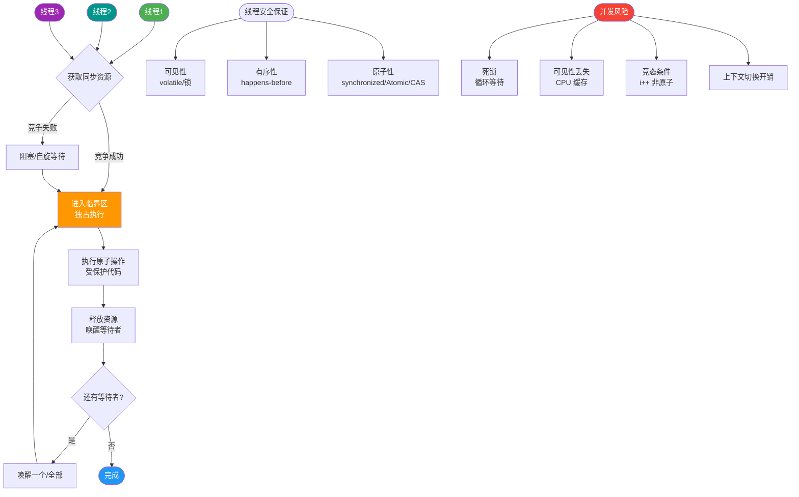
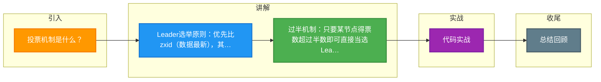

# 投票机制是什么？

ZooKeeper 的 ZAB 协议（ZooKeeper Atomic Broadcast）包含三个主要阶段，投票机制主要用于 **Leader 选举** 和 **事务提议确认**。

**1. ZAB 协议阶段**

*   **Discovery（发现阶段）**：
    *   当集群崩溃恢复或启动时，进入此阶段。
    *   Follower 与准 Leader 通信，同步最近接收的事务提议。
    *   目的：发现大多数节点已接受的最新提议（Epoch 和 ZXID），准 Leader 生成新的 Epoch，并让 Followers 接受，更新它们的 acceptedEpoch。

*   **Synchronization（同步阶段）**：
    *   Leader 利用前一阶段获得的最新提议历史，同步集群中所有副本。
    *   只有当大多数节点同步完成，准 Leader 才会成为真正的 Leader。
    *   Follower 只接收 ZXID 比自己 lastZxid 大的提议。

*   **Broadcast（广播阶段）**：
    *   集群正常对外提供服务。
    *   Leader 接收客户端事务请求，广播给 Follower，只需得到超过半数的节点 ACK 就可以提交。

**注意**：Java 实现中，Fast Leader Election (FLE) 包含了发现职责，因此实现中常将 Discovery 和 Synchronization 合并为 **Recovery Phase（恢复阶段）**。

**2. Leader 选举流程（投票机制详解）**

选举基于 **投票** 规则。每个选票包含两个核心参数：
1.  **sid** (Server ID)：服务器唯一标识。
2.  **zxid** (ZooKeeper Transaction ID)：事务 ID，值越大表示数据越新。

**原则**：先比较 zxid，zxid 大者胜出；若 zxid 相同，则 sid 大者胜出。

**流程图解**：

```
初始状态: [Server1, Server2, Server3, Server4, Server5]
       (各自投自己, 进入 LOOKING 状态)

Round 1 (广播): 
Server1: (sid=1, zxid=10)
Server2: (sid=2, zxid=20) <--- 假设 Server2 数据最新
Server3: (sid=3, zxid=15)
...

交互过程:
1. Server1 收到 Server2 的票 (20 > 10) -> 变更投票为 (sid=2, zxid=20)
2. Server3 收到 Server2 的票 (20 > 15) -> 变更投票为 (sid=2, zxid=20)
3. Server2 收到其他票，比较后发现自己是最大的 -> 保持投自己

统计:
(Server2): 票数 >= 3 (超过半数 N/2 + 1)

结果:
Server2 变更为 LEADING 状态
其他 Server 变更为 FOLLOWING 状态

后续:
Follower 连接 Leader，发送 lastZxid
Leader 确定同步点，数据同步（包括 Truncation 截断、Diff 差异、Snapshot 快照同步）
Follower 更新至 UPTODATE，开始对外服务
```

**详细步骤**：
1.  **自荐**：每个 Server 启动后都投自己一票，并广播给其他 Server。
2.  ** PK 变更**：收到其他 Server 的投票后，将外部投票与内部投票进行 PK（优先比 zxid，再比 sid）。如果外部票更优，则修改内部投票，再次广播。
3.  **统计**：每次收到投票后，统计当前是否有 Server 获得了超过半数的票数。
4.  **当选**：一旦某个 Server 获得超过半数的票数，立即当选 Leader，否则继续下一轮投票。
5.  **同步**：Follower 连接 Leader，发送最大的 zxid。Leader 根据 follower 的 zxid 确定同步点。

## 常见考点
1.  **为什么 ZXID 优先于 SID**：为了保证数据最新的节点成为 Leader，避免数据丢失。ZXID 是一个 64 位数字，高 32 位是 epoch（纪元），低 32 位是计数器。
2.  **半数机制的作用**：ZAB 协议要求所有事务 proposal 必须在半数以上节点提交成功。这保证了集群的一致性，同时也意味着 ZooKeeper 集群通常建议部署奇数台节点（如 3, 5, 7），以避免脑裂并利用少数服从多数原则。
3.  **Zab 与 Paxos 的区别**：ZAB 是专为 ZooKeeper 设计的，主要是为了实现主备模式下的高可用和原子广播；Paxos 更通用，允许 Proposer 争抢，且 Basic Paxos 只能就单个值达成一致。ZAB 在崩溃恢复时会优先保证数据一致性，而 Paxos 侧重于达成共识的过程。


## 核心流程图



## 记忆要点

- Leader选举原则：优先比zxid（数据最新），其次比sid（编号最大）
- 过半机制：只要某节点得票数超过半数即可直接当选Leader
- ZAB三阶段：发现同步最新数据，随后进入正常事务广播阶段
- 集群建议：为利用少数服从多数原则并防脑裂，通常部署奇数台节点

## 结构化回答


**30 秒电梯演讲：** 选班长，谁票数过半谁当选。

**展开框架：**
1. **每个Server** — 每个Server首先投自己一票
2. **投票比拼ZXID（事务ID）** — 投票比拼ZXID（事务ID），大者优先
3. **票数过半则当选L** — 票数过半则当选Leader

**收尾：** 这是我实战中的理解，您想深入哪一段？


## 视频脚本

> 预计时长：4 分钟 | 由浅入深

| 时间 | 画面/字幕 | 口播台词 | 讲解要点 |
|------|----------|----------|----------|
| 0:00 | 标题卡：投票机制是什么 | 今天这道题：投票机制是什么。30 秒先给你讲清楚。 | 开场钩子 |
| 0:20 | 核心概念动画/示意图 | 选班长，谁票数过半谁当选。 | 核心概念 |
| 0:40 | 每个Server示意图 | 每个Server首先投自己一票 | 每个Server |
| 1:10 | 投票比拼ZXID（事务ID）示意图 | 投票比拼ZXID（事务ID），大者优先 | 投票比拼ZXID（事务ID） |
| 1:40 | 总结卡 + 下期预告 | 记住今天这几个关键词，面试一定用得上。下期见。 | 收尾 |

### 视频流程图



