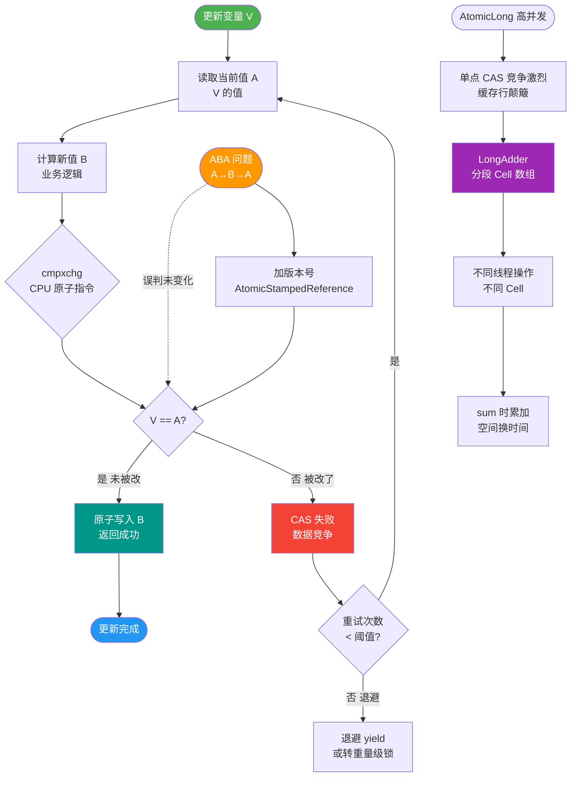
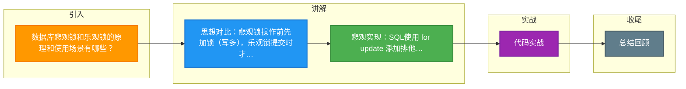

# 数据库悲观锁和乐观锁的原理和使用场景有哪些？

数据库锁机制从逻辑上分为悲观锁和乐观锁，主要用于解决并发事务下的数据一致性问题。

**1. 悲观锁**

*   **原理**：
    "悲观"地认为并发冲突概率很高。因此在操作数据前，先直接加锁，直到事务结束才释放。其他事务如果想对该数据进行操作，必须等待锁释放。
*   **实现方式（数据库层面）**：
    *   **行级锁**：`SELECT ... FOR UPDATE` (排他锁/X锁)。
    *   表级锁：通过 `LOCK TABLES` 语句（较少用）。
*   **数据库底层支持**：
    依赖数据库自身的锁机制（如 MySQL InnoDB 的 Record Lock, Gap Lock, Next-Key Lock）。
*   **适用场景**：
    写操作非常频繁（写多读少），冲突率高的场景。如秒杀扣库存、金融转账。
*   **优点**：保证强一致性，实现简单（直接依赖 DB）。
*   **缺点**：并发度低，锁等待可能导致死锁，数据库压力大。

**2. 乐观锁**

*   **原理**：
    "乐观"地认为并发冲突概率很低。操作时先不加锁，而是在提交更新时检查数据在此期间是否被修改过。如果被修改过，则拒绝更新并报错或重试。
*   **实现方式（应用层面/SQL 层面）**：
    1.  **版本号机制**：
        表中增加 `version` 字段。读取时读出 version，更新时 `WHERE version = old_version` 并 `SET version = version + 1`。
        ```sql
        UPDATE goods SET stock = stock - 1, version = version + 1 
        WHERE id = 100 AND version = 5;
        ```
        检查受影响行数，如果为 0 说明版本不匹配（数据已被修改）。
    2.  **时间戳机制**：原理同版本号，使用 `update_time` 判断。
    3.  **条件更新（CAS 思想）**：直接利用数据本身的状态判断。
        ```sql
        -- 秒杀场景：只有库存大于 0 时才扣减
        UPDATE stock SET count = count - 1 WHERE id = 1 AND count > 0;
        ```
*   **适用场景**：
    读操作非常频繁（读多写少），冲突率低的场景。如商品详情页读取、配置信息更新。
*   **优点**：并发度高，无死锁风险，数据库压力小（无锁开销）。
*   **缺点**：冲突时需要应用层重试（如 `Retry` 机制），若冲突频繁会导致大量 CPU 浪费在重试上；且无法保证脏读问题（需配合事务隔离级别解决）。

**3. 常见锁类型补充（MySQL InnoDB）**

*   **共享锁 (S Lock)**：允许其他事务加 S 锁，但禁止加 X 锁。通常用于 `SELECT ... LOCK IN SHARE MODE` 或 `SELECT ... FOR SHARE` (MySQL 8.0)。
*   **排他锁 (X Lock)**：完全独占，用于 `INSERT`, `UPDATE`, `DELETE` 及 `SELECT ... FOR UPDATE`。
*   **意向锁**：表级锁，用于协调行锁和表锁的兼容性检查（IS, IX）。
*   **Record Lock**：锁索引记录。
*   **Gap Lock**：间隙锁，锁两个索引记录之间的间隙（不包含记录本身），防止幻读。
*   **Next-Key Lock**：Record Lock + Gap Lock，锁定记录及前面的间隙。

## 常见考点
1. **乐观锁一定比悲观锁快吗？**
   不一定。在高并发写冲突严重的场景下，乐观锁会导致大量更新失败，应用层不断重试，反而比悲观锁（排队等待）性能更差且消耗 CPU。

2. **如何解决数据库死锁？**
   *   设置事务锁等待超时时间 (`innodb_lock_wait_timeout`)。
   *   开启死锁检测 (`innodb_deadlock_detect`)，数据库会主动回滚代价较小的事务。
   *   应用层保证加锁顺序一致（如都按 ID 升序获取锁）。

3. **MySQL 如何查看锁冲突？**
   使用 `SHOW ENGINE INNODB STATUS` 命令查看最近的死锁信息或当前锁等待情况；或在系统库 `information_schema` 中查询 `INNODB_TRX`, `INNODB_LOCKS`, `INNODB_LOCK_WAITS`。

4. **CAS 自旋锁与数据库乐观锁的区别？**
   概念相似（Compare-And-Swap），但 CAS 通常指 CPU 硬件指令或内存级操作（如 Java 的 AtomicInteger），而数据库乐观锁是基于 SQL 语句的逻辑判断，涉及磁盘 I/O 和网络交互。


## 核心流程图



## 记忆要点

- 思想对比：悲观锁操作前先加锁（写多），乐观锁提交时才检查（读多）
- 悲观实现：SQL使用 for update 添加排他锁，保证强一致性但并发度低
- 乐观实现：通过版本号机制或条件更新（如 where count>0）实现CAS思想
- 反转考点：高并发写冲突场景下，乐观锁重试风暴反而比悲观锁更慢更耗CPU

## 结构化回答

**30 秒电梯演讲：** 先改再提交（乐观）vs 先占座再改（悲观）。

**展开框架：**
1. **乐观锁** — 乐观锁利用CAS或版本号机制，无死锁
2. **悲观锁** — 悲观锁利用Select for Update等数据库锁，强一致
3. **乐观锁** — 乐观锁适合读多写少，冲突率低

**收尾：** 这块我踩过一些坑，您想深入聊哪一段——原理细节、实战案例还是常见踩坑？

## 视频脚本

> 预计时长：4 分钟 | 由浅入深

| 时间 | 画面/字幕 | 口播台词 | 讲解要点 |
|------|----------|----------|----------|
| 0:00 | 标题卡：数据库悲观锁和乐观锁的原理和使用场景有哪些 | 今天这道题：数据库悲观锁和乐观锁的原理和使用场景有哪些。30 秒先给你讲清楚。 | 开场钩子 |
| 0:20 | 核心概念动画/示意图 | 先改再提交（乐观）vs 先占座再改（悲观）。 | 核心概念 |
| 0:40 | 乐观锁示意图 | 乐观锁利用CAS或版本号机制，无死锁 | 乐观锁 |
| 1:10 | 悲观锁示意图 | 悲观锁利用Select for Update等数据库锁，强一致 | 悲观锁 |
| 1:40 | 总结卡 + 下期预告 | 记住今天这几个关键词，面试一定用得上。下期见。 | 收尾 |

### 视频流程图



