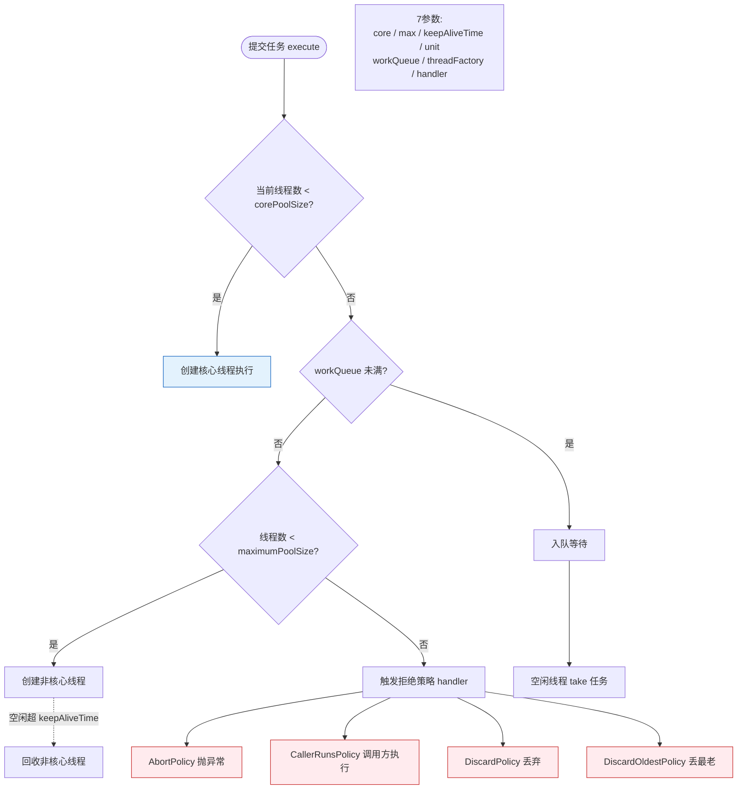

# 线程池的7个核心参数是什么？

ThreadPoolExecutor的7个参数：

1. **corePoolSize**：核心线程数，即使空闲也不会被回收（除非设置allowCoreThreadTimeOut）。
2. **maximumPoolSize**：最大线程数。
3. **keepAliveTime**：非核心线程的空闲存活时间。
4. **unit**：keepAliveTime的时间单位。
5. **workQueue**：任务队列，如LinkedBlockingQueue、ArrayBlockingQueue、SynchronousQueue。
6. **threadFactory**：线程工厂，用于创建线程（可自定义线程名，便于排查监控，如使用 Guava 的 ThreadFactoryBuilder）。
7. **handler**：拒绝策略，任务无法执行时的处理方式。

阿里巴巴规范建议：不要使用Executors创建线程池（FixedThreadPool和CachedThreadPool的队列/线程数无限制可能导致OOM），应该手动创建ThreadPoolExecutor。

#### 参数配置策略补充
- **CPU 密集型**：`corePoolSize = CPU 核心数 + 1`（减少上下文切换）。
- **IO 密集型**：`corePoolSize = CPU 核心数 * 2`（通常建议设置更大，因为大部分时间线程在等待 IO，利用 CPU 并行处理其他线程）。

## 常见考点
1. **核心线程数设置为0会发生什么？**（任务来了会先入队，如果队列为 SynchronousQueue 则直接走拒绝策略或创建非核心线程）
2. **线程池的线程数如何根据业务类型（IO密集/CPU密集）进行调优？**
3. **`allowCoreThreadTimeOut` 设置为 true 后，线程池的行为会有什么变化？**
4. **使用不同类型的 `workQueue` 对线程池的运行有什么影响？**（考察有界/无界队列对流量控制和 OOM 的影响）

## 技术原理

线程池 7 个参数的设计目标是**在资源有限的前提下，平滑处理流量峰谷**。理解参数的关键是搞懂任务提交后的流转逻辑（这是面试高频考点）：

- **任务提交后的执行顺序（核心逻辑，易错点）**：
  1. 若当前线程数 < `corePoolSize`，**创建新核心线程**执行任务（即使队列有空闲）。
  2. 若线程数已达 corePoolSize，**把任务放入 `workQueue`** 排队。
  3. 若队列满了，且线程数 < `maximumPoolSize`，**创建非核心线程**执行任务。
  4. 若队列满且线程数达 maximumPoolSize，**触发 `handler` 拒绝策略**。

  注意：不是"先创建到最大线程数再入队"，而是"先入队，队列满了才扩容到 max"。这个顺序导致用 `LinkedBlockingQueue`（无界队列）时 maximumPoolSize 永远不会生效（队列永远不满），是常见踩坑点。

- **keepAliveTime 针对非核心线程**：非核心线程空闲超过 keepAliveTime 会被回收。核心线程默认不回收（除非 `allowCoreThreadTimeOut=true`）。这是为了在流量低谷时释放资源、流量高峰时快速扩容。
- **拒绝策略的四种内置实现**：
  - `AbortPolicy`（默认）：抛 `RejectedExecutionException`，让调用方感知。
  - `CallerRunsPolicy`：让提交任务的线程自己执行（背压，降低提交速度）。
  - `DiscardPolicy`：静默丢弃新任务。
  - `DiscardOldestPolicy`：丢弃队列最老的任务，腾位置给新任务。

## 代码示例

手动创建线程池（阿里规范要求，避免 Executors 的 OOM 风险）：

```java
import java.util.concurrent.*;

public class ThreadPoolDemo {
    public static void main(String[] args) {
        int cpuCores = Runtime.getRuntime().availableProcessors();

        // 手动创建，7 个参数全部显式指定
        ThreadPoolExecutor pool = new ThreadPoolExecutor(
            cpuCores + 1,                    // corePoolSize: CPU 密集型 N+1
            cpuCores * 2,                     // maximumPoolSize: IO 密集型上限 2N
            60L, TimeUnit.SECONDS,            // keepAliveTime: 非核心线程空闲 60s 回收
            new ArrayBlockingQueue<>(1000),   // workQueue: 有界队列，防 OOM
            new ThreadFactory() {             // threadFactory: 自定义线程名便于排查
                private int count = 0;
                public Thread newThread(Runnable r) {
                    return new Thread(r, "biz-pool-" + (count++));
                }
            },
            // 拒绝策略：CallerRunsPolicy 让提交方自己跑，形成背压
            new ThreadPoolExecutor.CallerRunsPolicy()
        );

        // 监控（生产必备）
        System.out.printf("活跃线程: %d, 队列堆积: %d, 已完成: %d%n",
            pool.getActiveCount(),
            pool.getQueue().size(),
            pool.getCompletedTaskCount());

        for (int i = 0; i < 10000; i++) {
            try {
                pool.execute(() -> doBusinessLogic());
            } catch (RejectedExecutionException e) {
                // CallerRunsPolicy 不会抛，AbortPolicy 才会；这里兜底
                System.err.println("任务被拒，降级处理");
            }
        }
        pool.shutdown();
    }

    static void doBusinessLogic() { /* ... */ }
}
```

```java
// 阿里规范明确禁止的写法（OOM 风险）：
// Executors.newFixedThreadPool(10)    -> 队列是 LinkedBlockingQueue（无界），任务堆积 OOM
// Executors.newCachedThreadPool()     -> 最大线程数 Integer.MAX_VALUE，创建过多线程 OOM
```

## 注意事项

- **不要用 Executors 创建线程池**：`FixedThreadPool` 用无界队列，任务堆积导致 OOM；`CachedThreadPool` 最大线程数无上限，创建过多线程也 OOM。必须手动 `new ThreadPoolExecutor` 并指定有界队列。
- **队列选型决定行为**：`ArrayBlockingQueue`（有界）能触发扩容到 max；`LinkedBlockingQueue`（默认无界）让 max 永远不生效；`SynchronousQueue`（无容量）让任务直接交给线程，core 满立即扩容（CachedThreadPool 用的就是这个）。
- **corePoolSize 配置按任务类型**：CPU 密集型（计算、加密）配 N+1，多出 1 个应对偶发阻塞；IO 密集型（网络、磁盘）配 2N 甚至更多，因为线程大量时间在等 IO，多线程能提高 CPU 利用率。
- **必须配置监控和告警**：生产环境线程池要监控活跃线程数、队列堆积数、拒绝次数，队列堆积超阈值告警，否则流量洪峰时静默拒绝任务会导致业务故障。

### 线程池任务提交流程图



## 核心知识点图


## 记忆要点

- 7参数口诀：核心、最大、存活时、计时单位、任务队列、线程工厂、拒绝策略
- 核心(core)默认不回收，最大(max)限定上限，存活时间针对非核心线程
- 任务队列与拒绝策略是限流与兜底关键
- 配置策略：CPU密集型设为 N+1，IO密集型设为 2N (N为CPU核心数)

## 结构化回答


**30 秒电梯演讲：** 就像开公司，定几个正式工，满员了把简历放进人才库，实在忙不过头再招临时工，人都招不进去了就拒简历。

**展开框架：**
1. **corePool** — Size为核心常备线程
2. **maximumP** — oolSize为最大承载量
3. **workQueu** — workQueue为任务缓冲区

**收尾：** 这是我实战中的理解，您想深入哪一段？


## 视频脚本

> 预计时长：3 分钟 | 由浅入深

| 时间 | 画面/字幕 | 口播台词 | 讲解要点 |
|------|----------|----------|----------|
| 0:00 | 标题卡：线程池的7个核心参数是什么 | 今天这道题：线程池的7个核心参数是什么。30 秒先给你讲清楚。 | 开场钩子 |
| 0:20 | 核心概念动画/示意图 | 就像开公司，定几个正式工，满员了把简历放进人才库，实在忙不过头再招临时工，人都招不进去了就拒简历。 | 核心概念 |
| 0:40 | corePoolSize示意图 | corePoolSize为核心常备线程 | corePoolSize |
| 1:10 | 总结卡 + 下期预告 | 记住今天这几个关键词，面试一定用得上。下期见。 | 收尾 |
