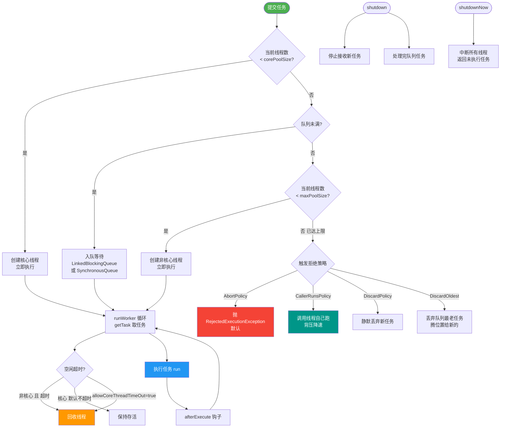

# 线程池的执行流程是怎样的？

ThreadPoolExecutor.execute()的执行流程：

1. 当前线程数 < corePoolSize → 创建新核心线程执行任务
2. 当前线程数 >= corePoolSize → 任务加入workQueue队列
3. 队列已满 → 创建非核心线程（直到maximumPoolSize）
4. 线程数 >= maximumPoolSize 且队列满 → 执行拒绝策略

四种拒绝策略：
- **AbortPolicy**（默认）：抛出RejectedExecutionException
- **CallerRunsPolicy**：由提交任务的线程执行
- **DiscardPolicy**：直接丢弃
- **DiscardOldestPolicy**：丢弃队列最旧的任务，重新提交

注意：任务是先入队再扩容到max，不是先扩容到max再入队。

```text
   Client Thread
        │
        │ execute(task)
        ▼
┌─────────────────────┐
│ Worker Count < Core?│──Yes──▶ 创建核心线程 -> CAS计数++ -> 执行任务
└─────────────────────┘
        │ No
        ▼
┌─────────────────────┐
│   Offer to Queue?   │──Yes──▶ 入队成功 -> 等待调度
└─────────────────────┘
        │ No (Queue Full)
        ▼
┌───────────────────────┐
│ Worker Count < Max?   │──Yes──▶ 创建非核心线程 -> CAS计数++ -> 执行任务
└───────────────────────┘
        │ No
        ▼
┌─────────────────────┐
│   Reject Policy     │ (Handler.rejectedExecution)
└─────────────────────┘
```

#### 关键细节补充
1. **线程安全控制**：在判断线程数和增加线程数时，使用 `ctl`（AtomicInteger）进行 CAS 操作，保证原子性。
2. **Worker 继承 AQS**：线程池中的工作线程被封装为 `Worker` 对象，它继承了 AQS，实现了独占锁，主要用于在执行任务时锁定自己，防止中断正在运行的任务（只有处于空闲等待任务时才允许被中断）。
3. **运行中状态校验**：在执行任务前会二次检查 `runState`，防止线程池在 `SHUTDOWN` 状态下继续接收新任务（除非是 `shutdownNow` 状态下清理队列任务）。

## 常见考点
1. **为什么线程池在执行任务前要进行二次检查（recheck）？**（考察线程池状态可能在入队过程中变为 SHUTDOWN，需要回滚任务）
2. **线程池中的 Worker 为什么是非公平锁？**（效率优先，不需要考虑排队饥饿问题）
3. **配置了 `SynchronousQueue` 作为队列，流程会有什么不同？**（因为没有容量，直接进入步骤3创建非核心线程或拒绝）
4. **线程池抛出 RejectedExecutionException 的常见原因及排查思路？**


## 核心流程图



## 记忆要点

- 执行四步曲：核心线程满 -> 任务入队 -> 非核心线程满 -> 拒绝策略
- 易错点：任务是先入队再扩容到max，而不是先扩容再入队
- CAS原子变量ctl高3位存状态，低29位存线程数，保证并发安全
- 四拒绝策略：抛异常(默认)、调用者执行、直接丢弃、丢最老任务

## 结构化回答


**30 秒电梯演讲：** 先找正式工干，没人的话先记在小本本上排队，本子满了就招临时工，实在没人也记不下了就拒单。

**展开框架：**
1. **优先创建核心** — 优先创建核心线程
2. **核心满了进队** — 核心满了进队列
3. **队列满了创建** — 队列满了创建非核心线程

**收尾：** 这是我实战中的理解，您想深入哪一段？


## 视频脚本

> 预计时长：3 分钟 | 由浅入深

| 时间 | 画面/字幕 | 口播台词 | 讲解要点 |
|------|----------|----------|----------|
| 0:00 | 标题卡：线程池的执行流程是怎样的 | 今天这道题：线程池的执行流程是怎样的。30 秒先给你讲清楚。 | 开场钩子 |
| 0:20 | 核心概念动画/示意图 | 先找正式工干，没人的话先记在小本本上排队，本子满了就招临时工，实在没人也记不下了就拒单。 | 核心概念 |
| 0:40 | 优先创建核心线程示意图 | 优先创建核心线程 | 优先创建核心线程 |
| 1:10 | 总结卡 + 下期预告 | 记住今天这几个关键词，面试一定用得上。下期见。 | 收尾 |
