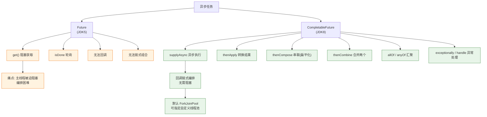
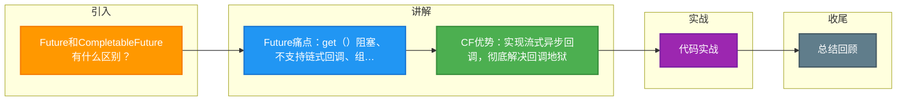

# Future和CompletableFuture有什么区别？

### Future 的局限性
1. **阻塞获取**：`get()` 方法会阻塞直到任务完成，无法高效利用异步非阻塞特性。
2. **缺乏链式调用**：无法在计算完成后自动触发后续操作，代码嵌套层级深（回调地狱）。
3. **组合困难**：难以处理“多个 Future 并行执行”、“其中一个完成即可”等复杂依赖关系。
4. **缺乏异常处理**：`get()` 抛出的是 ExecutionException，难以在链路中精细捕获和处理异常。
5. **无法手动完成**：任务必须由线程执行结束，无法手动设置结果（如缓存场景）。

### CompletableFuture 的优势
它实现了 `Future` 和 `CompletionStage` 接口，提供了强大的流式 API。

1. **异步回调与链式调用**：
   - `thenApply`: 接收上一步结果，有返回值。
   - `thenAccept`: 接收上一步结果，无返回值。
   - `thenRun`: 不接收上一步结果，无返回值。
   - `supplyAsync`: 异步执行有返回值的任务。

2. **组合操作**：
   - `thenCombine`: 两个任务都完成，合并结果。
   - `thenCompose`: 第一个任务完成后，用其结果作为参数开启第二个任务（类似 flatMap）。
   - `allOf`: 等待所有任务完成。
   - `anyOf`: 任一任务完成即返回。

3. **异常处理**：
   - `exceptionally`: 类似 catch，捕获异常并恢复。
   - `handle`: 无论成功或异常都执行，可访问结果和异常。

4. **手动完成**：`complete(value)` 方法可手动结束任务，适用于缓存命中场景。

### 架构流程图
```text
Thread(Main)           ForkJoinPool            Callback Chain
   |                        |                        |
   +-- supplyAsync ------>->| (Task A)                |
   |                        |   |                     |
   |                        |   +-- (Async) --------->+-- thenApply (Transform)
   |                        |                         |
   |                        |                         +-- thenAccept (Consume)
   |                        |                         |
   |                        |                         +-- exceptionally (Error)
   |                        |                        |
   +-- get() <-------------+ (Result ready) <-------+
```

### 代码示例
```java
CompletableFuture.supplyAsync(() -> queryDatabase())  // 异步查询
    .thenApplyAsync(data -> process(data))            // 异步处理
    .thenAcceptAsync(result -> updateUI(result))       // 异步更新UI
    .exceptionally(e -> {
        log.error("Async failed", e);
        return null; // 兜底
    });
```

### 💡 实战案例
在电商聚合页接口中，需同时调用商品、库存、优惠三个服务。若用 Future 串行 `get()`，耗时会累加（P99 超时）。改用 `CompletableFuture` 并行发起请求，利用 `allOf` 聚合，将总耗时由 300ms 降至 120ms（取决于最慢的下游）。

### 💻 代码示例
```java
// 实战：多服务并行调用与超时控制
CompletableFuture<User> userFuture = CompletableFuture.supplyAsync(() -> userService.findById(id), customExecutor);
CompletableFuture<Order> orderFuture = CompletableFuture.supplyAsync(() -> orderService.query(id), customExecutor);

// 组合结果，设置超时（Java 9+ API，或使用 orTimeout）
CompletableFuture.allOf(userFuture, orderFuture)
    .completeOnTimeout(null, 500, TimeUnit.MILLISECONDS) // 整体超时保护
    .thenAccept(v -> {
        try {
            User u = userFuture.get(); // 此时已确保完成，get 立即返回
            Order o = orderFuture.get();
            mergeData(u, o);
        } catch (Exception e) {
            handleTimeout();
        }
    });
```

### 🆚 Future vs CompletableFuture
| 维度 | Future | CompletableFuture |
| :--- | :--- | :--- |
| **获取结果** | 阻塞 get()，或轮询 isDone() | 支持回调 thenApply，不阻塞主线程 |
| **任务组合** | 难以组合，需手动阻塞获取 | 支持 thenCombine, allOf 等流式组合 |
| **异常处理** | 仅能在 get 时捕获 ExecutionException | 支持链路中的 exceptionally, handle 精细处理 |
| **外部控制** | 无法干预任务执行 | 支持 complete() 手动完成，cancel() 中断 |

## 常见考点
1. **线程池选择**：如果不指定线程池，`supplyAsync` 默认使用哪个线程池？（ForkJoinPool.commonPool()，业务代码强烈建议自定义线程池以避免阻塞公共池）
2. **thenApply vs thenApplyAsync**：有什么区别？（不带 Async 的由当前线程或上一个任务的线程执行，带 Async 的提交给线程池）

### Future vs CompletableFuture 编排能力对比




## 记忆要点

- Future痛点：get()阻塞、不支持链式回调、组合处理极其困难
- CF优势：实现流式异步回调，彻底解决回调地狱
- API对比：thenApply(转换) vs thenAccept(消费) vs thenRun(执行)
- 多任务编排：allOf等全部完成，anyOf任一完成即触发；支持handle统一处理异常

## 结构化回答


**30 秒电梯演讲：** Future就像电话订票只能一直等回复；CompletableFuture像短信订票，票好了自动通知你，还能顺便订酒店。

**展开框架：**
1. **支持非阻塞的** — 支持非阻塞的回调函数
2. **支持任务编排** — 支持任务编排（组合/串行/并行）
3. **支持异常处理** — 支持异常处理（核心概念）

**收尾：** 这是我实战中的理解，您想深入哪一段？


## 视频脚本

> 预计时长：3 分钟 | 由浅入深

| 时间 | 画面/字幕 | 口播台词 | 讲解要点 |
|------|----------|----------|----------|
| 0:00 | 标题卡：Future和CompletableFuture有什么区别 | 今天这道题：Future和CompletableFuture有什么区别。30 秒先给你讲清楚。 | 开场钩子 |
| 0:20 | 核心概念动画/示意图 | Future就像电话订票只能一直等回复；CompletableFuture像短信订票，票好了自动通知你，还能顺便订酒店。 | 核心概念 |
| 0:40 | 支持非阻塞的回调函数示意图 | 支持非阻塞的回调函数 | 支持非阻塞的回调函数 |
| 1:10 | 总结卡 + 下期预告 | 记住今天这几个关键词，面试一定用得上。下期见。 | 收尾 |

### 视频流程图



