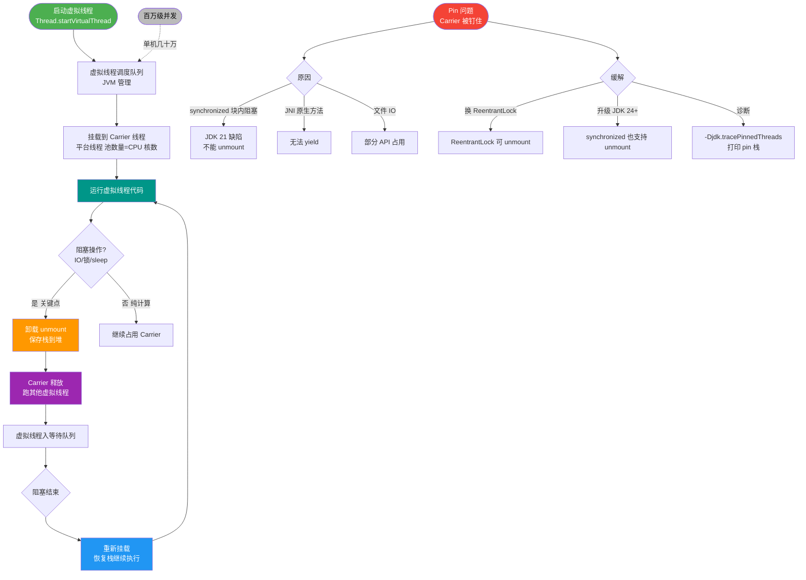
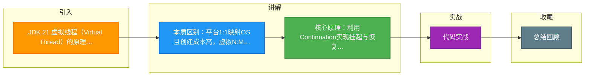

# JDK 21 虚拟线程（Virtual Thread）的原理是什么？它和平台线程有什么本质区别？

### 虚拟线程 vs 平台线程
| 特性 | 平台线程 | 虚拟线程 |
| :--- | :--- | :--- |
| **映射关系** | 1:1 映射到 OS 线程 | N:M 映射，运行在 Carrier Thread 上 |
| **创建成本** | 高（约 1MB 栈内存） | 极低（KB 级，对象分配在堆） |
| **数量上限** | 几千个（受限于 OS） | 百万级（受限于内存和文件描述符） |
| **调度方式** | OS 内核调度 | JVM 调度 |

### 底层原理（Continuation）
虚拟线程的核心是 **Continuation（续体）**，它允许代码执行到某个点挂起，并在后续恢复。

**执行流程图：**
```text
Java Code (Virtual Thread)
       |
       +--> [Blocking I/O] (e.g., Socket.read)
             | JVM 拦截
             v
+---------------------------+
|  Mount (挂载)              |
|  Running on Carrier Thread |
+---------------------------+
       | I/O 操作未就绪
       v
+---------------------------+
|  Unmount (卸载)            |
|  Copy Stack to Heap        | <--- 释放 Carrier Thread 去执行其他 VT
+---------------------------+
       |
       | (Carrier Thread 空闲)
       |
+---------------------------+
|  I/O Event (Poller)        |
|  Wake Up Virtual Thread    |
+---------------------------+
       |
       v
+---------------------------+
|  Re-Mount (重新挂载)       |
|  Restore Stack, Resume     |
+---------------------------+
```

### 关键细节
1. **Carrier Thread（载体线程）**：真正执行 CPU 指令的平台线程（通常是 ForkJoinPool 的 Worker 线程）。
2. **Pinning（钉住/锚定）**：
   - 当虚拟线程进入 `synchronized` 代码块或本地代码时，它无法被卸载，会钉住 Carrier Thread 直到操作结束。
   - **影响**：如果在该区域进行耗时操作或 IO，会阻塞 Carrier Thread，降低吞吐量。
   - **优化**：JDK 21+ 已大幅优化，尽量在 Native 代码外部进行 Pinning，但仍建议使用 `ReentrantLock` 替代 `synchronized`。

### 适用场景
- ✅ **IO 密集型**：Web 服务、微服务调用、数据库查询。百万级并发连接，少量线程处理。
- ⚠️ **CPU 密集型**：计算任务多，虚拟线程无优势，因为不增加 CPU 核心数。
- ❌ **ThreadLocal 污染**：每个虚拟线程都会复制一份 ThreadLocal，创建百万个虚拟线程可能导致内存爆炸。

### 对线程池的影响
**“虚拟线程足够廉价，不再需要池化。”**
- 旧模式：`newFixedThreadPool(200)`（限制并发数）。
- 新模式：`Executors.newVirtualThreadPerTaskExecutor()`（每个任务一个虚拟线程）。
- **限流**：不再通过线程池限流，改用 Semaphore 或下游服务的 Queues。

### 💡 实战案例
某高并发爬虫系统原使用传统线程池（200线程）爬取数据，吞吐量卡在瓶颈。迁移到 JDK 21 虚拟线程后，并发数提升至 10万+，CPU 利用率由 20%（主要在上下文切换）提升至 80%，抓取速度提升了 5 倍，且仅需简单替换 Executor 即可。

### 💻 代码示例
```java
// 创建并使用虚拟线程
try (var executor = Executors.newVirtualThreadPerTaskExecutor()) {
    // 虚拟线程中 sleep 不会占用 Carrier 线程
    IntStream.range(0, 10_000).forEach(i -> {
        executor.submit(() -> {
            Thread.sleep(Duration.ofSeconds(1)); // 模拟 IO 阻塞
            // 使用 ReentrantLock 避免 synchronized 的 Pinning 问题
            lock.lock();
            try {
                doWork(i);
            } finally {
                lock.unlock();
            }
        });
    });
}
// try-with-resources 会自动关闭（类似 awaitTermination）
```

### 🆚 虚拟线程 vs 异步框架 (如 Reactor/Netty)
| 维度 | 虚拟线程 | 异步框架
| :--- | :--- | :--- |
| **编程模型** | 同步阻塞代码，易读易维护 | 异步非阻塞，回调/响应式流，学习曲线陡峭
| **调试难度** | 简单，堆栈即业务逻辑 | 困难，堆栈碎片化
| **生态兼容性** | 几乎兼容所有旧代码 | 需特定库支持
| **开销** | 极低（堆栈帧） | 低，但对象分配略多 |

## 常见考点
1. **ThreadLocal 内存泄漏**：在虚拟线程中使用 ThreadLocal 会有什么风险？（数量巨大时，内存占用极高，建议使用 ScopedValue）
2. **同步锁问题**：为什么建议用 ReentrantLock 替代 synchronized？（避免 Pinning 导致的 Carrier Thread 阻塞）
3. **兼容性**：旧代码运行在虚拟线程上需要注意什么？（避免在 synchronized 中做 IO 操作）


## 核心流程图



## 记忆要点

- 本质区别：平台1:1映射OS且创建成本高，虚拟N:M映射由JVM调度且极廉价
- 核心原理：利用Continuation实现挂起与恢复，IO阻塞时自动卸载释放载体线程
- 致命雷区：synchronized会钉住载体线程，必须用ReentrantLock替代
- 架构改变：虚拟线程即用即销毁，无需池化，改用Semaphore限流

## 结构化回答


**30 秒电梯演讲：** 平台线程是正式员工，数量少且贵；虚拟线程是临时实习生，数量无限多，没事干就挂起，有事干就接手。

**展开框架：**
1. **KB** — 轻量级，内存KB级，可百万级并发
2. **IO** — IO阻塞时自动卸载，不占用OS线程
3. **IO** — 适合IO密集型，不适合CPU密集型

**收尾：** 虚拟线程在 synchronized 块中会发生什么？为什么要避免在虚拟线程中用 synchronized？


## 视频脚本

> 预计时长：4 分钟 | 由浅入深

| 时间 | 画面/字幕 | 口播台词 | 讲解要点 |
|------|----------|----------|----------|
| 0:00 | 标题卡：JDK 21 虚拟线程（Virtual Thread）的原理是什么？它和平台线程有什么本质区别 | 今天这道题：JDK 21 虚拟线程（Virtual Thread）的原理是什么？它和平台线程有什么本质区别。30 秒先给你讲清楚。 | 开场钩子 |
| 0:20 | 核心概念动画/示意图 | 平台线程是正式员工，数量少且贵；虚拟线程是临时实习生，数量无限多，没事干就挂起，有事干就接手。 | 核心概念 |
| 0:40 | 轻量级示意图 | 轻量级，内存KB级，可百万级并发 | 轻量级 |
| 1:10 | IO阻塞时自动卸载示意图 | IO阻塞时自动卸载，不占用OS线程 | IO阻塞时自动卸载 |
| 1:40 | 总结卡 + 下期预告 | 记住三个词就能答好这道题。下期追问：虚拟线程在 synchronized 块中会发生什么？为什么要避免在虚拟线程中用 synchronized？ | 收尾 |

### 视频流程图



