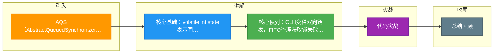

# AQS（AbstractQueuedSynchronizer）的底层实现原理是什么？CLH 队列是如何工作的？

### AQS 核心思想
AQS 是一个用来构建锁和同步器的**基础框架**。它维护了一个 `volatile int state`（同步状态）和一个 **CLH (Craig, Landin, and Hagersten) 队列**（变种的双向链表）。

### 关键组件
1. **state 状态**：
   - 0：无锁 / 未占用。
   - >0：重入次数（独占）或剩余许可数（共享）。
   - 通过 `CAS` (CompareAndSet) 原子修改。

2. **CLH 队列**：
   - 这是一个 FIFO 双向队列，管理所有获取锁失败的线程。
   - 节点类型：`SHARED`（共享，如 Semaphore）和 `EXCLUSIVE`（独占，如 ReentrantLock）。
   - 节点状态 `waitStatus`：
     - `SIGNAL (-1)`：后继节点需要唤醒。
     - `CANCELLED (1)`：节点超时或被中断，需清理。
     - `CONDITION (-2)`：节点在 Condition 队列中。
     - `PROPAGATE (-3)`：共享模式头节点可能传播唤醒。

### CLH 队列工作流程图
```text
       Head (Dummy Node)                     Tail
        | waitStatus=SIGNAL                     |
        +---- prev ----+---- next ----> +---- prev ----+
        |              |               |              |
        |   (Thread A) |               |   (Thread B) |
        |   (Running)  |               |   (Blocked)  |
        |              |               |              |
        +--------------+               +--------------+
            ^ 释放锁 unpark(next)          ^ park() 阻塞在此
```

### 独占锁获取流程
1. **tryAcquire**：子类实现（如 ReentrantLock 的 nonfairTryAcquire），尝试 CAS 修改 state。
   - 成功：设置 exclusiveOwnerThread，直接返回。
   - 失败：进入队列。
2. **addWaiter**：将当前线程封装成 `Node.EXCLUSIVE` 节点，通过 CAS 尾插法加入队列。
3. **acquireQueued**：在队列中自旋死循环。
   - 检查前驱节点是否为 Head（即自己是老二）：若是，再次尝试 tryAcquire。
   - 若前驱不是 Head 或 抢锁失败：检查前驱 waitStatus 是否为 SIGNAL。若不是，则 CAS 改为 SIGNAL，表示“我睡了，记得叫我”。然后调用 `LockSupport.park(this)` 挂起线程。

### 释放锁流程
1. **tryRelease**：子类实现，修改 state（通常减 1）。若 state 为 0，清空持有线程。
2. **unparkSuccessor**：若头节点的 waitStatus 不为 0，CAS 重置为 0。
   - 找到头节点的下一个有效节点（waitStatus <= 0）。
   - 调用 `LockSupport.unpark(node.thread)` 唤醒后继线程。

### 公平锁 vs 非公平锁
- **公平锁**：在 `tryAcquire` 时，**先检查** CLH 队列中是否有前驱节点。如果有，直接放弃竞争，去排队。
- **非公平锁**：直接尝试 CAS 抢锁（插队）。抢不到再去排队。吞吐量通常高于公平锁，但可能导致线程饥饿。

### 💡 实战案例
排查高并发服务 CPU 飙高问题时，发现大量线程阻塞在 AQS 的 `acquireQueued` 方法中，且堆栈显示不断自旋。原因是持有锁的线程在临界区内执行了耗时的 RPC 调用（违背了锁的快进快出原则），导致后续线程在 CLH 队列中自旋空转。优化后将 RPC 调用移出同步块，问题解决。

### 💻 代码示例
```java
// 基于 AQS 实现一个简单的互斥锁
class SimpleLock extends AbstractQueuedSynchronizer {
    @Override
    protected boolean tryAcquire(int arg) {
        // CAS 抢占 state：0 -> 1
        if (compareAndSetState(0, 1)) {
            setExclusiveOwnerThread(Thread.currentThread());
            return true;
        }
        return false;
    }

    @Override
    protected boolean tryRelease(int arg) {
        setExclusiveOwnerThread(null);
        setState(0); // volatile 写，保证可见性
        return true;
    }
    
    public void lock() { acquire(1); }
    public void unlock() { release(1); }
}
```

### 🆚 公平锁 vs 非公平锁
| 维度 | 公平锁 | 非公平锁 |
| :--- | :--- | :--- |
| **获取策略** | 严格按队列 FIFO 顺序获取 | 允许插队（新线程直接 CAS 抢） |
| **吞吐量** | 较低（需频繁切换上下文，无并发竞争） | 较高（减少了挂起/唤醒的开销） |
| **饥饿现象** | 无 | 可能（高并发下后继线程一直抢不过新来的） |
| **实现差异** | `tryAcquire` 中需判断 `hasQueuedPredecessors()` | 直接 CAS 尝试修改 state |

## 常见考点
1. **为什么头节点是虚拟节点**？头节点不代表任何线程，它是“已持有锁”状态的占位符，方便统一处理唤醒逻辑。
2. **自旋为什么放弃**：为了避免 CPU 空转浪费资源，在自旋一定次数或检查到前驱状态非 SIGNAL 时，会主动 park 挂起。
3. **Condition 实现**：AQS 的 ConditionObject 是如何利用等待队列的？（Condition 内部维护了一个单向队列，await 时将节点从 AQS 同步队列移至 Condition 队列，signal 时再转移回去）。


## 核心流程图

```mermaid
flowchart TD
    LOCK([线程请求锁]) --> CAS{CAS 抢锁<br/>state 0→1}
    CAS -->|成功| OWN[当前线程持有<br/>设 exclusiveOwnerThread]
    CAS -->|失败| ACQ[acquire 入队]

    ACQ --> ENQ[自旋入队<br/>CLH 双向队列]
    ENQ --> NODE[封装 Node 节点<br/>线程引用+状态]
    NODE --> PRED[找前驱 predecessor]
    PRED --> CHK_PRED{前驱是 head?<br/>head 是哨兵}
    CHK_PRED -->|是| RETRY[再次 tryAcquire]
    CHK_PRED -->|否| PARK

    RETRY --> CAS2{CAS 抢到?}
    CAS2 -->|是| HEAD[自己设为 head<br/>出队运行]
    CAS2 -->|否| PARK

    PARK[shouldParkAfterFailedAcquire<br/>设置前驱 SIGNAL] --> BLOCK[LockSupport.park<br/>线程挂起]
    BLOCK --> WAKE{被唤醒}
    WAKE --> RETRY

    OWN --> UNLOCK([unlock])
    UNLOCK -> REL[tryRelease<br/>state-1]
    REL --> ZERO{state == 0?}
    ZERO -->|否 重入| KEEP_OWN[保持持有]
    ZERO -->|是| UNPARK[找 head 后继<br/>LockSupport.unpark]
    UNPARK --> FREE([锁释放])

    FAIR([公平锁]) -. 排队先来后到 .-> ACQ
    UNFAIR([非公平锁]) -. 抢占插队 .-> CAS

    style LOCK fill:#4CAF50,color:#fff
    style OWN fill:#2196F3,color:#fff
    style PARK fill:#9C27B0,color:#fff
    style UNPARK fill:#009688,color:#fff
    style BLOCK fill:#FF9800,color:#fff

```

## 记忆要点

- 核心基础：volatile int state表示同步状态，配合CAS实现原子修改
- 核心队列：CLH变种双向链表，FIFO管理获取锁失败的阻塞线程
- 独占模式获取：tryAcquire失败 -> 尾插法入队 -> 前驱为头再自旋抢 -> park挂起
- 公平非公平对比：公平锁先查队列有无前驱；非公平锁直接CAS插队抢锁

## 结构化回答


**30 秒电梯演讲：** 就像办证大厅，state叫号器，CLH是排队的人龙，抢到了state就去窗口办业务，没抢到就睡觉。

**展开框架：**
1. **volatile** — int state标识状态
2. **CLH双向队列管** — CLH双向队列管理阻塞线程
3. **CAS修改sta** — CAS修改state保证原子性

**收尾：** AQS 的 CLH 队列和原始 CLH 队列有什么区别？


## 视频脚本

> 预计时长：5 分钟 | 由浅入深

| 时间 | 画面/字幕 | 口播台词 | 讲解要点 |
|------|----------|----------|----------|
| 0:00 | 标题卡：AQS（AbstractQueuedSynchronizer）的底层实现原理是什么？CLH 队列是如何工作的 | 今天这道题：AQS（AbstractQueuedSynchronizer）的底层实现原理是什么？CLH 队列是如何工作的。30 秒先给你讲清楚。 | 开场钩子 |
| 0:20 | 核心概念动画/示意图 | 就像办证大厅，state叫号器，CLH是排队的人龙，抢到了state就去窗口办业务，没抢到就睡觉。 | 核心概念 |
| 0:40 | volatile int示意图 | volatile int state标识状态 | volatile int |
| 1:10 | CLH双向队列示意图 | CLH双向队列管理阻塞线程 | CLH双向队列 |
| 1:40 | CAS修改state示意图 | CAS修改state保证原子性 | CAS修改state |
| 2:10 | 总结卡 + 下期预告 | 记住三个词就能答好这道题。下期追问：AQS 的 CLH 队列和原始 CLH 队列有什么区别？为什么改成双向？ | 收尾 |

---

### 视频流程图




## 延伸：什么是 AQS（抽象的队列同步器）？

> 合并自 `conc-066`（相似度 67%）

**AQS (AbstractQueuedSynchronizer)**

AQS 是 JDK 提供的一个用来构建锁和同步器的框架。它位于 `java.util.concurrent.locks` 包下，许多 JUC 并发包中的类（如 `ReentrantLock`、`Semaphore`、`CountDownLatch`）都是基于 AQS 实现的。

**核心原理：**

1. **State 变量（同步状态）**
   - AQS 内部维护一个 `volatile int state` 变量，表示同步状态（如锁被重入的次数、剩余的信号量个数）。
   - **关键细节**：提供了 `getState`、`setState` 和 `compareAndSetState` (CAS) 方法进行修改。CAS 保证了修改 state 的原子性。

2. **CLH 队列（双向链表）**
   - AQS 内部维护了一个 FIFO（先进先出）的双向队列（CLH 变体）。
   - **节点结构**：`Node` 包含 `waitStatus`（状态：CANCELLED, SIGNAL, CONDITION, PROPAGATE）、`prev`、`next` 和 `thread`。
   - **流程**：多线程争抢资源失败时，会被封装成 Node 节点加入队列尾部阻塞。
   - **头节点**：通常表示当前持有锁的线程（或虚节点）。释放锁时，头节点唤醒后继节点。

3. **资源共享模式**
   - **独占模式**：一次只能一个线程持有资源（如 `ReentrantLock`）。需实现 `tryAcquire` 和 `tryRelease`。
   - **共享模式**：多个线程可同时持有资源（如 `Semaphore`、`CountDownLatch`）。需实现 `tryAcquireShared` 和 `tryReleaseShared`。

**## 实战案例**
在一个高性能网关项目中，我们需要实现一个限流器。直接使用 AQS 的共享模式自定义同步器，控制并发访问数。相比直接使用 `Semaphore`，自定义实现允许我们在获取许可失败时记录更详细的拦截日志，并集成到监控系统中，这是对 AQS 灵活性的典型应用。

**## 代码示例**
```java
// 基于 AQS 实现一个简单的互斥锁（非公平）
class MyLock implements Lock {
    private static class Sync extends AbstractQueuedSynchronizer {
        protected boolean tryAcquire(int acquires) {
            return compareAndSetState(0, 1); // CAS 尝试将 0 改为 1
        }
        protected boolean tryRelease(int releases) {
            setState(0);
            return true;
        }
    }
    private final Sync sync = new Sync();
    public void lock() { sync.acquire(1); }
    public void unlock() { sync.release(1); }
    // ... 其他接口实现
}
```

**## 对比表格**
| 特性 | 独占模式 | 共享模式 |
| :--- | :--- | :--- |
| **核心方法** | tryAcquire / tryRelease | tryAcquireShared / tryReleaseShared |
| **资源占用** | 同一时刻仅一个线程 | 同一时刻允许多个线程 |
| **典型实现** | ReentrantLock | Semaphore, CountDownLatch, ReentrantReadWriteLock.ReadLock |
| **Node 等待状态** | EXCLUSIVE (-1) | SHARED (1) |

**架构数据流图：**

```text
       线程 1            线程 2             线程 3
         |                |                  |
    TryAcquire()     TryAcquire()       TryAcquire()
         |                |                  |
    [成功: State=1]   [失败]             [失败]
         |                |                  |
    (执行业务)    -> Node(2)入尾  ->  Node(3)入尾
                           ^                  |
                           | (阻塞/LockSupport.park)
                      FIFO 等待队列
```

**## 面试追问**
1. AQS 中的 `Condition`（条件变量）是如何实现的？它和 `wait/notify` 有什么区别？（基于 Node 的单向链表，支持多条件队列）
2. 什么是 AQS 的“公平锁”和“非公平锁”实现上的区别？（非公平锁在尝试获取锁时直接 CAS 抢占，不检查队列前驱）
3. 如果一个线程在 AQS 队列中等待时被中断，它会立刻从队列中移除吗？（不，只是标记中断状态，通常在获取锁成功后或抛出 InterruptedException 时才处理取消逻辑）

**## 易错点**
1. **覆盖误区**：认为自定义 AQS 必须重写所有方法，实际上只需根据模式重写 `tryAcquire`/`tryRelease` 或 `tryAcquireShared`/`tryReleaseShared`，其余排队逻辑由父类实现。
2. **State 理解**：认为 `state` 只能是 0 或 1（是否上锁），实际上 `state` 是 int 类型，可用于计数（如重入次数、信号量剩余数）。

## 记忆要点

- 核心定义：JUC下构建锁和同步器的基础框架，如ReentrantLock和Semaphore均基于此。
- 双核心机制：volatile int state（配合CAS修改） + CLH变种双向等待队列。
- 两大模式：独占模式（如ReentrantLock）与共享模式（如Semaphore、CountDownLatch）。
- 模板方法设计：子类仅需重写tryAcquire/tryRelease管理state，入队与阻塞交由AQS负责。

## 结构化回答


**30 秒电梯演讲：** 就像办证大厅的叫号系统，管排队(CLH队列)和当前办理人数(state)，具体业务由自定义窗口实现。

**展开框架：**
1. **通过volati** — le int state管理资源状态
2. **使用CLH队列管** — 使用CLH队列管理阻塞线程
3. **支持独占和共享两** — 支持独占和共享两种资源获取模式

**收尾：** 这是我实战中的理解，您想深入哪一段？


## 视频脚本

> 预计时长：4 分钟 | 由浅入深

| 时间 | 画面/字幕 | 口播台词 | 讲解要点 |
|------|----------|----------|----------|
| 0:00 | 标题卡：什么是 AQS（抽象的队列同步器） | 今天这道题：什么是 AQS（抽象的队列同步器）。30 秒先给你讲清楚。 | 开场钩子 |
| 0:20 | 核心概念动画/示意图 | 就像办证大厅的叫号系统，管排队(CLH队列)和当前办理人数(state)，具体业务由自定义窗口实现。 | 核心概念 |
| 0:40 | volatile int示意图 | 通过volatile int state管理资源状态 | volatile int |
| 1:10 | CLH队列示意图 | 使用CLH队列管理阻塞线程 | CLH队列 |
| 1:40 | 总结卡 + 下期预告 | 记住今天这几个关键词，面试一定用得上。下期见。 | 收尾 |

### 视频流程图


