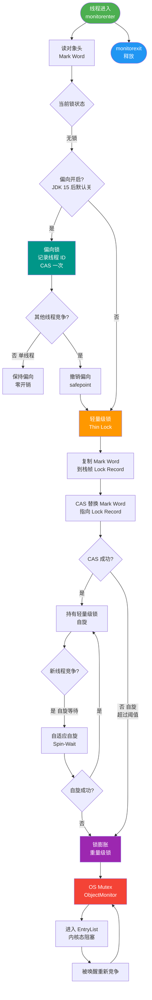
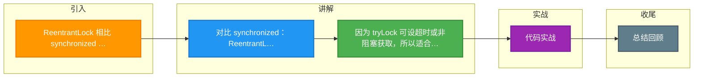

# ReentrantLock 相比 synchronized 多了哪些高级功能？什么场景该用 ReentrantLock？

【synchronized：简单够用】
- **关键字**：JVM 层面实现，C++ 编写，内置锁。
- **自动管理**：加锁、解锁由 JVM 自动控制（基于字节码 `monitorenter`/`monitorexit` 或方法常量池标志），不会发生死锁（代码执行完或异常自动释放）。
- **优化**：JDK 1.6 后引入偏向锁、轻量级锁、重量级锁锁升级，减少 OS 悬挂开销。
- **限制**：非公平锁，不可中断，不可设置超时，只有一个条件队列（等待集）。

【ReentrantLock 多出的 4 大功能】
1. **可中断锁**：
   - `lockInterruptibly()`：允许线程在等待锁时响应 `interrupt()` 中断信号，抛出 `InterruptedException` 退出等待。
   - *场景*：用于消除死锁，两个线程互相等待时，外部中断其中一个使其释放锁。
2. **可超时锁**：
   - `tryLock(long time, TimeUnit unit)`：给定时间内获取不到锁则返回 false，不会无限阻塞。
   - *场景*：避免死锁，或者用于轮询尝试获取资源。
3. **公平锁选择**：
   - 构造函数 `new ReentrantLock(true)` 启用公平模式。
   - *原理*：基于 AQS 的 `CLH` 队列，严格按照请求顺序（FIFO）获取锁，避免线程饥饿。
   - *代价*：维护队列开销大，吞吐量通常低于非公平锁。
4. **多条件变量**：
   - `newCondition()`：创建多个 `Condition` 对象。
   - *场景*：生产者/消费者模型。用 `notFull` 等待队列不满，用 `notEmpty` 等待队列不空，比 `synchronized` 的 `wait/notify` 更精细（`notifyAll` 唤醒所有线程效率低）。

【额外功能】
- **非阻塞获取**：`tryLock()` 立即返回，获取不到直接失败，不阻塞线程。
- **锁状态查询**：
  - `isLocked()`：锁是否被持有。
  - `isHeldByCurrentThread()`：当前线程是否持有锁。
  - `getHoldCount()`：当前线程重入获取锁的次数。
  - `getQueueLength()`：正在等待获取此锁的线程估计数。

【实战案例】
在实现一个分布式锁客户端时，需要获取 Redis 锁并在本地执行业务。由于网络抖动导致锁获取时间不确定，使用 `synchronized` 可能会导致主线程长时间阻塞。改用 `ReentrantLock.tryLock(3, TimeUnit.SECONDS)`，若 3 秒内无法获取本地执行权限则直接返回失败，极大提升了系统的容错性和响应能力。

【代码示例】
```java
ReentrantLock lock = new ReentrantLock(true); // 公平锁
if (lock.tryLock(1, TimeUnit.SECONDS)) {
    try {
        // 业务逻辑
    } finally {
        lock.unlock();
    }
} else {
    // 获取锁超时处理
    log.warn("Failed to acquire lock, timeout");
}

// 多条件变量示例
Condition notEmpty = lock.newCondition();
Condition notFull = lock.newCondition();
```

【架构对比（AQS vs Monitor）】
```text
ReentrantLock 基于实现 (AQS)
┌─────────────────────┐
│   State (int: 0/1)  │ <--- volatile state 变量 (CAS 修改)
├─────────────────────┤
│  CLH Queue (Node)   │ <--- 等待队列 (双向链表)
├─────────────────────┤
│ ConditionObject[]   │ <--- 多个条件队列
└─────────────────────┘

synchronized 基于实现
┌─────────────────────┐
│    Object Monitor   │ <--- C++ ObjectMonitor
├─────────────────────┤
│ _EntryList (CXQ)    │ <--- 竞争队列
├─────────────────────┤
│  _WaitSet           │ <--- 调用 wait() 的线程集合
└─────────────────────┘
```

【选型建议】
- **默认 synchronized**：代码简洁，JVM 自动管理，JVM 锁优化极佳。
- **使用 ReentrantLock 的场景**：
  - 需要使用 `tryLock` 避免死锁或实现轮询锁。
  - 需要公平锁机制以保证业务顺序。
  - 需要精细化控制多组线程等待/唤醒（多 Condition）。
  - 需要中断正在等待锁的线程。

【注意】`ReentrantLock` 必须在 `finally` 块中调用 `unlock()`，且加锁解锁次数必须对应，否则会导致死锁或逻辑错误。


## 核心流程图



## 记忆要点

- 对比 synchronized：ReentrantLock 基于 AQS，支持可中断、可超时、公平锁及多条件变量。
- 因为 tryLock 可设超时或非阻塞获取，所以适合防范死锁或实现轮询尝试。
- 因为 newCondition 能精细分组等待唤醒，所以适合复杂的生产者消费者模型。
- 注意区别：thenApply 同步转换，而 thenApplyAsync 异步转换。
- 必须牢记：必须在 finally 块中调用 unlock()，避免死锁。

## 结构化回答

**30 秒电梯演讲：** synchronized像自动挡汽车，简单省心但控制少；ReentrantLock像手动挡赛车，操作繁琐但能漂移、抢跑、精确控制引擎。

**展开框架：**
1. **synchronized** — synchronized简单自动，JDK1.6后性能已优化
2. **ReentrantLock** — ReentrantLock支持中断、超时、公平锁、多条件变量
3. **用ReentrantLock** — 用ReentrantLock必须手动在finally中释放锁

**收尾：** 关于这个问题，我还可以展开聊——ReentrantLock 的公平锁为什么比非公平锁慢？您想从哪个角度深入？

## 视频脚本

> 预计时长：4 分钟 | 由浅入深

| 时间 | 画面/字幕 | 口播台词 | 讲解要点 |
|------|----------|----------|----------|
| 0:00 | 标题卡：ReentrantLock 相比 synchronized 多了哪些高级功能？什么场景该用 ReentrantLock | 今天这道题：ReentrantLock 相比 synchronized 多了哪些高级功能？什么场景该用 ReentrantLock。30 秒先给你讲清楚。 | 开场钩子 |
| 0:20 | 核心概念动画/示意图 | synchronized像自动挡汽车，简单省心但控制少；ReentrantLock像手动挡赛车，操作繁琐但能漂移、抢跑、精确控制引擎。 | 核心概念 |
| 0:40 | synchronized示意图 | synchronized简单自动，JDK1.6后性能已优化 | synchronized |
| 1:10 | ReentrantLock示意图 | ReentrantLock支持中断、超时、公平锁、多条件变量 | ReentrantLock |
| 1:40 | 总结卡 + 下期预告 | 记住三个词就能答好这道题。下期追问：ReentrantLock 的公平锁为什么比非公平锁慢？性能差多少？ | 收尾 |

---

### 视频流程图




## 延伸：synchronized和ReentrantLock的区别？

> 合并自 `conc-063`（相似度 67%）

**synchronized 和 ReentrantLock 的区别**

**相同点：**
1. 都是用于协调多线程对共享资源的访问，保证线程安全。
2. 都是可重入锁（同一个线程可以多次获取同一把锁，避免死锁）。
3. 都保证了可见性和互斥性（基于 JMM 的 Happens-Before 原则）。

**不同点：**

| 特性 | synchronized | ReentrantLock |
| :--- | :--- | :--- |
| **实现层面** | JVM 层面，基于关键字，由 JVM 实现。 | JDK API 层面，基于 AQS (AbstractQueuedSynchronizer) 实现。 |
| **释放锁方式** | 自动释放锁（代码执行完或异常）。 | 必须在 `finally` 块中手动调用 `unlock()` 释放，否则可能导致死锁。 |
| **公平性** | 非公平锁。 | 可选，默认非公平，构造方法传入 `true` 可构造公平锁。 |
| **等待可中断** | 不可中断，死等（除非抛出异常或执行完毕）。 | 支持中断等待（`lockInterruptibly`），解决死锁更灵活。 |
| **绑定条件** | 只有一个 WaitSet，随机唤醒一个或全部 (`notify/notifyAll`)。 | 支持多个 `Condition`，可以精细控制唤醒特定线程（生产/消费模型常用）。 |
| **性能** | JDK 1.6 后优化极大（锁升级、偏向锁），性能与 ReentrantLock 持平。 | 在高竞争或复杂场景（如定时锁、轮询锁）下仍具一定优势。 |

**### 1. 实战案例**
在实现一个简单的阻塞队列时，如果使用 `synchronized`，我们无法区分“队列为空等待”和“队列已满等待”的线程，`notify` 可能会错误地唤醒空队列上的生产者。使用 `ReentrantLock` 配合两个 `Condition`（`notFull` 和 `notEmpty`），可以精确控制唤醒生产者或消费者，大大提高了调度效率。

**### 2. 代码示例**
```java
ReentrantLock lock = new ReentrantLock();
Condition notEmpty = lock.newCondition();
Condition notFull = lock.newCondition();

public void put(Object item) throws InterruptedException {
    lock.lock();
    try {
        while (count == items.length)
            notFull.await(); // 队列满，阻塞在 notFull 条件上
        items[putIndex] = item;
        notEmpty.signal(); // 唤醒消费者
    } finally {
        lock.unlock();
    }
}
```

**## 常见考点**
1. **AQS 原理简述**：ReentrantLock 是如何利用 AQS 的？（通过 state 变量（0 表示无锁，>0 表示重入次数）和 CLH 双向队列管理等待线程）。
2. **tryLock 与 lock**：tryLock 有什么用？（tryLock 会尝试获取锁，获取不到立即返回 false，不会阻塞，可用于避免死锁或轮询）。
3. **Condition 的实现**：Condition 的 await/signal 和 Object 的 wait/notify 有什么本质区别？（Condition 可以支持多路通知，更灵活；且必须持有对应的 Lock 才能调用）。
4. **选择建议**：一般如果没有特殊需求（如公平性、中断等），推荐使用 synchronized（写法简单，JVM 自动优化）。
5. **ReentrantLock 的可重入实现**：线程再次获取锁时，CAS 增加 state 变量的值；释放锁时，state 减为 0 才真正释放锁。

## 记忆要点

- 实现层面：Synchronized 是 JVM 关键字自动释放，ReentrantLock 是 JDK API 需手动 unlock。
- 高级特性：ReentrantLock 支持公平锁、可中断、多条件变量。
- 条件变量对比：Synchronized 只有一个 WaitSet 随机唤醒，而 ReentrantLock 可绑定多个 Condition 精确唤醒。
- 核心依赖：ReentrantLock 底层基于 AQS 实现，通过 state 变量记录重入次数。

## 结构化回答

**30 秒电梯演讲：** synchronized是自动挡（自动开关），ReentrantLock是手动挡（手动控制，功能多）。

**展开框架：**
1. **synchronized** — synchronized自动释放，ReentrantLock手动释放
2. **ReentrantLock** — ReentrantLock支持公平锁和中断等待
3. **ReentrantLock** — ReentrantLock支持多个Condition精细控制

**收尾：** 这块我踩过一些坑，您想深入聊哪一段——原理细节、实战案例还是常见踩坑？

## 视频脚本

> 预计时长：4 分钟 | 由浅入深

| 时间 | 画面/字幕 | 口播台词 | 讲解要点 |
|------|----------|----------|----------|
| 0:00 | 标题卡：synchronized和ReentrantLock的区别 | 今天这道题：synchronized和ReentrantLock的区别。30 秒先给你讲清楚。 | 开场钩子 |
| 0:20 | 核心概念动画/示意图 | synchronized是自动挡（自动开关），ReentrantLock是手动挡（手动控制，功能多）。 | 核心概念 |
| 0:40 | synchronized示意图 | synchronized自动释放，ReentrantLock手动释放 | synchronized |
| 1:10 | ReentrantLock示意图 | ReentrantLock支持公平锁和中断等待 | ReentrantLock |
| 1:40 | 总结卡 + 下期预告 | 记住今天这几个关键词，面试一定用得上。下期见。 | 收尾 |

### 视频流程图


