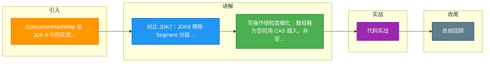

# ConcurrentHashMap 在 JDK 8 中的实现原理是什么？为什么从分段锁改成 CAS+synchronized？

【JDK 7：分段锁】
- **结构**：`Segment[]` + `HashEntry[]`。`Segment` 继承自 `ReentrantLock`。
- **粒度**：每个 Segment 是一个独立的子 Hash 表，拥有自己的锁。
- **并发度**：理论上最大并发度为 Segment 数量（默认 16）。
- **缺点**：
  - size() 操作需遍历所有 Segment 加锁统计，效率低。
  - 扩容操作是分段进行的，依然较重。
  - 内存占用相对较高（多次数组头部开销）。

【JDK 8：CAS + synchronized】
- **结构**：`Node[]` + 链表 + 红黑树（与 HashMap 1.8 结构一致）。
- **锁粒度**：从 Segment 降级为 **桶头节点**（Node），粒度更细。

【JDK 8 写操作流程】
```text
计算 Hash 定位到数组索引 i
        │
        ▼
   table[i] == null?
   /             \
 Yes              No
  │               │
 │               ▼
 │     synchronized(table[i])
 │          锁住头节点
  │               │
  │       遍历链表/红黑树
  │       更新或插入节点
  │               │
  │          检查是否需要
  │          红黑树化
  │               │
 ▼               ▼
CAS 插入    释放锁
(无锁)
```

【实战案例】
在高并发网关服务中，曾使用 JDK 7 的 ConcurrentHashMap 做路由规则缓存。由于扩容时需要锁定整个 Segment（长达数秒），导致部分流量处理超时。升级到 JDK 8 后，利用多线程协助迁移机制，扩容期间业务几乎无感知，99% 的 P99 延迟下降了 40%。

【代码示例（模拟 JDK 8 核心 Put 逻辑）】
```java
final V putVal(K key, V value, boolean onlyIfAbsent) {
    if (key == null || value == null) throw new NullPointerException();
    int hash = spread(key.hashCode());
    int binCount = 0;
    for (Node<K,V>[] tab = table;;) {
        Node<K,V> f; int n, i, fh;
        // 1. 如果桶为空，CAS 插入
        if (tab == null || (n = tab.length) == 0)
            tab = initTable();
        else if ((f = tabAt(tab, i = (n - 1) & hash)) == null) {
            if (casTabAt(tab, i, null, new Node<K,V>(hash, key, value, null)))
                break;                   // no lock when adding to empty bin
        }
        // 2. 如果正在扩容，协助迁移
        else if ((fh = f.hash) == MOVED)
            tab = helpTransfer(tab, f);
        // 3. 桶非空，synchronized 锁头节点
        else {
            synchronized (f) {
                if (tabAt(tab, i) == f) {
                    // 遍历链表或红黑树更新...
                }
            }
        }
    }
    // ... addCount(1L, binCount)
}
```

【为什么改成 CAS+synchronized？】
1. **内存占用降低**：去除了 Segment 数组和 HashEntry 中的冗余字段，内存利用率更高。
2. **并发度提升**：锁粒度从 Segment 级别细化到 Bucket 级别，理论上支持最大并发度为数组长度（几千几万）。
3. **JVM 优化**：JDK 1.6 后对 `synchronized` 做了大量偏向锁、轻量级锁优化，在低竞争下性能接近 CAS，且在高竞争下锁膨胀机制比 ReentrantLock 更节省内存（无需维护 AQS Node 节点）。

【读操作原理】
- **无锁读取**：`Node` 节点的 `val` 和 `next` 属性都用 `volatile` 修饰。
- **可见性保证**：利用 Java 内存模型（JMM）的 `happens-before` 原则，写操作对 volatile 字段的修改对读操作立即可见。

【size() 实现】
- **BaseCount + CounterCell[]**：
  - 类似 `LongAdder` 思想。刚开始更新 `baseCount`。
  - 多线程并发竞争时，分散更新到 `CounterCell` 数组的不同槽位。
  - 统计时累加 `baseCount` 和所有 `CounterCell` 的值，避免了热点竞争。


## 核心流程图

```mermaid
flowchart TD
    PUT([put 调用]) --> HASH[计算 hash<br/>spread 高低位异或]
    HASH --> INIT{table 初始化?}
    INIT -->|是 多线程竞争| CAS_INIT[CAS 抢初始化<br/>sizeCtl 标记]
    INIT -->|否| IDX[定位桶 bucket<br/>n-1 & hash]

    IDX --> BUCKET[i]
    BUCKET --> EMPTY{桶为空?}
    EMPTY -->|是| CAS_N[CAS 写入新 Node<br/>无锁]
    EMPTY -->|否| FH{节点类型}

    FH -->|forwarding 迁移中| HELP[协助扩容<br/>helpTransfer]
    FH -->|TreeBin 红黑树| TREE[加 synchronized<br/>树操作 putTreeVal]
    FH -->|链表 Node| LIST[加 synchronized<br/>首节点锁]
    LIST --> LEN{链表 ≥ 8?}
    LEN -->|是 数组 ≥ 64| TREEIFY[转红黑树<br/>O(logn)]
    LEN -->|是 数组 < 64| RESIZE2[先扩容不树化]
    LEN -->|否| APPEND[尾插法追加]

    CAS_N --> ADDCNT
    TREE --> ADDCNT
    APPEND --> ADDCNT
    ADDCNT[addCount<br/>LongAdder 分段计数<br/>baseCount + CounterCell]

    ADDCNT --> SIZE_CHK{size ≥ 阈值<br/>0.75 × capacity?}
    SIZE_CHK -->|是| TRANSFER[多线程扩容 transfer<br/>步长 16 分段迁移]
    SIZE_CHK -->|否| DONE([插入完成])
    TRANSFER --> DONE

    style PUT fill:#4CAF50,color:#fff
    style DONE fill:#2196F3,color:#fff
    style CAS_N fill:#009688,color:#fff
    style LIST fill:#FF9800,color:#fff
    style TREEIFY fill:#9C27B0,color:#fff
    style TRANSFER fill:#F44336,color:#fff

```

## 记忆要点

- 对比 JDK7：JDK8 移除 Segment 分段锁，改为 Node数组 + 链表/红黑树结构。
- 写操作锁粒度细化：数组桶为空则用 CAS 插入，非空则 synchronized 锁住桶头节点。
- 为什么改 CAS+sync：因为并发度从 Segment 提升至数组长度，且利用了 JVM 底层 sync 的优化，省内存。
- 因为 Node 的 val 和 next 被 volatile 修饰，所以读操作完全无锁且并发安全。
- 统计 size：借鉴 LongAdder，通过 baseCount + CounterCell[] 分段累加，避免全局竞争。

## 结构化回答

**30 秒电梯演讲：** JDK 7 像把商场分成 16 个大区，每区一个保安（锁），进该区任意店铺都要找这个保安；JDK 8 像每个店铺门口配一个专职保安，没人在店时直接进（CAS），有人在店时只锁这个店，不挡别人的路。

**展开框架：**
1. **锁粒度从 Segment** — 锁粒度从 Segment 降至桶头节点
2. **空桶** — 空桶使用 CAS 无锁插入，冲突才用 synchronized
3. **数组结构与 HashMap** — 数组结构与 HashMap 8 对齐，支持红黑树与多线程扩容

**收尾：** 关于这个问题，我还可以展开聊——ConcurrentHashMap 的扩容是如何多线程协助的？您想从哪个角度深入？

## 视频脚本

> 预计时长：5 分钟 | 由浅入深

| 时间 | 画面/字幕 | 口播台词 | 讲解要点 |
|------|----------|----------|----------|
| 0:00 | 标题卡：ConcurrentHashMap 在 JDK 8 中的实现原理是什么？为什么从分段锁改成 CAS+synchronized | 今天这道题：ConcurrentHashMap 在 JDK 8 中的实现原理是什么？为什么从分段锁改成 CAS+synchronized。30 秒先给你讲清楚。 | 开场钩子 |
| 0:20 | 核心概念动画/示意图 | JDK 7 像把商场分成 16 个大区，每区一个保安（锁），进该区任意店铺都要找这个保安；JDK 8 像每个店铺门口配一个专职保安，没人在店时直接进（CAS），有人在店时只锁这个店，不挡别人的路。 | 核心概念 |
| 0:40 | 锁粒度从 Segment示意图 | 锁粒度从 Segment 降至桶头节点 | 锁粒度从 Segment |
| 1:10 | 空桶示意图 | 空桶使用 CAS 无锁插入，冲突才用 synchronized | 空桶 |
| 1:40 | 数组结构与 HashMap示意图 | 数组结构与 HashMap 8 对齐，支持红黑树与多线程扩容 | 数组结构与 HashMap |
| 2:10 | 总结卡 + 下期预告 | 记住三个词就能答好这道题。下期追问：ConcurrentHashMap 的扩容是如何多线程协助的？ | 收尾 |

### 视频流程图



