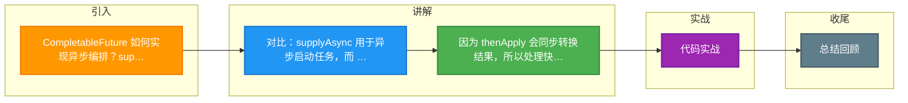

# CompletableFuture 如何实现异步编排？supplyAsync/thenApply/thenCompose 的区别？

【CompletableFuture 核心】
JDK 8 引入，实现了 `Future` 和 `CompletionStage` 接口，支持函数式编程进行复杂的异步编排。

【核心方法区别与用法】
- **创建任务**：
  - `supplyAsync(Supplier<U>)`：支持返回值，异步执行。
  - `runAsync(Runnable)`：无返回值。
  - *注意*：如果不指定线程池，默认使用 `ForkJoinPool.commonPool()`（ daemon 线程，应用结束可能不执行），生产环境强烈建议指定自定义线程池。

- **转换（Transformation - 类似 Stream.map）**：
  - `thenApply(Function)`：接收上一步结果，有返回值。**同步执行**（使用上一个任务的线程）。
  - `thenApplyAsync`：**异步执行**（提交到线程池，可能切换线程）。

- **组合（Composition - 类似 Stream.flatMap）**：
  - `thenCompose(Function)`：
    - 输入：上一步的结果。
    - 输出：返回一个新的 `CompletableFuture`。
    - *作用*：将两个异步流水线串行连接，**扁平化**结果（避免 `CompletableFuture<CompletableFuture>` 嵌套）。
  - `thenCombine(CompletionStage, BiFunction)`：
    - *作用*：**并行**汇聚。将两个独立的 `Future` 结果合并。两个任务同时执行，都完成后执行 BiFunction。

- **消费（Consumption）**：
  - `thenAccept(Consumer)`：消费结果，无返回值（类似 fire-and-forget 的回调）。
  - `thenRun(Runnable)`：不关心上一步结果，执行 Runnable。

【实战案例】
在电商聚合服务中，需要同时调用“库存服务”、“优惠服务”和“用户服务”来计算最终价格。原代码采用串行调用（总耗时 = sum(所有RPC)）。改用 `CompletableFuture` 并行编排后，将三个 RPC 并行发起，最后用 `thenCombine` 聚合结果，接口 RT 从 600ms 降低至 200ms（取决于最慢的 RPC）。

【代码示例】
```java
// 自定义 IO 密集型线程池
ExecutorService ioPool = Executors.newFixedThreadPool(50);

CompletableFuture<User> userFuture = CompletableFuture.supplyAsync(() -> rpc.getUser(id), ioPool);
CompletableFuture<Order> orderFuture = CompletableFuture.supplyAsync(() -> rpc.getOrder(id), ioPool);

// thenCompose: 串行依赖 (获取用户后再获取积分)
CompletableFuture<Integer> pointsFuture = userFuture.thenCompose(user -> 
    CompletableFuture.supplyAsync(() -> rpc.getPoints(user.getId()), ioPool)
);

// thenCombine: 并行汇聚 (用户+订单计算折扣)
CompletableFuture<Discount> discountFuture = userFuture.thenCombine(orderFuture, (user, order) -> 
    calculateDiscount(user, order)
);

// 异常处理
CompletableFuture<Result> resultFuture = discountFuture.exceptionally(ex -> {
    log.error("Calc failed", ex);
    return new Result(DefaultDiscount); // 兜底
});
```

【异常处理机制】
- `exceptionally(Function)`：类似 catch，只能处理异常，返回兜底值恢复流程。
- `handle(BiFunction)`：无论成功或失败都会执行，可访问结果或异常，可返回新值（类似 finally + transform）。
- `whenComplete(BiConsumer)`：无论成功或失败都执行回调，但不能改变返回值（仅用于日志记录）。

【多任务编排流程图】
```text
CompletableFuture<String> future = ...

   [ exceptionally ] ──┐
                     │ (异常兜底)
   [ thenApply ] ────> [ handle ] ───> [ thenAccept ]
        │               │   (处理结果/异常)     (最终消费)
        │ (转换)
        ▼
   [ thenCompose ] ───> [ CF2 ]
   (串行依赖)

并行场景：
   [ CF_A ] ───┐
               ├─> [ thenCombine ] ──> 结果
   [ CF_B ] ───┘
```

【实战建议】
1. **IO 密集型必用自定义线程池**：`ForkJoinPool` 适合计算密集，IO 阻塞会占用公共池资源，可能导致阻塞（commonPool 默认线程数 = CPU - 1）。
2. **避免死循环回调**：在 `thenApply` 等回调中做极快操作，避免阻塞回调线程。
3. **阻塞获取**：
   - `join()`：不检查中断，抛出 `CompletionException` (unchecked)。
   - `get()`：检查中断，抛出 `InterruptedException` (checked)。


## 核心流程图

```mermaid
flowchart TD
    START([异步编排起点]) --> SA[supplyAsync<br/>异步执行 Supplier]
    SA --> THREAD_POOL[Executor 线程池<br/>默认 ForkJoinPool]

    SA --> CHAIN{链式编排}
    CHAIN -->|同步转换| TA[thenApply<br/>上一步结果→新值<br/>同线程或调用线程]
    CHAIN -->|异步转换| TAA[thenApplyAsync<br/>提交到线程池]
    CHAIN -->|消费无返回| TA_C[thenAccept/thenRun]
    CHAIN -->|组合两个| COMBINE[thenCombine<br/>合并两个 future]
    CHAIN -->|依赖下一个| COMPOSE[thenCompose<br/>扁平化嵌套 future]

    TA --> DEP{多任务协调}
    DEP -->|全部完成| ALL[allOf<br/>等待所有<br/>f1∧f2∧f3]
    DEP -->|任一完成| ANY[anyOf<br/>最快返回<br/>f1∨f2∨f3]

    ALL --> NEXT[继续后续逻辑]
    ANY --> NEXT

    NEXT --> ERR{异常处理}
    ERR -->|恢复| EXCEPT[exceptionally<br/>捕获返回默认值]
    ERR -->|统一处理| HANDLE[handle<br/>(value, throwable)]
    ERR -->|whenComplete| WC[记录日志<br/>不改结果]

    EXCEPT --> RESULT([最终结果])
    HANDLE --> RESULT

    BLOCKING([阻塞获取]) --> GET[.get 阻塞<br/>需超时参数]
    BLOCKING --> JOIN[.join 阻塞<br/>抛 RuntimeException]

    style START fill:#4CAF50,color:#fff
    style RESULT fill:#2196F3,color:#fff
    style SA fill:#009688,color:#fff
    style THREAD_POOL fill:#FF9800,color:#fff
    style COMPOSE fill:#9C27B0,color:#fff
    style EXCEPT fill:#F44336,color:#fff

```

## 记忆要点

- 对比：supplyAsync 用于异步启动任务，而 runAsync 无返回值。
- 因为 thenApply 会同步转换结果，所以处理快；而 thenApplyAsync 会异步切换线程。
- 核心区别：thenCompose 用于串联依赖的异步任务，能扁平化嵌套（类似 flatMap）；thenCombine 用于并行汇聚两个独立任务。
- 注意：强烈建议自定义线程池，避免默认的 ForkJoinPool 阻塞拖垮系统。
- 异常处理：exceptionally 类似 catch 兜底，handle 可处理异常并转换，whenComplete 仅记录不改结果。

## 结构化回答

**30 秒电梯演讲：** 像餐厅流水线：supplyAsync 是点菜（开始任务），thenApply 是洗菜切菜（加工处理），thenCombine 是把菜和饭拼在一起（组合结果），allOf 是等所有菜上齐了再叫客人吃（并行汇总）。

**展开框架：**
1. **supplyAsync 创建** — supplyAsync 创建，thenApply 变换（平铺），thenCompose 组合（嵌套扁平化）
2. **thenApply 类似** — thenApply 类似 map（T->R），thenCompose 类似 flatMap（T->Future<R>）
3. **ForkJoinPool 不** — 默认 ForkJoinPool 不适合 IO 阻塞，务必传入自定义线程池

**收尾：** 关于这个问题，我还可以展开聊——CompletableFuture 默认的 ForkJoinPool 有什么问题？您想从哪个角度深入？

## 视频脚本

> 预计时长：4 分钟 | 由浅入深

| 时间 | 画面/字幕 | 口播台词 | 讲解要点 |
|------|----------|----------|----------|
| 0:00 | 标题卡：CompletableFuture 如何实现异步编排？supplyAsync/thenApply/thenCompose 的区别 | 今天这道题：CompletableFuture 如何实现异步编排？supplyAsync/thenApply/thenCompose 的区别。30 秒先给你讲清楚。 | 开场钩子 |
| 0:20 | 核心概念动画/示意图 | 像餐厅流水线：supplyAsync 是点菜（开始任务），thenApply 是洗菜切菜（加工处理），thenCombine 是把菜和饭拼在一起（组合结果），allOf 是等所有菜上齐了再叫客人吃（并行汇总）。 | 核心概念 |
| 0:40 | supplyAsync 创建示意图 | supplyAsync 创建，thenApply 变换（平铺），thenCompose 组合（嵌套扁平化） | supplyAsync 创建 |
| 1:10 | thenApply 类似示意图 | thenApply 类似 map（T->R），thenCompose 类似 flatMap（T->Future<R>） | thenApply 类似 |
| 1:40 | 总结卡 + 下期预告 | 记住三个词就能答好这道题。下期追问：CompletableFuture 默认的 ForkJoinPool 有什么问题？为什么 IO 密集型要换线程池？ | 收尾 |

### 视频流程图



