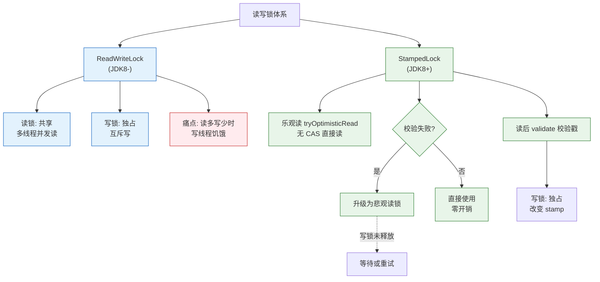

# 读写锁（ReadWriteLock）和 StampedLock 的原理与适用场景？什么时候用乐观读？

【ReadWriteLock（ReentrantReadWriteLock）】
- **机制**：一对锁（读锁共享，写锁排他）。
  - 读-读：共存。
  - 读-写：互斥。
  - 写-写：互斥。
- **实现**：基于 AQS，使用一个 state 字段的高 16 位表示读锁持有数，低 16 位表示写锁重入数。
- **问题**：
  - **写饥饿**：如果读操作非常频繁，写线程可能一直无法获取锁（因为读锁一直被占用）。JDK 提供了“写锁降级”支持，但不支持“读锁升级”（先读后写会导致死锁风险，需先释放读再拿写）。

【StampedLock（JDK 8）】
- **核心**：乐观读锁，不可重入。
- **状态标记**：使用一个 `stamp`（类似版本戳）来控制锁状态。

【三种模式与流程】
```text
1. 写锁:
   stamp = lock.writeLock();  // 排他，阻塞
   ... 修改数据 ...
   writeLock.unlock(stamp);

2. 悲观读锁:
   stamp = lock.readLock();   // 共享，阻塞
   ... 读取数据 ...
   readLock.unlock(stamp);

3. 乐观读锁:
   stamp = lock.tryOptimisticRead(); // 获取版本戳 (非阻塞)
   ... 读取局部变量 ...
   if (!lock.validate(stamp)) {     // 校验版本戳
       // 如果失效 (期间有写锁)，升级为悲观读锁
       stamp = lock.readLock();
       ... 重新读取 ...
       readLock.unlock(stamp);
   }
```

【实战案例】
在实现一个内存中的“路由规则缓存”时，读操作（QPS 5w+）远高于写操作（每分钟更新一次）。使用 `ReentrantReadWriteLock` 时，虽然读锁共享，但大量的内存屏障（volatile 读）操作仍对 CPU 缓存造成压力。切换到 `StampedLock` 的乐观读模式后，读取路径完全没有锁开销，仅在偶尔更新时才自旋重试，CPU 占用率下降 20%。

【代码示例】
```java
public class Cache {
    private double x, y;
    private final StampedLock sl = new StampedLock();

    // 乐观读场景：读多写少
    double distanceFromOrigin() {
        long stamp = sl.tryOptimisticRead(); // 1. 非阻塞获取票据
        double currentX = x, currentY = y;   // 2. 读取局部变量（可能脏读）
        if (!sl.validate(stamp)) {           // 3. 校验是否有写发生
            stamp = sl.readLock();           // 4. 失败则升级为悲观读锁
            try {
                currentX = x;
                currentY = y;
            } finally {
                sl.unlockRead(stamp);
            }
        }
        return Math.sqrt(currentX * currentX + currentY * currentY);
    }

    void move(double deltaX, double deltaY) { 
        long stamp = sl.writeLock();  // 独占写锁
        try {
            x += deltaX;
            y += deltaY;
        } finally {
            sl.unlockWrite(stamp);
        }
    }
}
```

【原理对比】
| 特性 | ReadWriteLock | StampedLock |
| :--- | :--- | :--- |
| **锁实现** | 基于 AQS (int state) | 基于 volatile 变量 + CAS (stamp) |
| **读机制** | 共享锁，涉及内存屏障 | **乐观读**无锁，悲观读有锁 |
| **重入性** | 支持可重入 | **不支持**可重入 (易死锁) |
| **性能** | 高并发下读写互斥有开销 | 读操作极高吞吐，写饥饿概率略高 |

【适用场景】
- **ReentrantReadWriteLock**：读多写少，且读操作逻辑复杂（不仅仅是读一个变量），或者需要 Reentrant 特性（在递归中使用）。
- **StampedLock**：读远多于写，且读操作非常快（如读取缓存中的几个原子变量）。非常适合做高并发计数器、缓存行的读取。

【注意事项】
1. **不可重入**：这是 StampedLock 最大的坑。同一个线程不能重复获取锁，否则会死锁。
2. **不要中断**：StampedLock 的 `readLock` 获取锁时如果被中断，会导致 CPU 飙升（类似自旋锁），需配合 `tryReadLock` 使用。
3. **读写互斥可见性**：写锁释放后，需要手动释放并确保 volatile 写语义，StampedLock 内部已经处理了内存语义。
4. **无 Condition**：不支持 `newCondition`，无法进行精细的线程间等待/通知。

### ReadWriteLock vs StampedLock 原理对比




## 记忆要点

- 对比 AtomicLong：高并发下 AtomicLong 单点 CAS 竞争大，而 LongAdder 将热点数据分散到 Cell[]。
- 因为 LongAdder 分段加锁减少了冲突，所以高并发写吞吐量极高（空间换时间）。
- 原理细节：Cell 数组使用 @Contended 解决了 CPU 缓存的伪共享问题。
- 对比场景：需要强一致精确序列用 AtomicLong，允许弱一致的高并发监控统计用 LongAdder。

## 结构化回答

**30 秒电梯演讲：** ReadWriteLock像公厕，读的人多要排队等位（加锁）；StampedLock像看新闻，先瞄一眼标题（乐观读），若没被篡改直接看，有变再去买书（悲观锁）。

**展开框架：**
1. **ReadWriteLock** — ReadWriteLock读写互斥，高并发读存在写饥饿
2. **StampedLock乐观读** — StampedLock乐观读通过版本号校验实现无锁读取
3. **乐观读** — 乐观读适用于读极多且逻辑短的场景，不可重入

**收尾：** 关于这个问题，我还可以展开聊——StampedLock 为什么不可重入？您想从哪个角度深入？

## 视频脚本

> 预计时长：4 分钟 | 由浅入深

| 时间 | 画面/字幕 | 口播台词 | 讲解要点 |
|------|----------|----------|----------|
| 0:00 | 标题卡：读写锁（ReadWriteLock）和 StampedLock 的原理与适用场景？什么时候用乐观读 | 今天这道题：读写锁（ReadWriteLock）和 StampedLock 的原理与适用场景？什么时候用乐观读。30 秒先给你讲清楚。 | 开场钩子 |
| 0:20 | 核心概念动画/示意图 | ReadWriteLock像公厕，读的人多要排队等位（加锁）；StampedLock像看新闻，先瞄一眼标题（乐观读），若没被篡改直接看，有变再去买书（悲观锁）。 | 核心概念 |
| 0:40 | ReadWriteLock示意图 | ReadWriteLock读写互斥，高并发读存在写饥饿 | ReadWriteLock |
| 1:10 | StampedLock乐观读示意图 | StampedLock乐观读通过版本号校验实现无锁读取 | StampedLock乐观读 |
| 1:40 | 总结卡 + 下期预告 | 记住三个词就能答好这道题。下期追问：StampedLock 为什么不可重入？如果同一线程重复获取会怎样？ | 收尾 |
