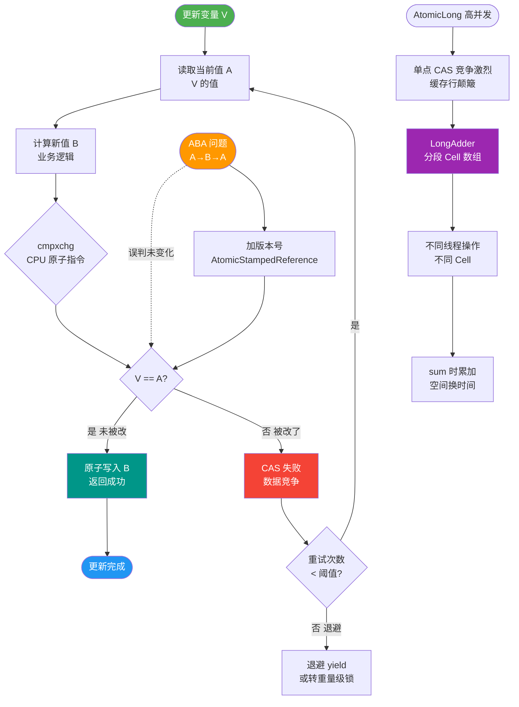

# AtomicLong 和 LongAdder 有什么区别？高并发计数为什么用 LongAdder？

【AtomicLong 原理与瓶颈】
- **核心机制**：基于 `Unsafe` 类的 CAS 操作（`compareAndSwapLong`）。内部维护一个 `volatile long value`。
- **瓶颈原理（伪共享除外）**：在高并发下，多个线程同时修改同一个内存地址的变量。CAS 本质是乐观锁，冲突时需要操作系统层面的总线锁或缓存锁指令，导致大量 CPU 自旋重试，吞吐量急剧下降。

【LongAdder 架构原理】
- **核心设计**：将热点数据分散。内部维护一个 `base` 变量和一个 `Cell[]` 数组。
- **Cell 结构**：每个 Cell 是一个 `@Contended`（防止伪共享）的 volatile 变量，填充了缓存行，避免多线程修改相邻 Cell 导致的缓存一致性失效。
- **写流程**：
  1. 线程尝试 CAS 更新 base（竞争低时成功）。
  2. 若 base 更新失败，根据线程 Hash 值找到对应的 Cell，对该 Cell 进行 CAS 操作。
  3. 若 Cell 数组未初始化或当前 Cell 冲突严重，会触发扩容（rehash）或 LongAccumulator 的自旋尝试。
- **读流程（sum()）**：`base + 累加所有 Cell 的值`。这是一个弱一致性快照，遍历期间若有新写入，结果可能不包含这些写入。

【LongAdder 写流程图】
```text
Thread 1 ──┐
Thread 2 ──┼──> CAS(Base) ──失败─┐
Thread 3 ──┘                    │
                                 ▼
                        ┌─────────────────┐
                        │   Cell[] Array  │
                        ├─────┬─────┬─────┤
                        │Cell0│Cell1│Cell2│ ...
                        │  ↑  │  ↑  │     │
                        │  │  │  │  │     │
Thread X ────────────────┘  │  │  └─────┘
Thread Y ───────────────────┘  │
Thread Z ──────────────────────┘
      (Hash寻址分散竞争)
```

【实战案例】
在电商平台大促场景下，统计“全站瞬时 QPS”或“接口总调用量”时，使用 AtomicLong 往往会因为 CPU 自旋飙升导致服务响应变长甚至 STW。替换为 LongAdder 后，吞吐量通常能提升 5-10 倍，且 CPU 负载显著降低。

【对比表格：AtomicLong vs LongAdder】
| 维度 | AtomicLong | LongAdder |
| :--- | :--- | :--- |
| **核心实现** | 自旋 CAS (Unsafe) | 分段累加 (Base + Cell[]) |
| **并发场景** | 低并发 < 高并发 | 高并发写优势明显 |
| **结果准确性** | 强一致性，实时精确 | 最终一致性 (sum() 时有延迟) |
| **空间开销** | 低 (仅一个 long 变量) | 较高 (可能有多个 Cell 对象) |
| **适用场景** | 序列生成、全局唯一 ID | 监控统计、计数器 (吞吐优先) |

【性能对比深度解析】
- **低并发**：AtomicLong 更快。因为 LongAdder 初始化 Cell 数组、计算 Hash 都有额外开销，直接 CAS base 更直接。
- **高并发**：LongAdder 呈压倒性优势。虽然 sum() 有一定开销，但写操作的吞吐量是 AtomicLong 的数倍甚至数十倍。
- **空间换时间**：LongAdder 牺牲了精确的实时性（sum() 不加锁）和一定的内存空间（Cell 数组），换取了极高的并发写性能。

【适用场景选择】
- **AtomicLong**：
  1. 需要精确的原子计数器（如 Sequence ID 生成）。
  2. 并发度不高，且对内存敏感。
- **LongAdder**：
  1. 统计类场景（如 QPS、TPS、监控指标）。这类场景通常关注总量或平均值，容忍瞬时的微小误差。
  2. 高并发写，读相对较少。

【衍生类】
- **LongAccumulator**：LongAdder 的功能增强版，支持自定义二元函数（如 max, min），不仅仅是加法。
- **DoubleAdder**：针对 double 类型的实现，原理相同，处理了浮点数的精度问题。

【代码示例：自定义 LongAccumulator 求最大值】
```java
// LongAdder 默认是加法，LongAccumulator 可支持任意函数
// 这里演示求最大值代替 AtomicLong.updateAndGet
LongAccumulator maxAccumulator = new LongAccumulator(Math::max, Long.MIN_VALUE);
maxAccumulator.accumulate(100L); // 多线程并发调用
maxAccumulator.accumulate(200L);
System.out.println(maxAccumulator.get()); // 输出 200
```


## 核心流程图



## 记忆要点

- 对比 ReadWriteLock：StampedLock 不可重入，且引入了性能极高的乐观读机制。
- 乐观读流程：tryOptimisticRead 获取票据 -> 读局部变量 -> validate 校验 -> 失败则升级悲观读锁。
- 因为乐观读期间完全无锁，所以读多写少的高并发缓存场景特别适合。
- 注意避坑：StampedLock 不可重入，且 readLock 阻塞期间被中断会导致 CPU 飙升。

## 结构化回答

**30 秒电梯演讲：** 好比银行办事，AtomicLong只有一个窗口，所有人排队，高并发时由于争抢导致CPU空转；LongAdder开了多个窗口，客户分流去不同窗口办，最后再把各窗口的数加起来，效率极高。

**展开框架：**
1. **竞争机制** — 竞争机制：AtomicLong基于CAS单点竞争，LongAdder基于Cell[]分散热点。
2. **精度代价** — 精度代价：LongAdder的sum()方法是遍历求和，非原子快照，允许微小误差。
3. **场景选择** — 场景选择：低并发或全局序列号选AtomicLong；高并发统计（如QPS）选LongAdder。

**收尾：** 关于这个问题，我还可以展开聊——LongAdder 的 Cell 数量是如何确定的？您想从哪个角度深入？

## 视频脚本

> 预计时长：4 分钟 | 由浅入深

| 时间 | 画面/字幕 | 口播台词 | 讲解要点 |
|------|----------|----------|----------|
| 0:00 | 标题卡：AtomicLong 和 LongAdder 有什么区别？高并发计数为什么用 LongAdder | 今天这道题：AtomicLong 和 LongAdder 有什么区别？高并发计数为什么用 LongAdder。30 秒先给你讲清楚。 | 开场钩子 |
| 0:20 | 核心概念动画/示意图 | 好比银行办事，AtomicLong只有一个窗口，所有人排队，高并发时由于争抢导致CPU空转；LongAdder开了多个窗口，客户分流去不同窗口办，最后再把各窗口的数加起来，效率极高。 | 核心概念 |
| 0:40 | 竞争机制示意图 | 竞争机制：AtomicLong基于CAS单点竞争，LongAdder基于Cell[]分散热点。 | 竞争机制 |
| 1:10 | 精度代价示意图 | 精度代价：LongAdder的sum()方法是遍历求和，非原子快照，允许微小误差。 | 精度代价 |
| 1:40 | 总结卡 + 下期预告 | 记住三个词就能答好这道题。下期追问：LongAdder 的 Cell 数量是如何确定的？为什么通常是 CPU 核数？ | 收尾 |
